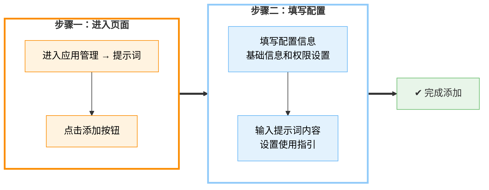

# **提示词**

提示词是一种用于引导大语言模型生成特定内容或完成特定任务的输入信息，通过明确的指令、背景设定或示例内容，帮助模型理解上下文并输出更符合预期的结果，常用于提升智能体在内容创作、数据处理、决策辅助等场景中的准确性与实用性。

在「**应用管理 - 提示词**」模块中，你可以添加使用频率较高的提示词一键部署至前台，为搭建智能体提供强大的提示词能力。同时，平台支持为每个提示词配置使用权限，你可以根据订阅等级或用户角色灵活管控访问范围，确保功能精准触达目标用户。

### **添加提示词**

在“**应用管理 → 提示词**”页面，点击“**添加**”，进入提示词基础信息的设置。

* **基础信息**:为提示词选择合适的分组、起一个标题、使用一段清晰的文字描述此提示词的用途，以便后续的使用。
* **使用范围**:设置用户的使用权限，管控前台用户访问范围，使提示词可以精准抵达目标用户。

添加完成后点击“**确定**”，进入提示词“**内容**”与“**使用指引**”界面。

#### **提示词内容**

“提示词内容”用于指导大语言模型理解任务意图，明确生成方向，是驱动智能体完成各类操作的核心要素。通过精心设计的提示词内容，用户可以控制模型的语气、格式、逻辑结构和输出范围，广泛应用于自动写作、对话交互、数据分析、知识问答等场景，显著提升智能体的执行效率和输出质量。

#### **使用指引**

使用指引模块旨在通过 `“使用案例”`与 `“使用场景”`两个部分，帮助前台用户快速理解提示词的使用方式与应用范围。在前台使用提示词时，用户可通过侧边栏入口随时查看该部分内容，提升上手效率与使用体验。

* **使用案例**
  点击 `“添加”`按钮，设置 `输入`与 `输出`，创建使用案例，帮助用户更直观地了解提示词的操作流程，提升使用体验。

* **使用场景**
  点击 `“添加”`按钮，上传示图并设置场景描述，为应用添加更多实际使用场景，便于用户快速理解应用的适用范围。

### **分组管理**

在「**提示词**」页面，点击左上角的**全部分组**按钮，即可进行特定分组的管理。

如果你只想对某一分组下的提示词进行查看与编辑，在该分组前面的“□”内打上“√”，点击“**确定**”按钮即可。

你可以点击“**全部分组**”下的“**分组管理**”按钮，进行提示词分组的添加与修改。

* **新增分组**
  点击 **+ 添加**，在弹出的文本框中输入分组名称（不超过10个字符），按下回车或点击确认完成创建。
* **命名或重命名**
  单击已有分组名称，直接编辑文本框内容，按回车保存。
* **顺序调整**
  将鼠标悬停在分组左侧的拖拽手柄上，按住并拖动即可调整分组显示顺序。

### **常见问题**

xxxxxx
