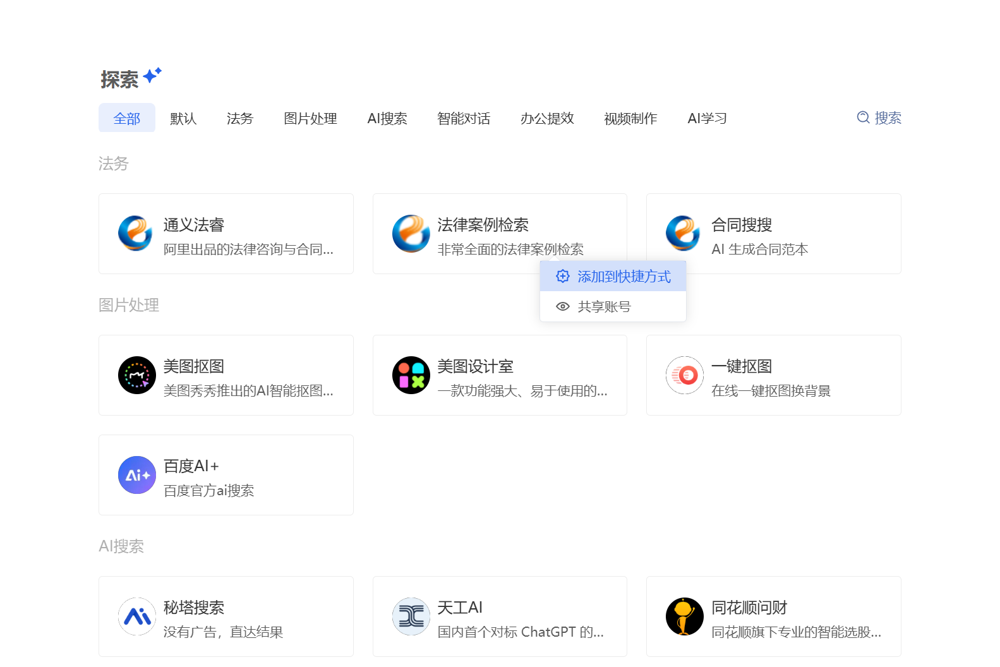
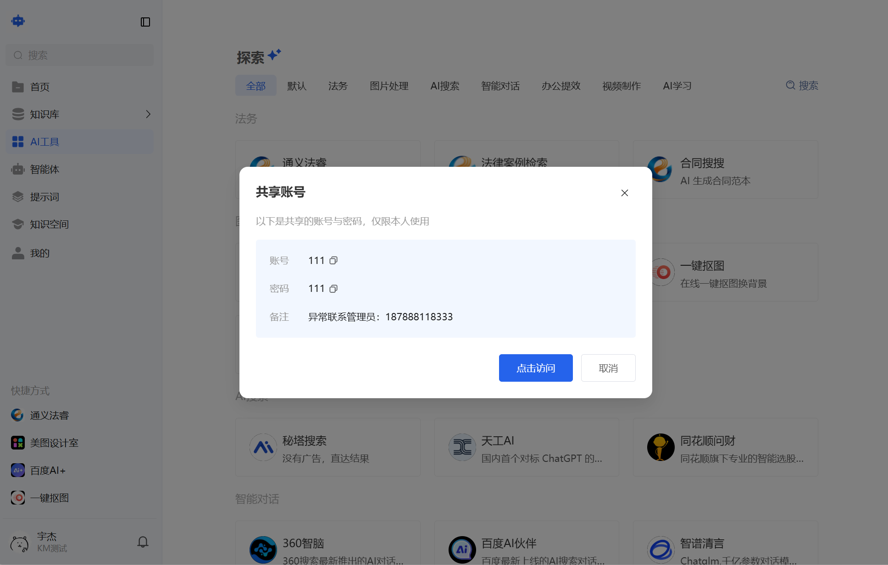
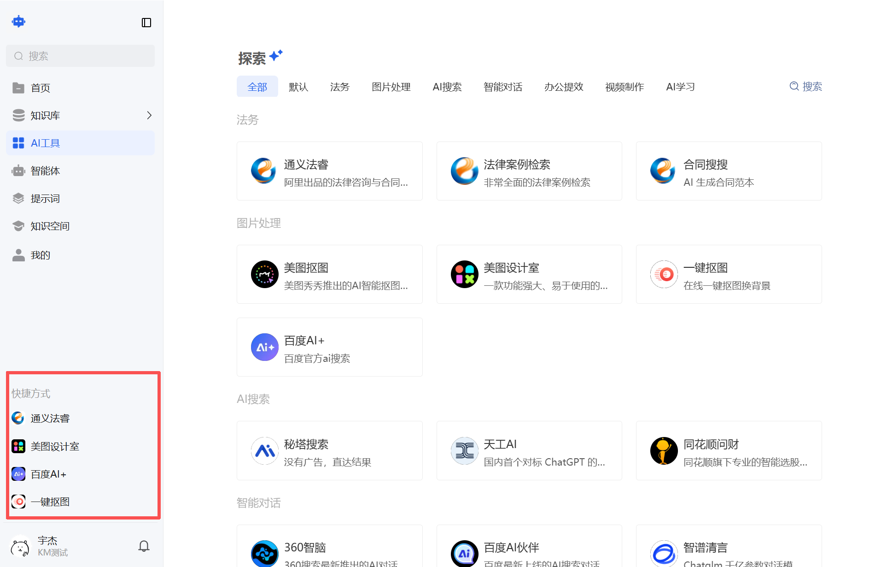

# AI工具

## （一）功能说明
进入AI工具页面后，可浏览并选择所需AI工具，页面展示各类可用工具，支持按分组浏览。右上角设有搜索功能，便于快速查找所需工具。

## （二）操作步骤
1、鼠标移动到对应工具，即可直接访问工具页面。

2、鼠标移动到对应工具，可根据需求将工具加入快捷方式使用及查看共享账号。

-软件风格：快捷方式展示在页面的左下角

-网站风格：快捷方式展示在首页

