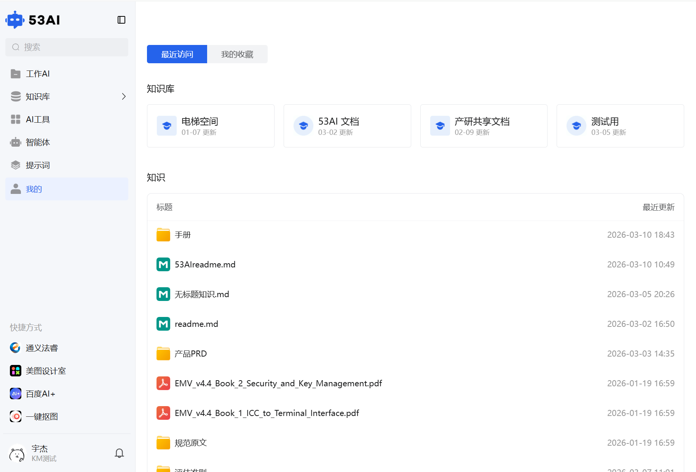
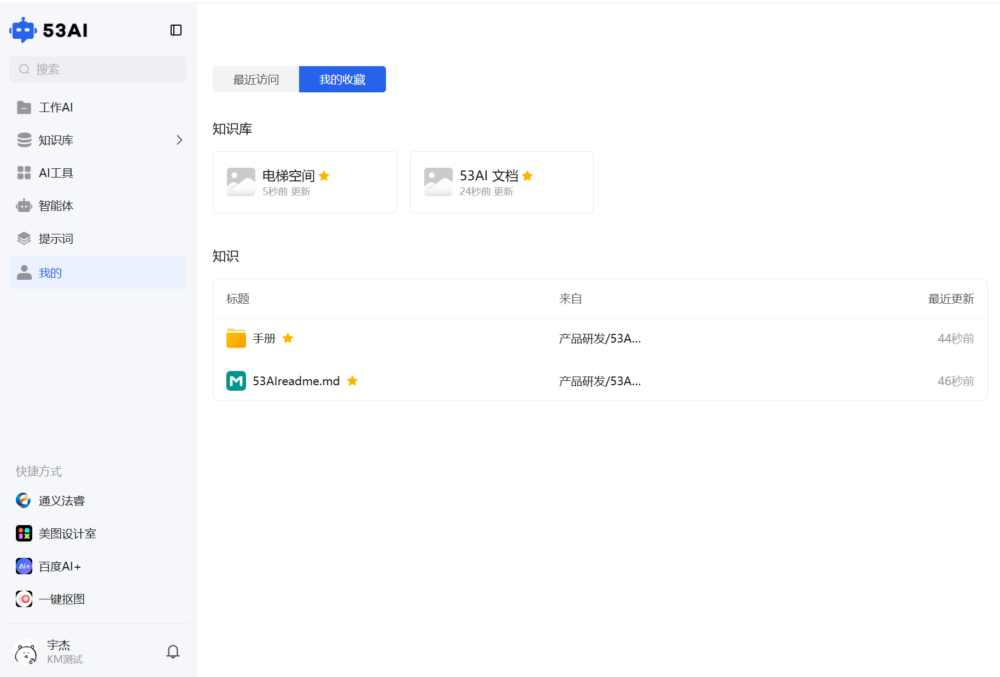

# 前台「我的」：个人知识收藏与访问记录中心
「我的」是你在 53AI 平台的个人知识管理面板，集中展示你收藏和最近访问的知识库、文档，方便快速找回常用资源，提升知识复用效率。

## 一、「最近访问」标签页：快速回溯历史操作
切换到「最近访问」标签，可查看你近期操作过的资源：

### 1、知识库卡片：
展示你最近打开过的所有知识库，按访问时间倒序排列（最新访问在前）。\
卡片显示知识库名称与最后更新时间（如「电梯空间 | 01-07 更新」）。

### 2、知识列表：
展示你最近打开过的文档 / 文件夹，按访问时间倒序排列。\
列表项包含：标题（文件夹 / 文件名）、来源路径（如「产品研发 / 53AI 文档」）、最近更新时间。\
使用场景：适合快速找回刚才查看过的文档，无需重新在知识库目录中逐层查找。

## 二、「我的收藏」标签页：永久留存高频资源
切换到「我的收藏」标签，可管理你手动星标的资源：

### 1、收藏标记：
被收藏的知识库 / 文档旁会显示黄色⭐标记，在列表和卡片中直观区分。

### 2、知识库收藏：
展示你星标的知识库，按收藏时间或更新时间排序。\
卡片显示知识库名称与最近访问 / 更新时间（如「53AI 文档 | 24 秒前 更新」）。

### 3、知识收藏：
展示你星标的文档 / 文件夹，按收藏时间或更新时间排序。\
列表项包含：标题、来源路径、最近更新时间，方便你定位常用核心文档。

### 4、收藏 / 取消收藏：
在知识库卡片或文档列表中，点击⭐图标即可完成收藏 / 取消操作，收藏后资源会永久保留在「我的收藏」中，直到你手动取消。

### 5、使用场景：
适合将高频使用的手册、PRD 文档、核心知识库等标记为收藏，避免在海量文档中反复查找，打造个人专属知识快捷入口。

