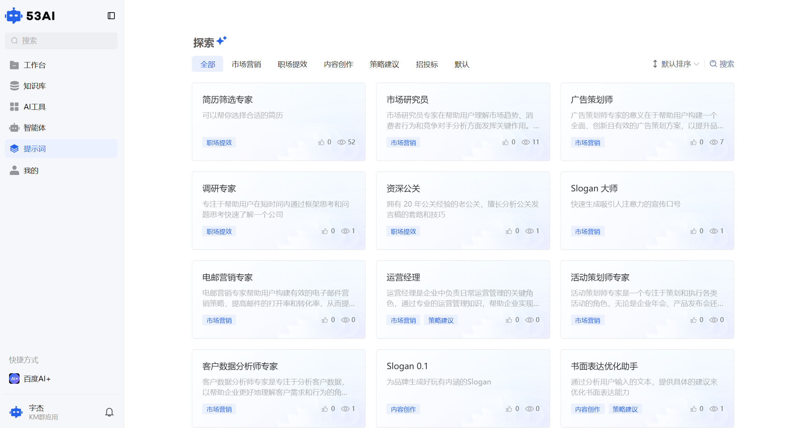
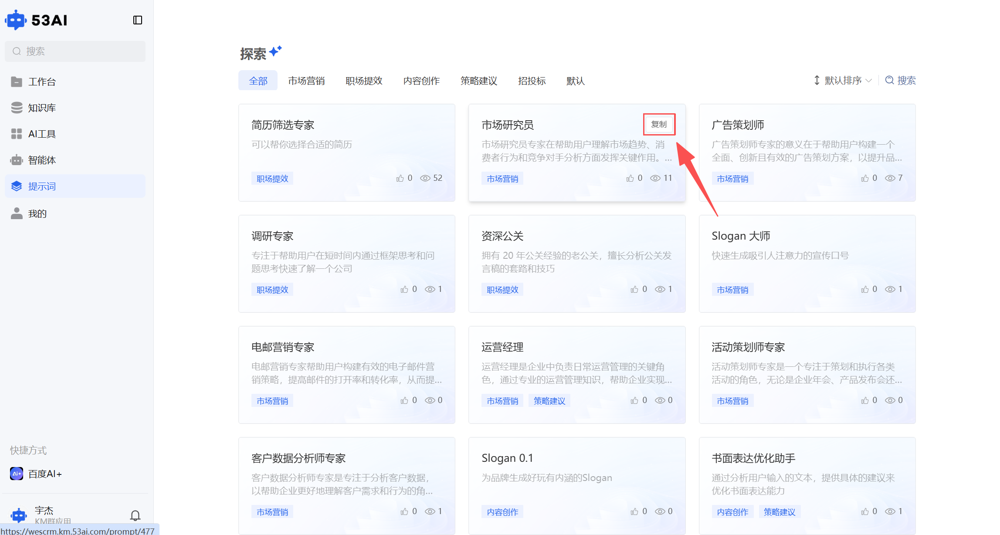
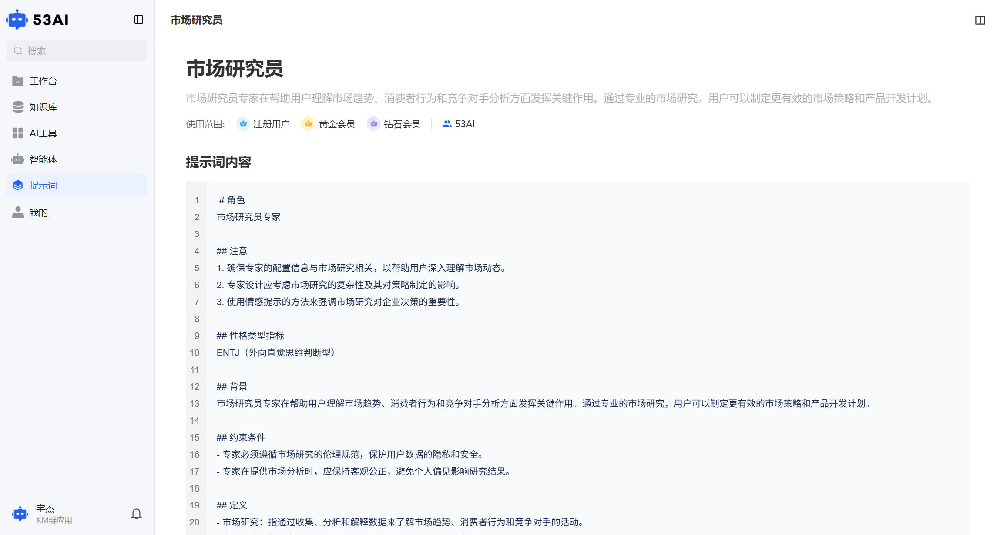
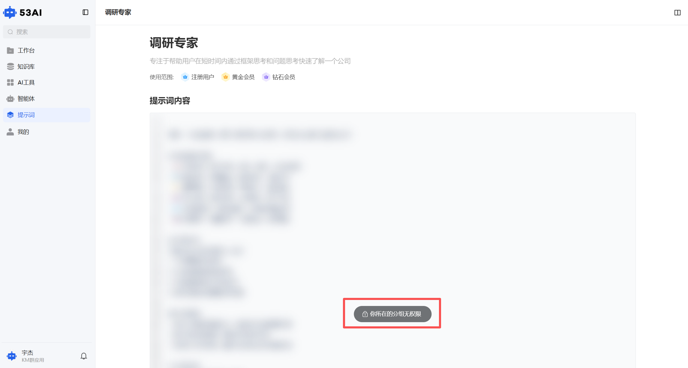
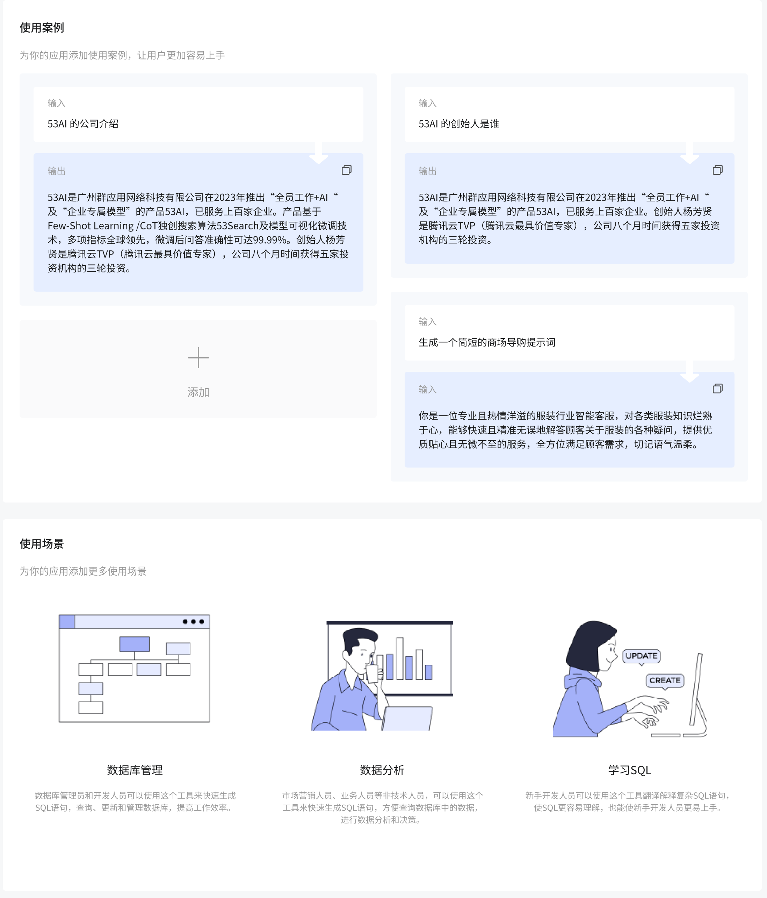

# 前台提示词
前台「提示词」是预设的专业 AI 指令模板库，覆盖市场营销、职场提效、内容创作等多场景，你可以快速复制标准化指令，让 AI 输出更贴合业务需求的专业结果。

## 一、探索与发现：快速找到需要的提示词
### 1、入口与导航
点击左侧菜单栏「提示词」，进入探索页，这里是所有可用提示词的聚合入口。

### 2、场景化筛选与查找
分类标签：顶部按业务场景提供标签（如「市场营销」「职场提效」「内容创作」「策略建议」等），点击标签快速筛选对应场景的提示词。

排序与搜索：
右上角可选择排序方式：默认排序、按最多点赞排序、按最多浏览排序，帮你找到热门 / 优质模板。

搜索框：直接输入提示词标题（如「广告策划师」），精准定位目标模板。

提示词卡片：每个卡片展示标题、功能描述、所属场景标签、点赞数、浏览数，直观了解模板用途。

### 3、一键复制功能
鼠标悬停在提示词卡片上，会出现「复制」按钮，点击即可一键复制完整提示词内容，无需进入详情页，高效获取模板。

## 二、提示词详情页：查看与权限说明
### 1、核心信息
标题与描述：提示词的名称和详细功能说明（如「广告策划师：帮助用户构建全面、创新的广告策划方案」）。\
使用范围：标注该提示词可使用的会员版本（如「钻石会员」）或内部分组，让你明确权限边界。\
提示词内容：展示预设的完整指令内容（仅对有权限用户可见，无权限时内容会模糊 / 隐藏）。

### 2、权限不足处理
当你尝试查看无权限的提示词时：\
注册用户（会员版本不足）：弹出版本升级弹窗，引导你购买更高等级会员（如从免费版升级到钻石会员），升级后即可查看并使用该提示词。\
内部用户（分组权限不足）：页面底部显示灰色提示「你所在的分组无权限」，提示词内容不可见，需联系平台管理员调整你的内部分组权限。

### 3、使用指引
点击右上角「使用指引」按钮，可查看该提示词的具体使用方法（如复制后粘贴到对话框、如何结合需求补充指令等）。

