# 前台智能体
前台「智能体」是用户与各类 AI 能力直接交互的核心入口，分为对话型智能体（聊天交互）和应用型智能体（工作流 / 插件）两种形态，满足从日常问答到复杂业务流程的全场景需求。本章手册以软件风格为例。

## 一、探索与发现：快速找到适合你的智能体
### 1、入口与导航
点击左侧菜单栏「智能体」，进入探索页。

筛选与搜索：
顶部标签：按版本 / 分组筛选（如免费版、创业版、专业版，或自定义分组「一二」「三四」），快速定位你权限内的智能体。

右上角搜索框：直接输入智能体名称，精准查找目标工具。

工具卡片：每个卡片展示智能体名称、类型（对话型 / 应用型）、聊天人数（反映热门程度），点击即可进入使用页面。

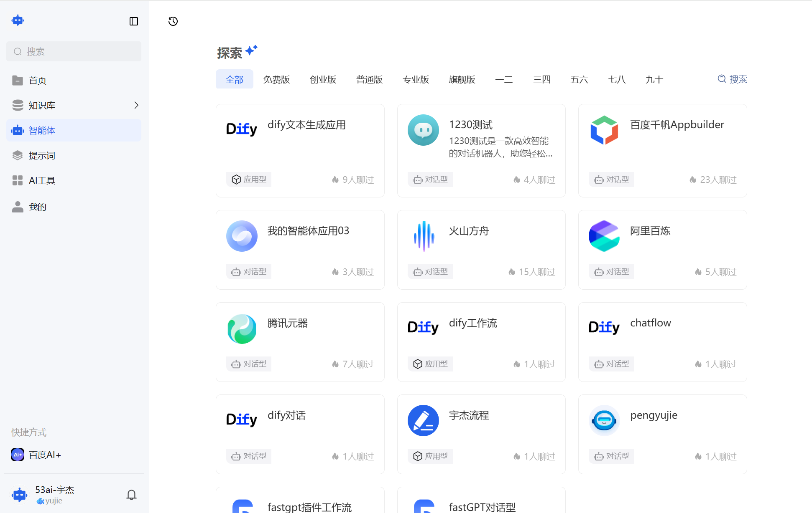

### 2、权限使用
仅对你有权限的版本 / 分组的智能体才能正常使用：

注册用户：按会员版本（如免费版 / 普通 VIP / 超级 VIP 等）控制使用范围，按后台设置的版本可使用相应的智能体。若权限不足，则会引导进行升级版本。

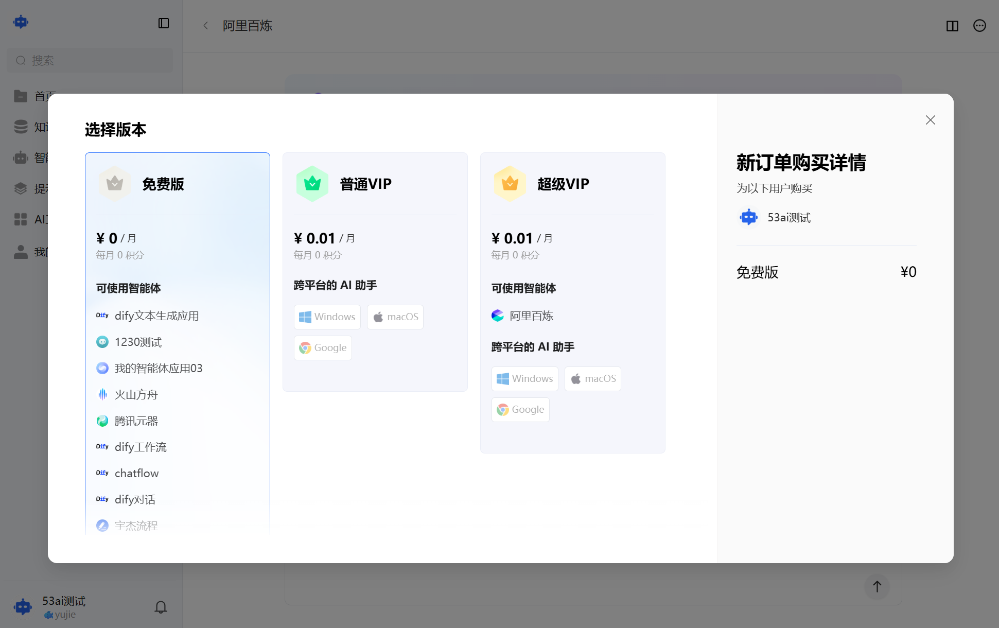

内部用户：按所属分组控制使用范围，仅组内授权的智能体可使用。
未授权的智能体则会提示联系管理员。

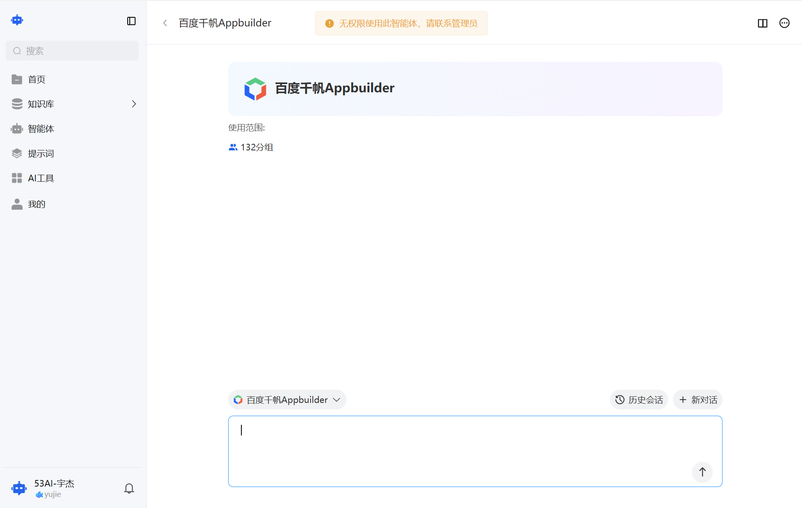

## 二、对话型智能体：像聊天一样和 AI 互动
这类智能体适合日常问答、知识咨询、创意生成等轻量交互场景：

### 1、进入对话页
顶部：显示智能体名称和使用范围（如「免费版 | 默认」），让你清晰了解当前可用权限。\
底部：输入框用于输入问题，同时提供「切换智能体」「历史会话」「新对话」功能。

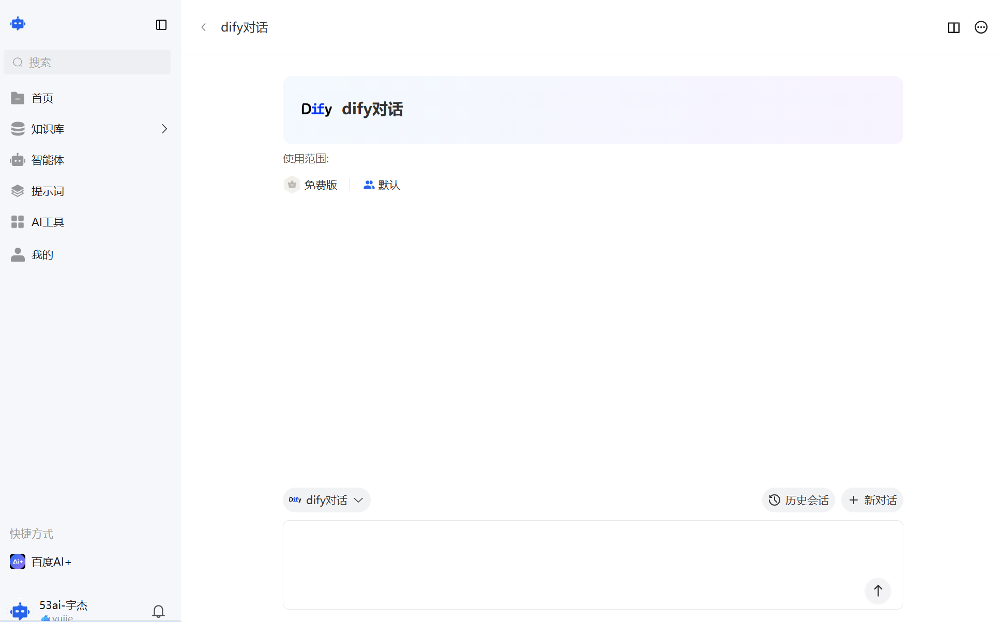

### 2、发起与管理对话
提问与回复：在输入框输入问题（如「今天天气如何？」），点击发送按钮（↑），AI 会实时生成回复。回复下方支持复制、重新生成（刷新按钮）、分享（分享对话链接）操作。

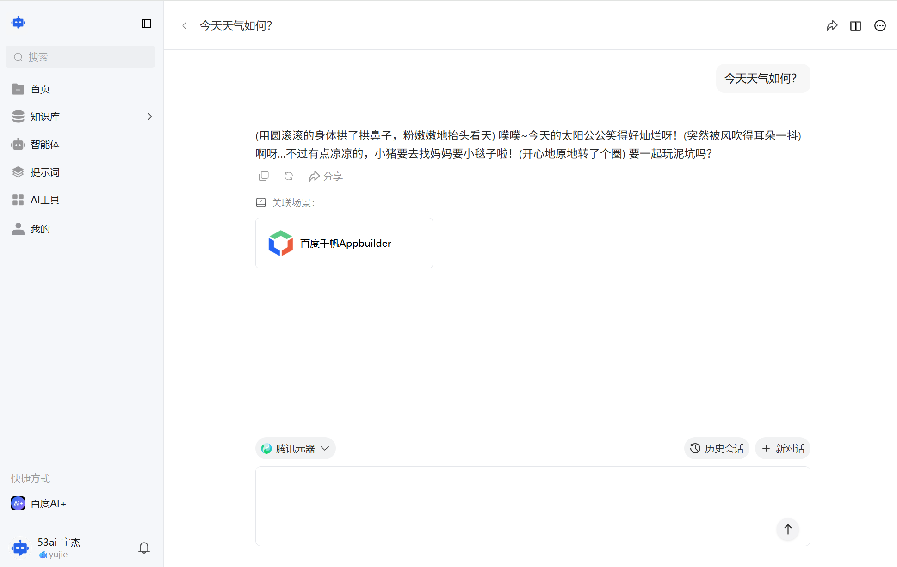

切换智能体：点击输入框左侧的智能体名称，弹出「发现」弹窗，可直接选择其他有权限的智能体，无需离开当前对话窗口。

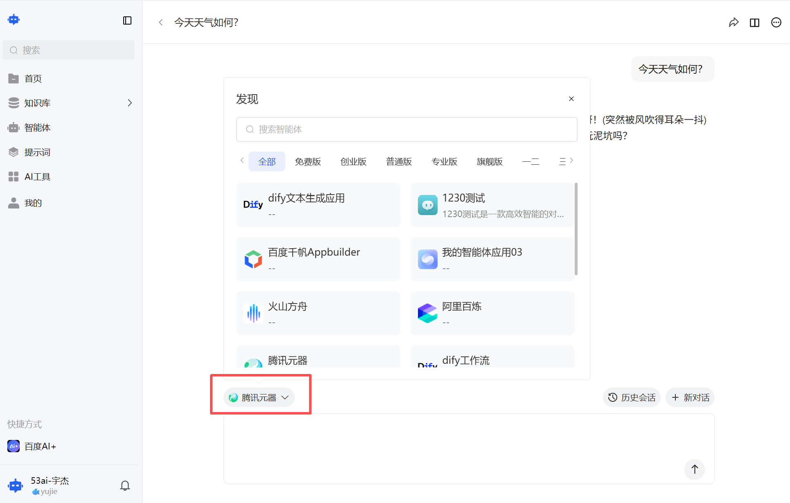

历史会话：点击「历史会话」，侧边栏会展示你与该智能体的所有对话记录（按时间排序），点击任意记录可回溯对话，也可点击「+ 新对话」开启全新交流。

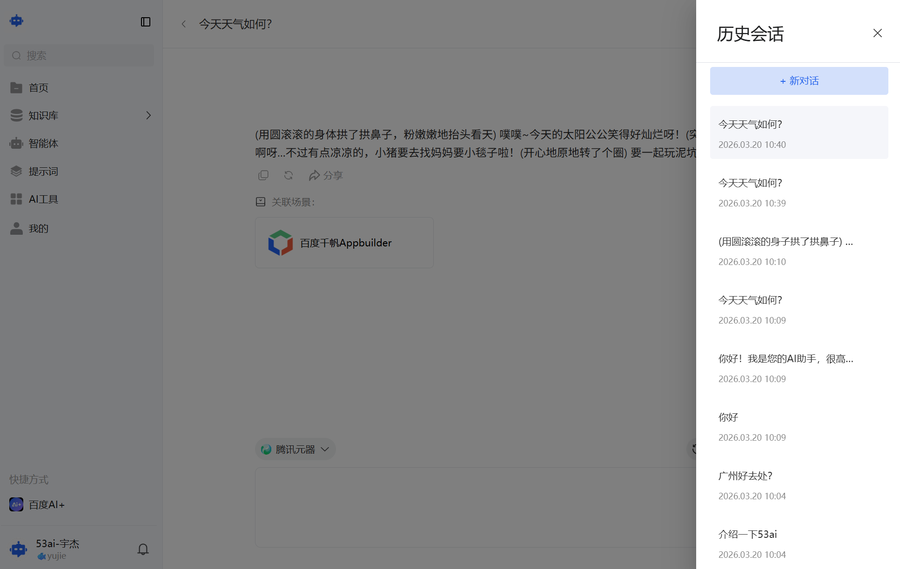

分享对话：选中需要分享的聊天对话，点击分享，会生成链接。粘贴生成的链接分享即可查看聊天对话内容。

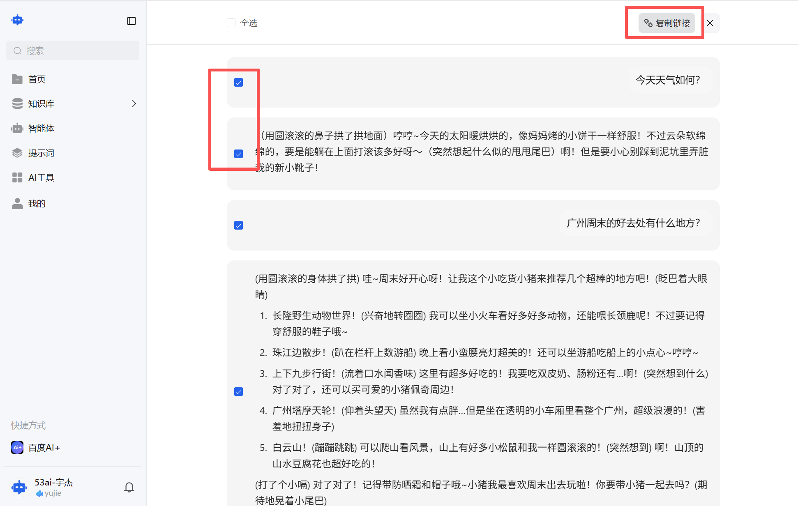

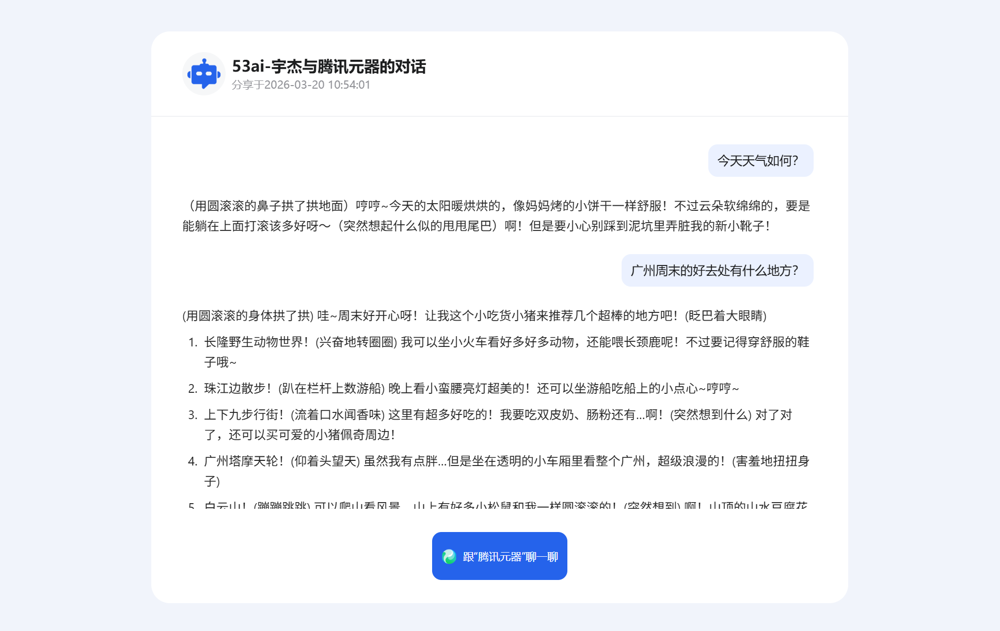

左侧快捷方式：可将常用智能体添加到这里，下次一键访问，无需重复查找。

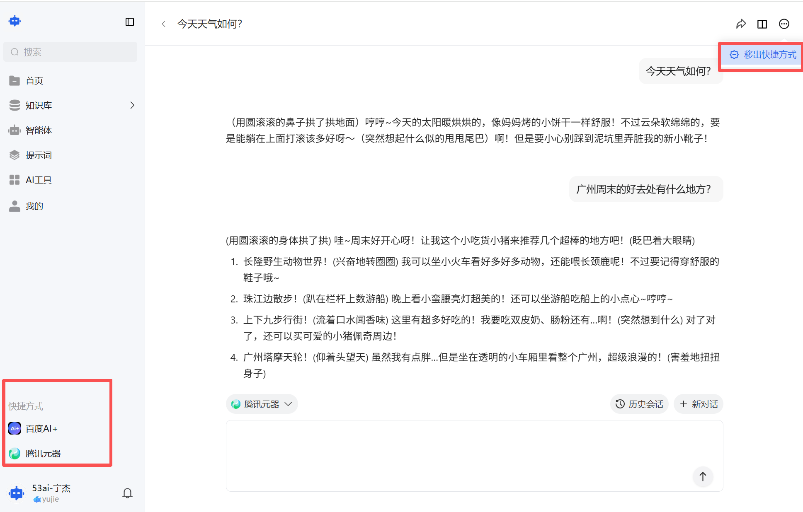

### 3、✨ 关联场景：多智能体联动（核心进阶功能）
位置：在 AI 回复下方，会显示「关联场景」模块，展示管理员预先配置的联动智能体（如「百度千帆 Appbuilder」）。

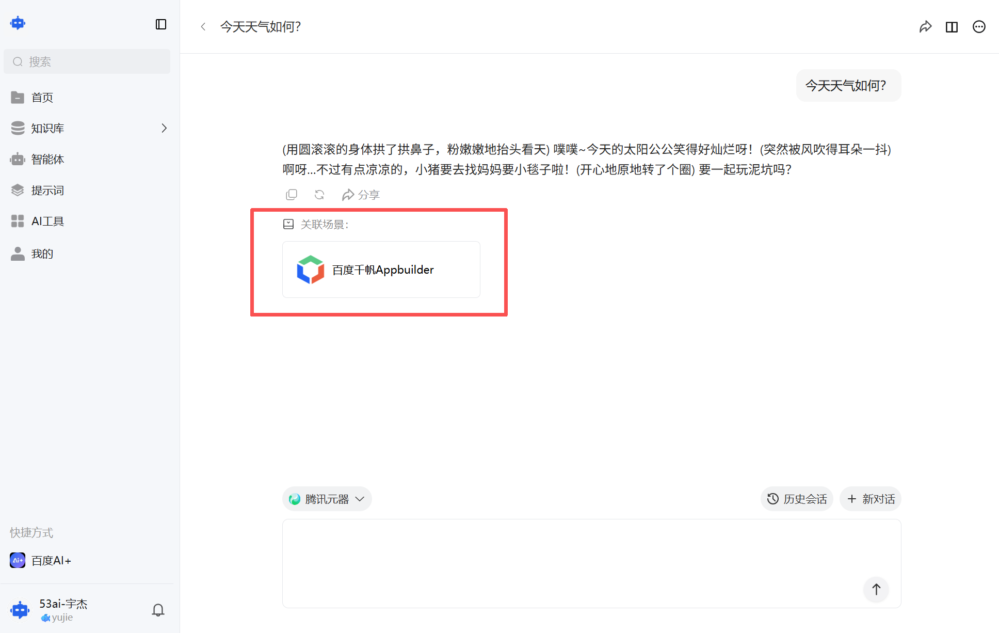

作用：将当前 AI 的回复内容，自动作为输入传递给目标智能体，实现「对话理解需求 → 工作流 / 其他智能体处理」的联动，无需手动复制粘贴。

使用方法：点击「关联场景」中的智能体卡片，自动跳转到目标智能体的对话 / 工作流页面，当前回复内容已预填为输入，直接发起下一步操作即可。

示例：先和「腾讯元器」聊天获取创意灵感，再点击关联的「dify 工作流」，将创意内容自动传入，快速生成正式文档或报告。

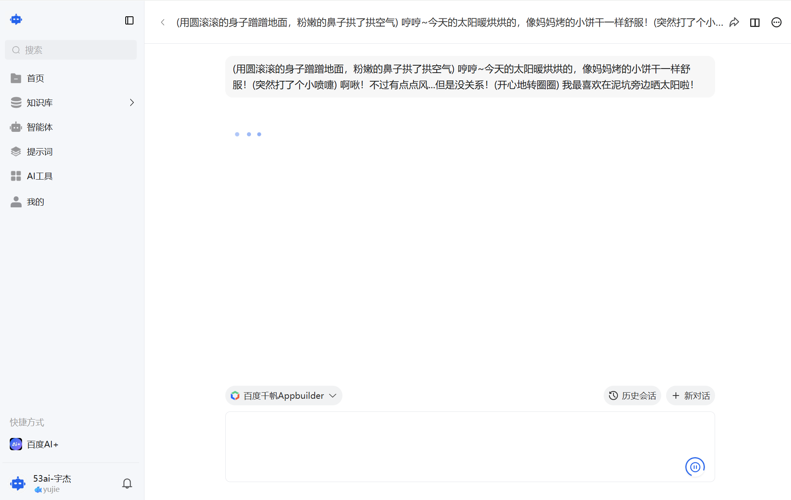

## 三、应用型智能体：用工作流完成复杂任务
这类智能体是参数化工作流，适合数据处理、文本生成、业务自动化等复杂场景：

### 1、进入工作流页
点击应用型智能体卡片，进入左右分栏界面：\
左侧：输入区，展示需要填写的参数（带*标记为必填项，如a、bbb）。\
右侧：输出区，将展示最终生成结果（如文档、报告、结构化数据等）。

### 2、执行工作流
填写参数：在输入区的每个参数框中填写对应内容（比如a填 “主题”，bbb填 “具体要求”）。

生成结果：确认所有必填项填写完成后，点击底部「开始生成」按钮，AI 会自动执行工作流，在右侧输出区展示结果。

提示：不同工作流的参数数量和要求由后台管理员配置，请按页面提示填写；生成时间取决于任务复杂度，一般几秒到几分钟不等。

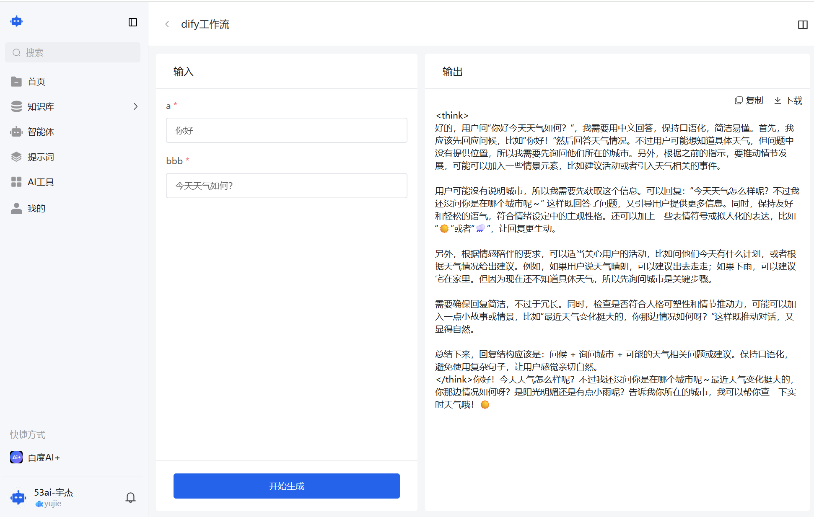

3、其余功能\
包括分享、使用指引、关联智能体、添加快捷方式等功能与对话型智能体共有。