# 知识库（首页与概述）
## 一、知识空间与知识库管理
### 1、入口与导航
点击左侧菜单栏「知识库」，展开后可选择不同知识空间（如「全员空间」「营销中心」「产品研发」「行业研究」等），每个空间对应不同的业务场景与权限范围。

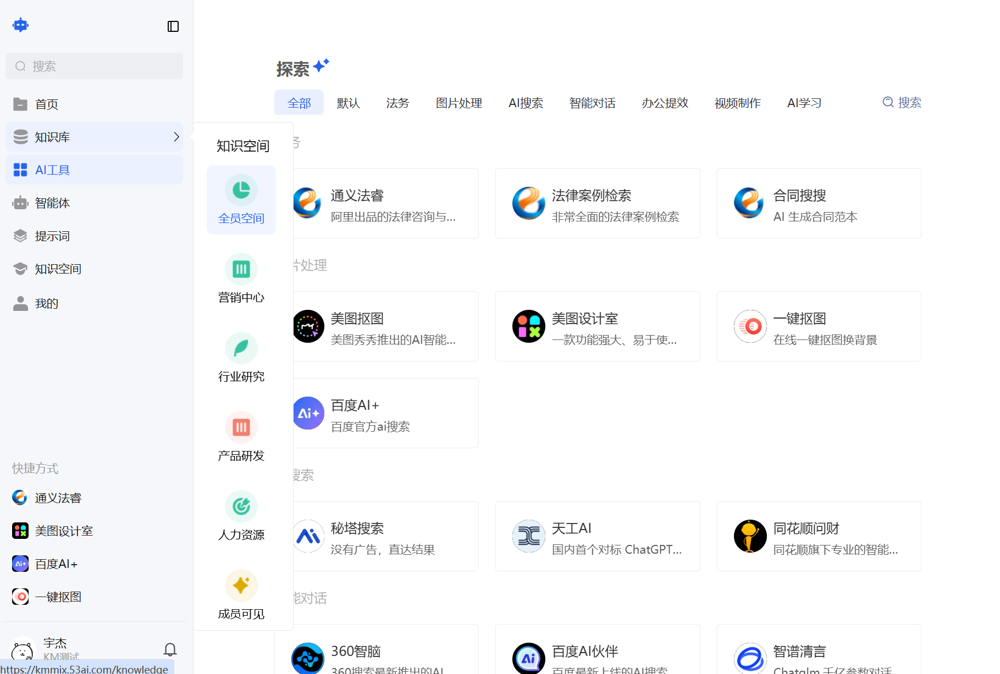

### 2、知识库列表
选择知识空间后，右侧展示该空间下的所有知识库卡片，包含：\
知识库名称、来源空间、更新时间\
卡片操作：支持收藏、分享、编辑 / 删除等\
权限提示：仅对你有权限的知识库可见，未授权的知识库会隐藏

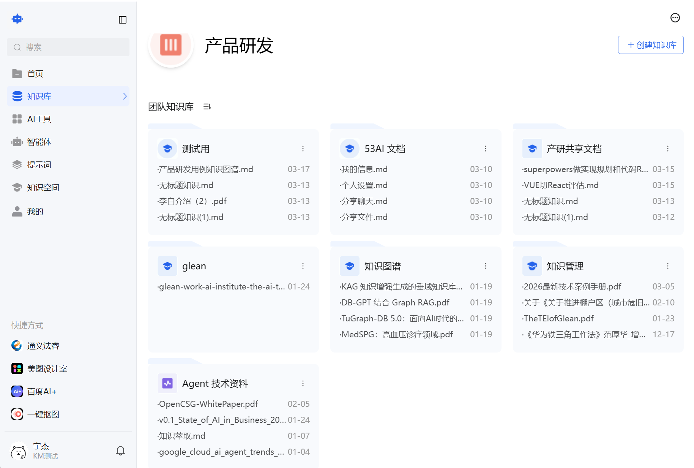

### 3、创建新知识库
点击右上角「+ 创建知识库」，在弹窗中配置：\
必填项：名称（最多 20 字符）\
选填项：描述（最多 150 字符，用于说明知识库用途）\
成员与权限：默认继承团队空间的管理员 / 成员权限，也可自定义添加成员并分配权限\
点击「确定」后完成创建，新知识库会出现在当前知识空间列表中。

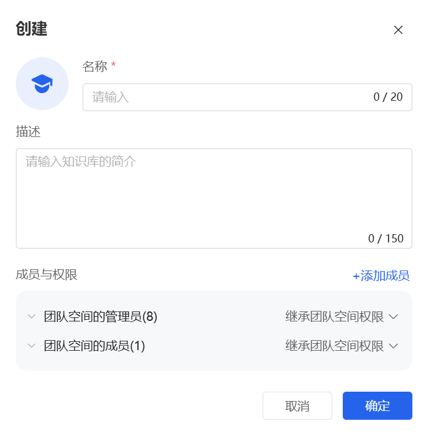

### 4、知识库管理
#### 1、核心信息编辑
名称：必填项，最多 20 字符，用于标识知识库，可随时修改。

描述：选填项，最多 150 字符，用于补充知识库的用途、范围等说明信息。

可见性设置：\
提供三种可见性选项，控制非成员对知识库的可见范围：\
继承团队空间设置：默认选项，直接沿用所属知识空间的可见性规则（如空间设为「可见」，则知识库也为「可见」），页面会提示当前继承的空间可见性状态。\
可见：非空间成员也能看到该知识库，并可直接发起权限申请加入。\
不可见：仅空间成员可见该知识库，非成员需通过专属邀请链接才能申请加入，私密性更强。

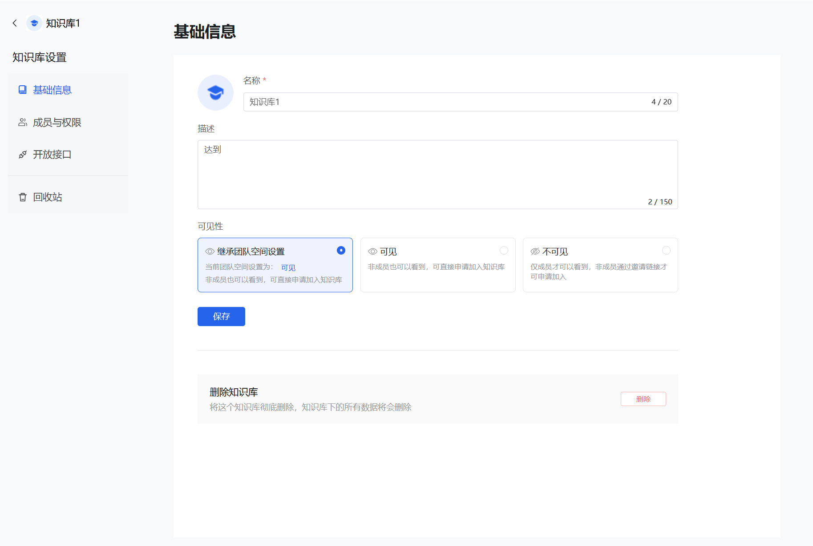

删除知识库：点击「删除」后会彻底移除该知识库，库内所有文档、语料、配置数据将被永久删除，操作不可逆，需谨慎执行。

#### 2、成员与权限管理
成员与权限页面是精细化权限管控的核心入口，用于分配、修改、回收知识库级别的成员权限，遵循「下级自定义 > 上级继承」的优先级规则。

更详情介绍可查看《知识权限管理》文档

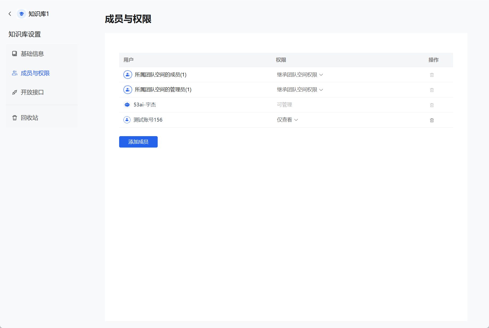

#### 3、开放接口管理
开放接口页面用于将知识库能力对外暴露，支持通过 API 方式接入第三方系统或 AI 开发平台，实现知识的跨场景调用。

1. 核心接口信息\
知识库名称：当前知识库的展示名称，可复制。\
知识库 ID：知识库的唯一标识，用于接口调用时的身份校验，可复制。\
API Endpoint：对外调用的接口地址，所有外部请求需发送至此地址，可复制。\
API Key：接口调用的鉴权密钥，点击「+ 添加」可生成新的 API Key，用于请求时的身份验证，保障接口安全。

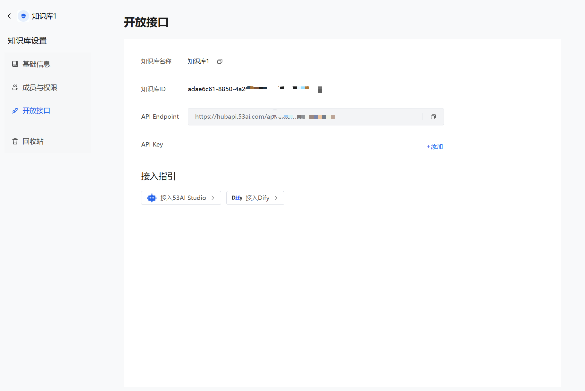

#### 4、回收站
回收站用于暂存被删除的文档，提供数据恢复与清理能力，避免误删导致的数据丢失。

文档删除后，会自动进入回收站，默认保存 30 天，逾期后将被永久删除，无法恢复。

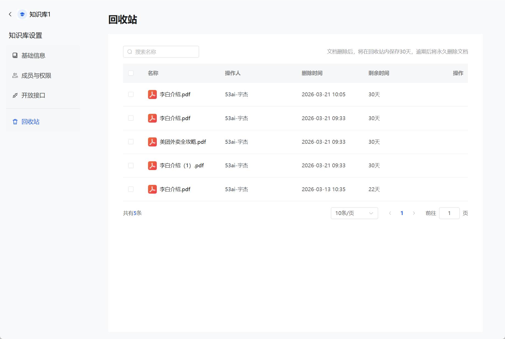

## 二、知识视图：结构化文档管理
进入任意知识库后，默认展示「知识视图」，用于管理知识库内的文档与语料处理进度：
### 1、左侧目录栏
层级结构：展示文件夹（如「手册」「产品 PRD」）与文件（.md、.pdf 等）的树形目录，方便分类管理知识

操作功能：\
点击「+」可新建文件夹或上传新文件（上传文件格式支持：md、txt、html、htm、pdf、pptx、docx、xls、xlsx、csv、xml、epub、MP3等格式, 单个文件最大支持500MB）\
搜索框：快速定位目录内的文件\
展开 / 折叠：控制文件夹的显示层级

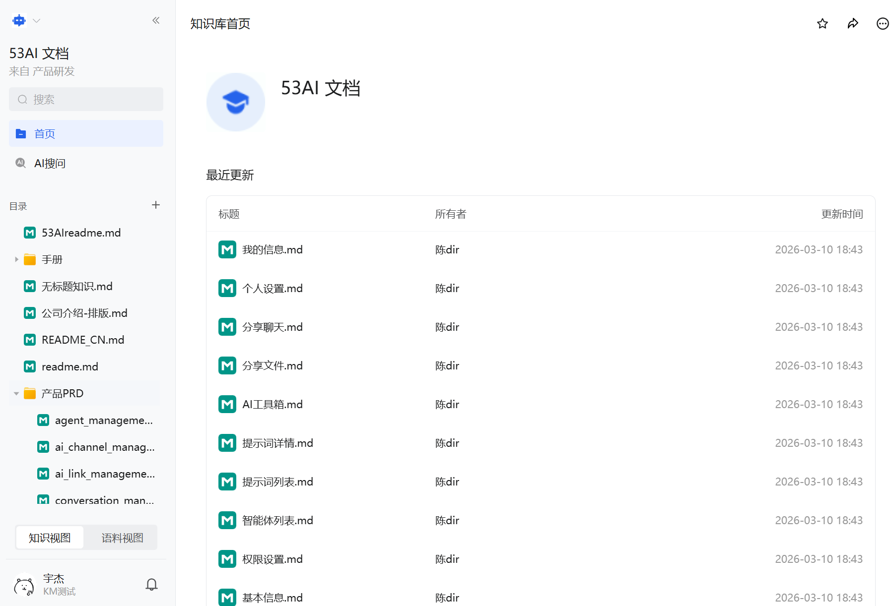

底角编辑器工具：\
可对原文档知识视图进行查看目录、查找关键字、选择及更多视图工具。

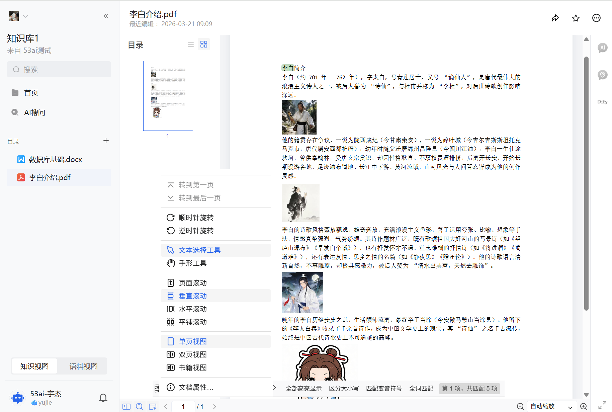

### 2、右侧内容区
知识库首页：\
顶部显示知识库名称、来源空间\
「最近更新」列表：按更新时间排序，展示文件标题、所有者、更新时间，方便快速查看最新变更

右上角功能栏：\
分享：分享当前文档页面的链接
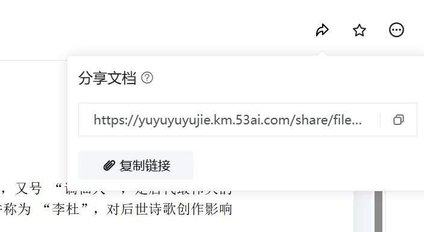

更多：包括对文档的重命名、导出下载、查看当前文档权限、查看历史版本等功能
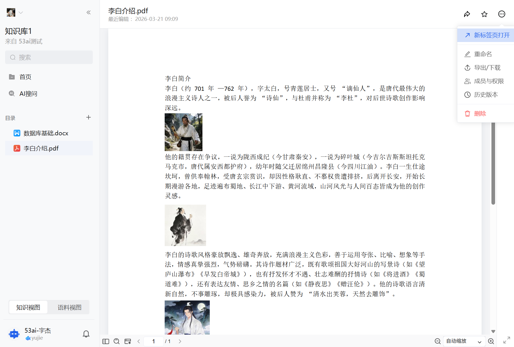

### 3、 AI 搜问（核心功能）
AI 搜问是基于知识库内容的精准问答工具，AI 会自动召回和索引你有权限的知识库文件，根据私有知识回答问题，也可切换为全网搜索。

#### 问答范围控制：
默认范围：当前打开的知识库，AI 仅会在该库的文件中检索答案
精准范围：在输入框输入 @，可快捷选择「最近访问的文件 / 文件夹」，将问答范围缩小到指定文档或目录，让结果更聚焦

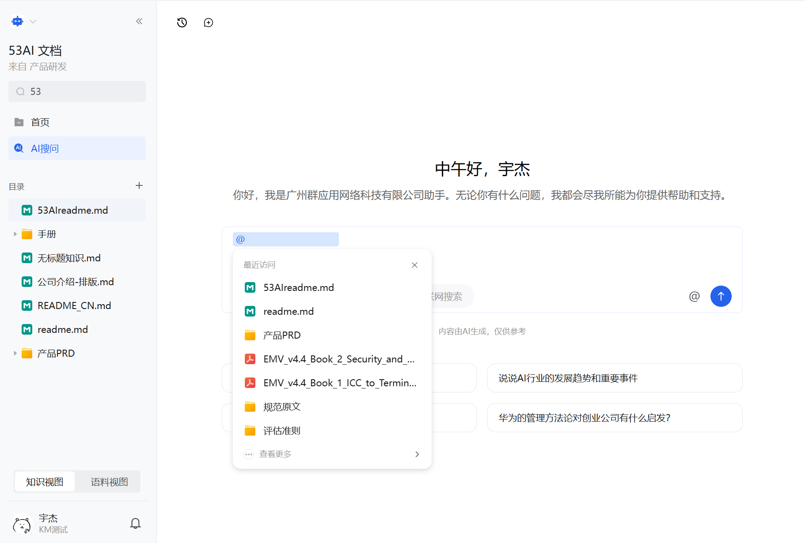

联网搜索：切换为「联网搜索」模式，不再依赖知识库，直接基于全网信息回答（适合知识库未覆盖的通用问题）

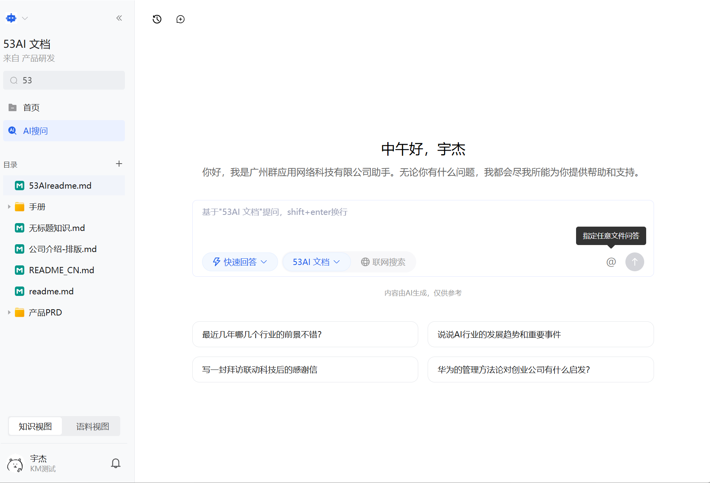

#### 交互细节：
输入框：支持 shift+enter 换行，底部提供高频问题示例（如「说说 AI 行业的发展趋势」），快速发起提问
回答展示：AI 生成的回答会引用知识库原文片段，并标注来源文件，确保答案可追溯

历史会话：侧边栏展示所有对话记录，可随时切换回顾，或点击「+ 新对话」开启全新问答

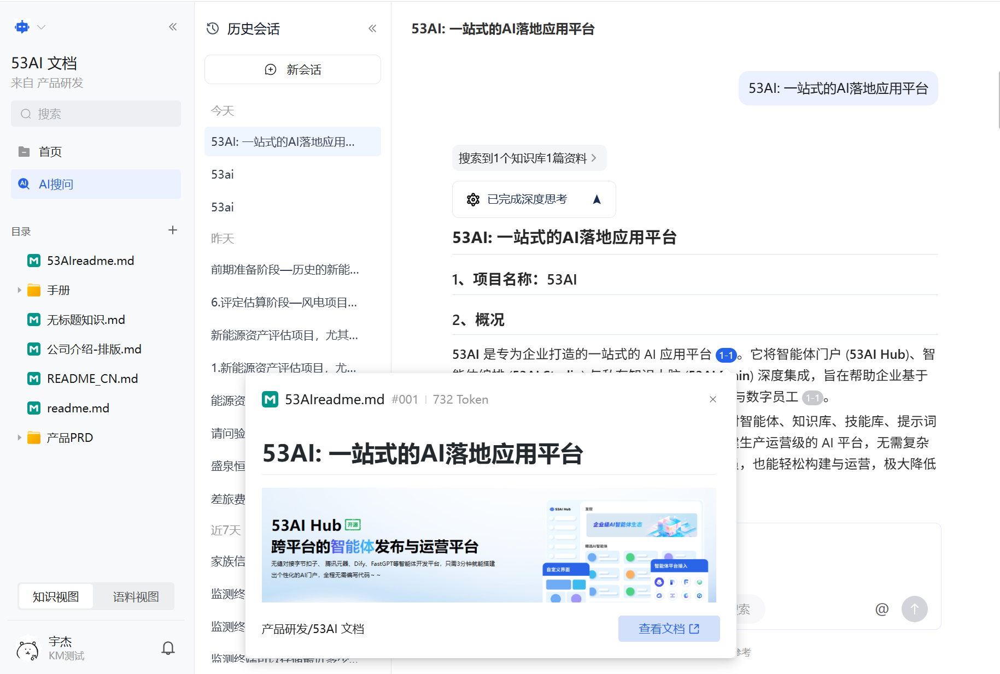

模型切换：可选择「快速回答」「深度思考」模型，进行模型切换实现效果

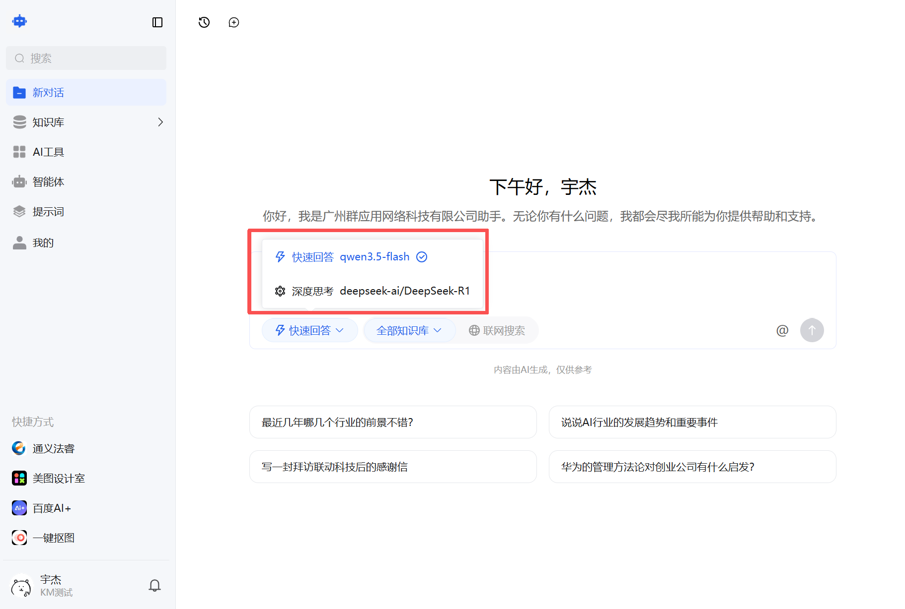

#### 权限约束：
AI 仅会召回你有权限查看的文档，无权限的文件不会出现在检索结果中

## 三、语料视图：语料质量测试
### 1、召回测试
用于测试知识库的检索精度，帮助你优化语料：
输入测试提问（如「53AI 是什么」），点击「测试」

右侧展示「匹配度」的文档列表，包含：匹配得分、数据源文件、内容片段
可对匹配项进行「启用 / 禁用」或「编辑」操作，调整语料的召回优先级，提升问答准确性

召回的分数阈值及片数依据后台AI搜问的设置来决定

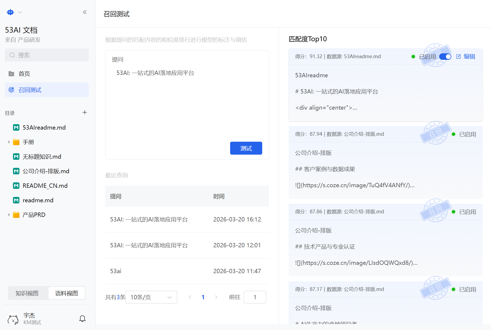

### 2、语料状态管理
同「知识视图」，展示文档的清洗状态与统计数据，方便你监控语料处理进度，排查失败 / 中断的文档。

#### 数据统计：
直观展示文档的语料处理状态：已完成、排队中、清洗中、失败 / 中断的数量，帮助你了解语料入库进度

#### 知识列表：
按状态筛选文档（全部 / 已完成 / 排队中 / 清洗中 / 失败 / 中断）\
展示文档详情：文档名称、清洗策略、处理状态、耗时、文件大小\
操作栏：对文档进行查看、编辑、重新清洗等操作

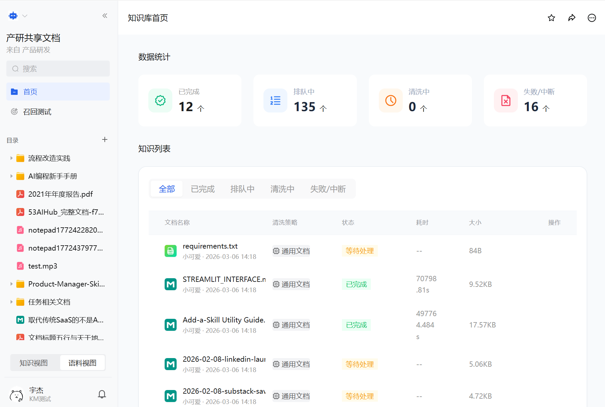