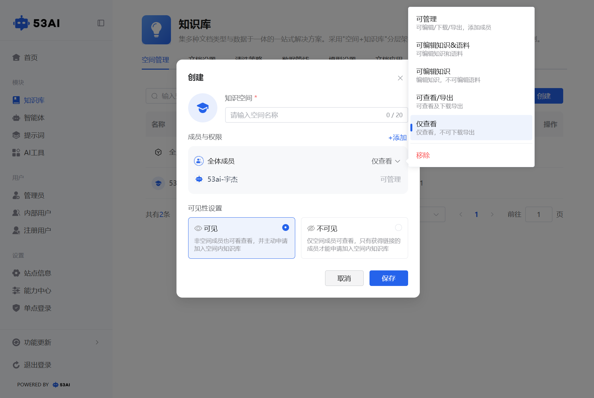
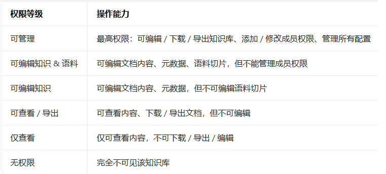
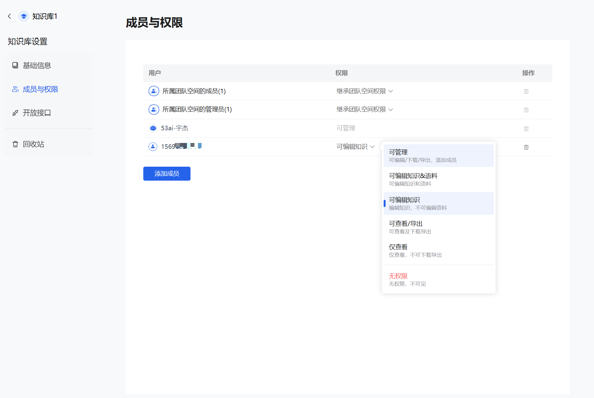
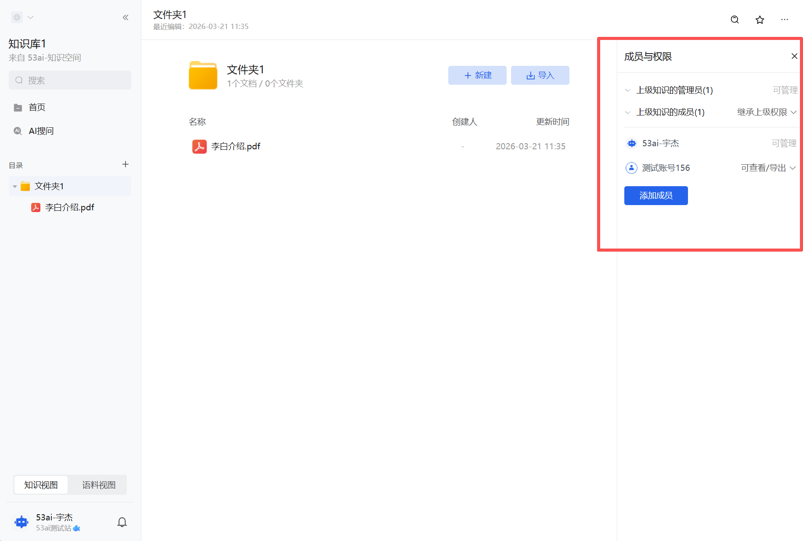
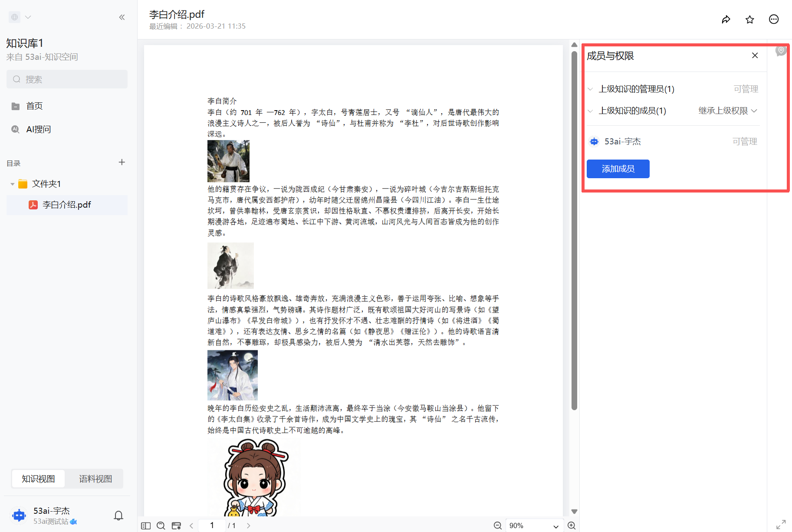
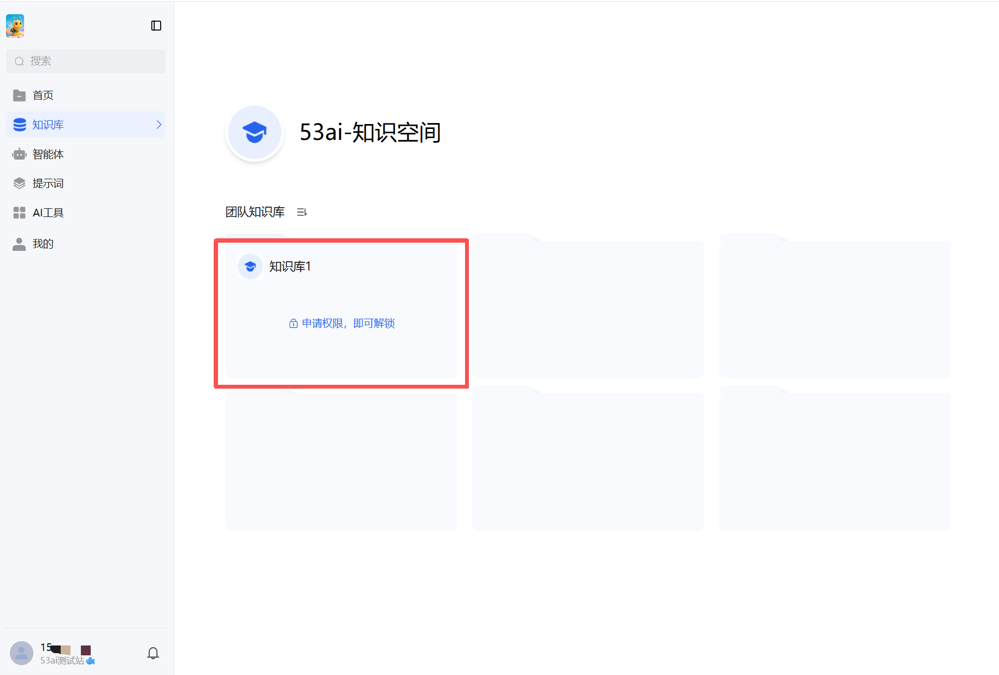
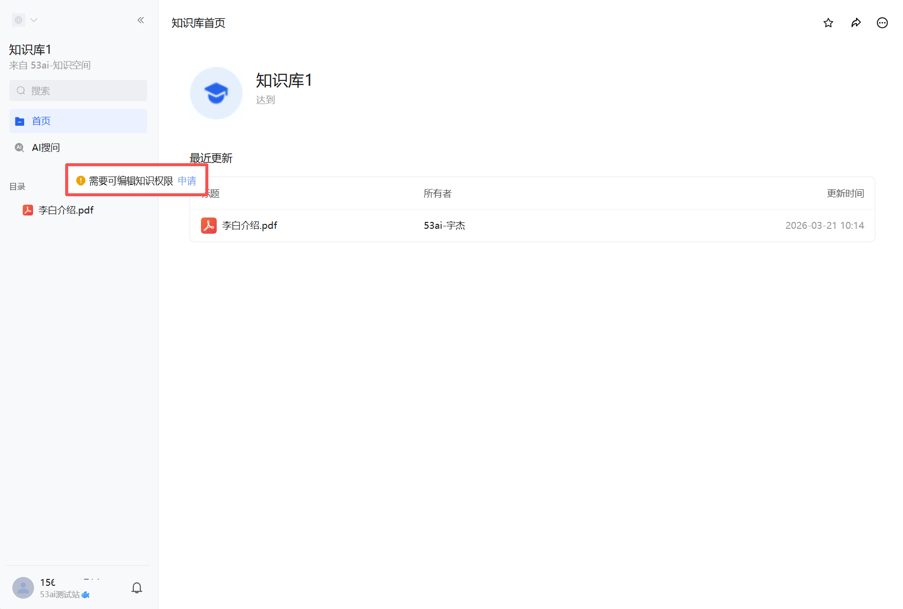
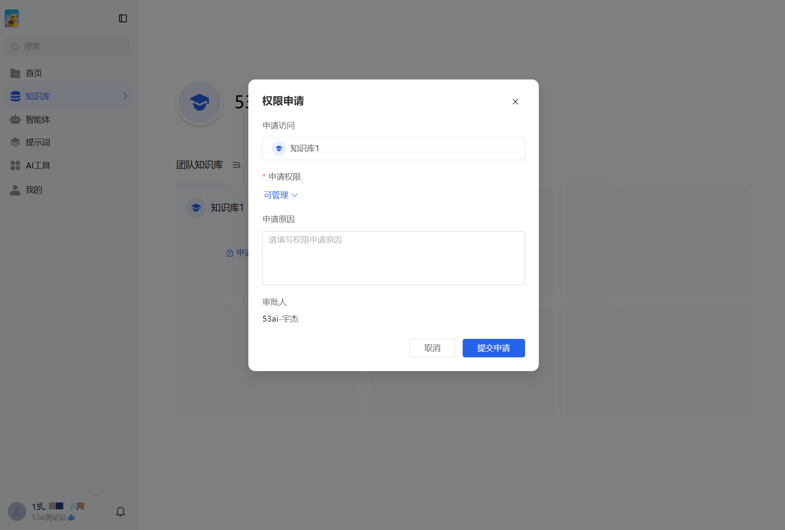
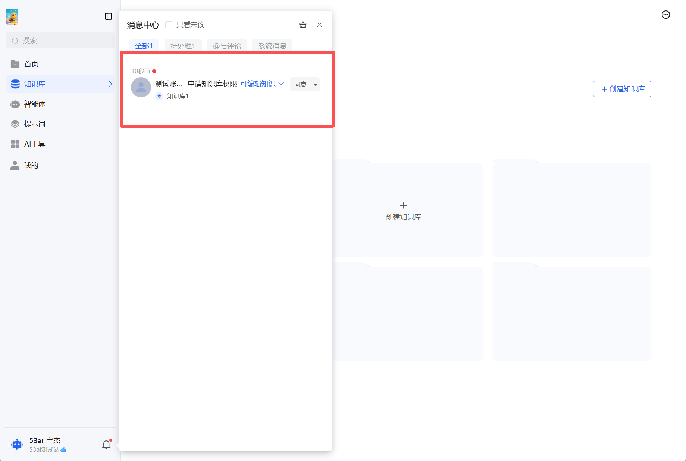

# 知识库权限管理使用指南
## 一、权限层级与继承优先级
系统权限遵循「下级自定义 > 上级继承」的优先级规则：\
1、四级结构：知识空间 → 知识库 → 文件夹 → 文档

2、继承逻辑：若未对某一层级设置自定义权限，则该层级自动继承上一级的权限配置（如文档未单独设权，则继承文件夹权限；文件夹未设权，则继承知识库权限，以此类推）。

3、自定义优先：若对某一层级单独设置了权限，则该权限覆盖上级继承的权限（如空间中成员 A 为「仅查看」，但在某知识库中单独将 A 设为「可管理」，则 A 在该知识库内拥有管理权限，不受空间权限限制）。

## 二、后台知识空间权限配置（顶层权限入口）
知识空间是权限管理的顶层容器，需在后台完成创建与基础权限配置：
### 1. 创建知识空间
1、必填项：空间名称（最多 20 字符）。\
成员与权限设置：\
默认包含「全体成员」，可预设基础权限（如「仅查看」）。\
点击「+ 添加」，可选择成员 / 分组，为特定成员 / 团队分配差异化权限。\
权限选项（空间层级）：「仅查看」「可查看/导出」「可编辑知识」「可编辑知识语料」「可管理」等。

2、可见性设置：\
可见：非空间成员也能看到该空间下的知识库，并可主动申请加入 / 获取权限。\
不可见：仅空间成员可见该空间内容，外部用户需获得专属链接才能申请权限，私密性更强。

### 2. 空间权限的影响
空间权限是所有下属知识库的默认权限基准，未自定义知识库权限时，所有知识库自动继承该空间的成员权限与可见性规则。

## 三、前台知识库权限配置（核心权限层）
知识库是权限管理的核心单元，支持创建时继承 / 自定义权限，创建后也可随时修改：

### 1. 创建知识库时的权限设置
默认继承：创建时自动继承所属知识空间的成员权限（如空间中成员 B 为「仅查看」，则知识库默认 B 为「仅查看」）。

自定义权限：
可在创建弹窗中直接修改成员权限，或添加新成员 / 分组。\
权限选项（知识库层级，更精细化）：

### 2. 知识库创建后的权限管理
进入知识库「设置→成员与权限」页面，可进行以下操作：

添加成员：点击「添加成员」，选择成员 / 分组并分配权限。

修改权限：点击已有成员的权限下拉框，直接切换权限等级（如从「仅查看」改为「可管理」）。

移除成员：删除成员的权限配置，该成员将恢复为继承上级权限或变为「无权限」。

## 四、文件夹与文档层级权限（精细化颗粒度控制）
文件夹和文档的权限逻辑与知识库完全一致，支持更细粒度的权限管控：

### 1. 文件夹权限
默认继承所属知识库的权限。

可单独设置自定义权限：为特定成员 / 分组分配文件夹级别的权限（如知识库中成员 C 为「可管理」，但在某敏感文件夹中设为「仅查看」）。

权限优先级：文件夹自定义权限 > 知识库权限。

### 2. 文档权限
默认继承所属文件夹的权限。

可单独设置自定义权限：为特定文档分配差异化权限（如某核心文档仅对管理员开放「可管理」，其他成员为「仅查看」）。

权限优先级：文档自定义权限 > 文件夹权限 > 知识库权限 > 空间权限。

## 五、权限申请与审批流程（无权限时的解决路径）
当用户无某层级的操作权限时，系统会引导通过申请机制获取权限：
### 1. 权限不足提示
前台场景：\
知识空间 / 知识库不可见时，显示「申请权限，即可解锁」。

进入文档 / 知识库时，提示「需要 XX 权限 申请」（如「需要可编辑知识权限 申请」）。

### 2. 发起权限申请
点击「申请」后，弹出申请窗口：\
申请对象：自动识别当前无权限的层级（如知识库 / 文档）。\
申请权限：选择需要的权限等级（如「可管理」「可编辑知识」）。\
申请原因：填写申请理由（如「需要编辑该文档更新项目信息」）。\
审批人：系统自动匹配该层级的有权限管理员（如知识库的「可管理」成员）。\
提交申请后，审批人会在「消息中心」收到审批通知。

### 3. 核心权限场景与操作约束
文档上传权限：需获得知识库「可编辑知识」及以上权限（可编辑知识、可编辑知识 & 语料、可管理），才能上传新文档 / 文件夹。

语料视图访问权限:需获得知识库「可编辑知识 & 语料」及以上权限（可编辑知识 & 语料、可管理），才能查看语料切片、进行语料拆分 / 合并 / 编辑等操作。

## 六、完整权限流转示例
1、后台创建「产品研发空间」：设置全体成员为「仅查看」，指定管理员为「可管理」，可见性设为「可见」。

2、前台创建「知识库 1」：默认继承空间权限，全体成员仅查看，管理员可管理。

3、自定义「知识库 1」权限：将成员 A 设为「可编辑知识 & 语料」，则 A 在该知识库可编辑文档和语料，但不能管理成员。

4、创建「核心资料」文件夹：未自定义权限，继承知识库权限（A 为可编辑知识 & 语料）。

5、单独设置「核心合同.pdf」权限：将 A 设为「仅查看」，则 A 在该文档仅能查看，无法编辑。

6、新用户 B 访问「知识库 1」：提示无编辑权限，发起「可编辑知识」申请，管理员审批同意后，B 获得该知识库的编辑权限。