# 知识库文档清洗与语料管理使用指南
文档清洗是将非结构化文档转化为可被 AI 精准检索、问答的结构化知识的核心流程，整套流程需先在后台完成规则与能力配置，再在前台完成文档上传、自动化清洗、人工精细化干预，最终实现知识的结构化沉淀与可视化展示，为 AI 搜问提供底层数据支撑。

## 一、后台基础配置（清洗流程前置必备）
在后台知识库模块完成核心配置，所有配置均支持自定义调整，此前展示的管线仅为界面示例，并非系统固定默认配置，可根据业务需求灵活修改。

### （一）数据管线配置（管线配置详细可查看“后台-知识库-数据管线”手册文档）
1、数据管线是文档清洗的全流程自动化流水线，承载文档从上传到最终知识化的全步骤处理逻辑，系统支持新增、编辑、删除任意管线，也可对单条管线内的处理节点进行自定义调整。

2、每条管线可根据业务场景定制化搭建，核心可包含文档解析、语料拆分、向量索引、生成摘要等处理节点，节点的启用、禁用、执行顺序均可人工设定，无需遵循固定流程，可根据文档类型、业务需求灵活组合节点。

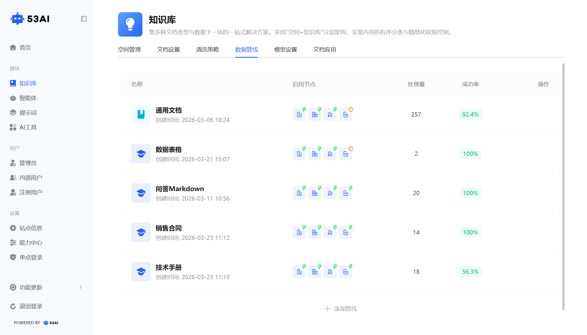

### （二）清洗策略配置
1、清洗策略的核心作用是建立文档与管线的匹配规则，实现上传文档的自动分流处理，无需人工手动分配管线。

2、配置时可通过文件后缀、文件名关键词等条件设置匹配规则，当上传的文档满足某条规则的判定条件时，系统会自动将其分配至对应的管线执行清洗；

3、对于未匹配到任何自定义规则的文档，可设置兜底策略，指定统一的默认管线进行处理。同时支持调整规则的匹配优先级，通过拖动规则顺序，让优先级更高的规则优先被系统判定执行，确保特殊类型文档能进入专属的清洗流程。

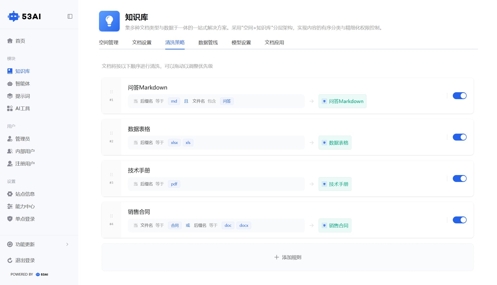

### （三）模型相关配置
在后台模型设置模块，需完成清洗全流程所需 AI 模型的绑定配置，包括语料拆分所用模型、向量索引生成模型、摘要与知识地图生成模型等，不同处理节点可绑定不同性能的模型，平衡清洗效率与知识生成质量，模型的选择与切换均支持自定义操作。

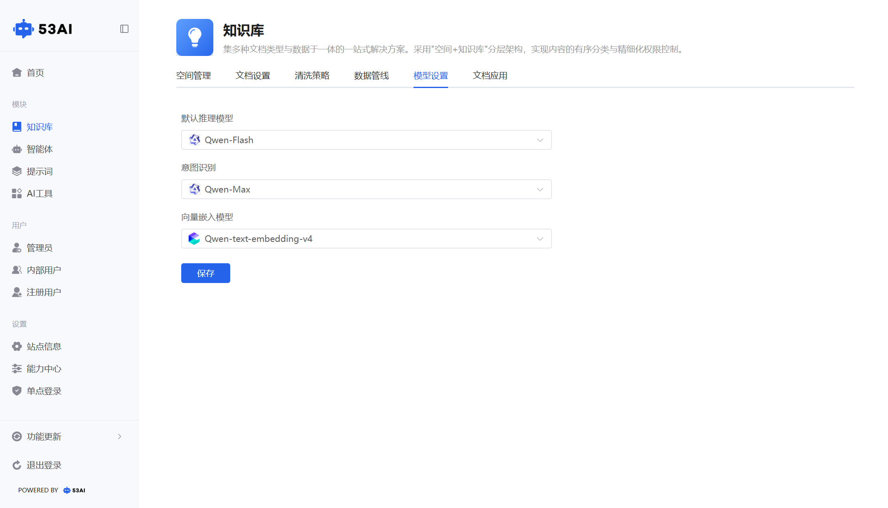

## 二、前台文档上传与清洗流程触发
完成后台所有配置后，在前台知识库模块进行文档上传，系统会自动匹配清洗策略与对应管线，启动完整的清洗流程。

### （一）文档上传入口
进入目标知识空间下的指定知识库后，在左侧目录操作栏点击添加按钮，可选择三种操作方式：新建知识实现在线文档创作、新建文件夹用于文档的分类层级管理、上传文件或上传文件夹实现本地文档的批量导入，支持 PDF、MD、xlxs、docx等多种格式的文档上传。

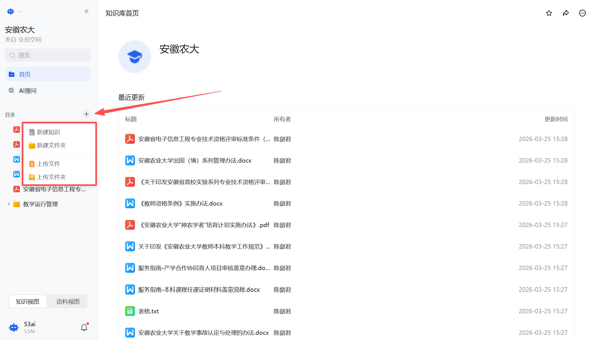

### （二）上传与清洗启动逻辑
文档上传完成后，系统会弹出上传成功的提示信息，随即自动根据后台配置的清洗策略，匹配对应的处理管线，文档即刻进入清洗队列，无需人工手动触发清洗操作。可在知识库的语料视图页面，实时查看该文档的清洗状态，包括排队中、清洗中、已完成、失败中断等不同状态，同时可查看失败的具体节点原因，便于后续排查问题。

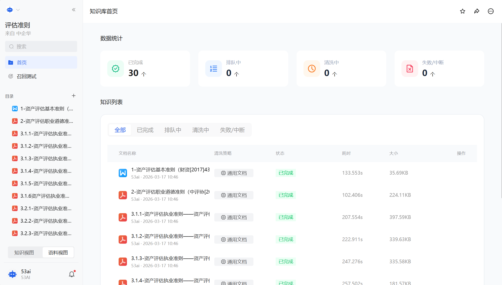

## 三、清洗管线执行与人工干预操作
文档进入管线后，系统会按照预设的节点顺序自动执行清洗流程，同时支持在管线完成或中断后，进行人工节点干预，也可通过修改解析内容重触发管线流程。

### （一）自动化清洗核心节点执行逻辑
1、文档解析节点：负责将非结构化的原始文档（如 PDF、图片、Word）转化为结构化文本，完成文字提取、排版解析、图片内容识别等基础处理。

2、语料拆分节点：在文档解析后，按照后台设定的拆分规则（如按段落、语义、固定 Token 长度等），将长文档拆分为若干独立的语料切片，适配不同检索场景。

3、向量索引节点：为每个语料切片生成向量数据并建立索引块，作为 AI 搜问时快速语义匹配的核心基础，确保精准召回相关语料。

4、生成摘要节点：基于文档整体内容，自动生成文档摘要、配套标签，并完成知识地图的生成准备，丰富文档的知识展示维度。

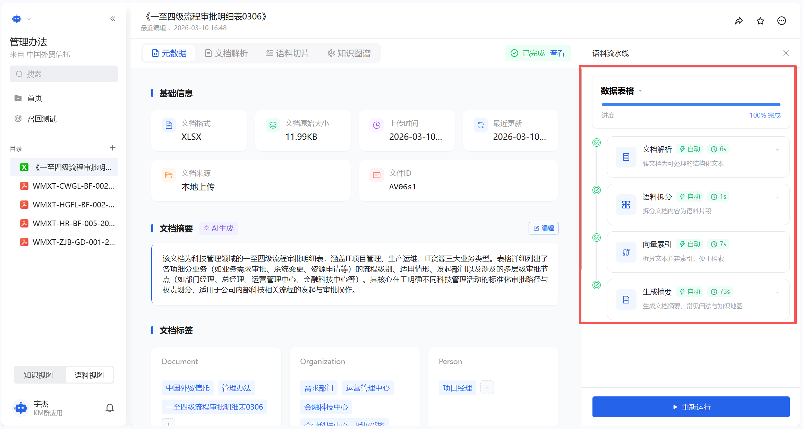

### （二）管线节点的手动干预执行
操作前提：
当管线执行完成、中途中断或执行失败后，支持对任意单个节点进行重新设置与执行，无需重新运行整条管线。

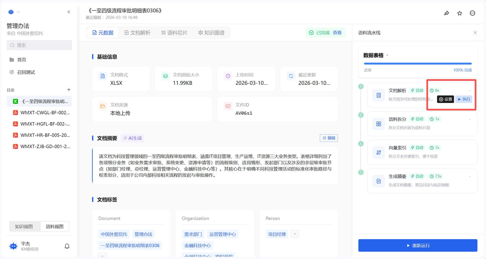

选择执行模式：\
仅执行当前节点：只重新运行该单个节点，已完成的后续节点不受影响。\
执行当前与后续节点：从该节点开始，重新运行该节点及之后所有的管线节点，确保节点变更后的内容能同步到后续流程。

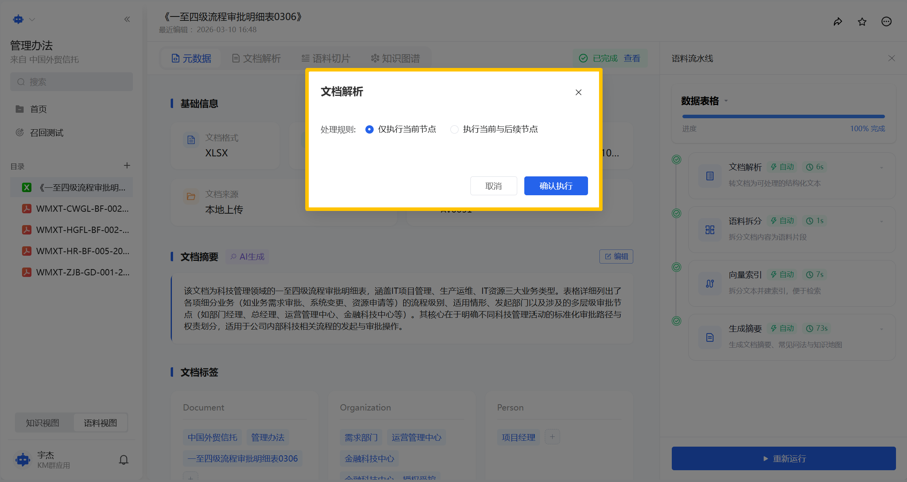

### （三）文档解析内容修改与管线重触发
若对系统自动执行的文档解析结果不满意，比如文字识别错误、排版解析混乱等情况，可进入文档解析页面，手动修改解析后的文本内容，修正所有不符合需求的解析问题。

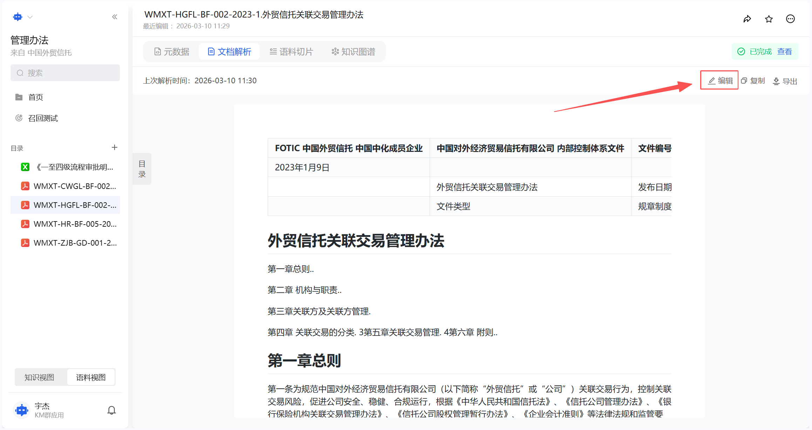

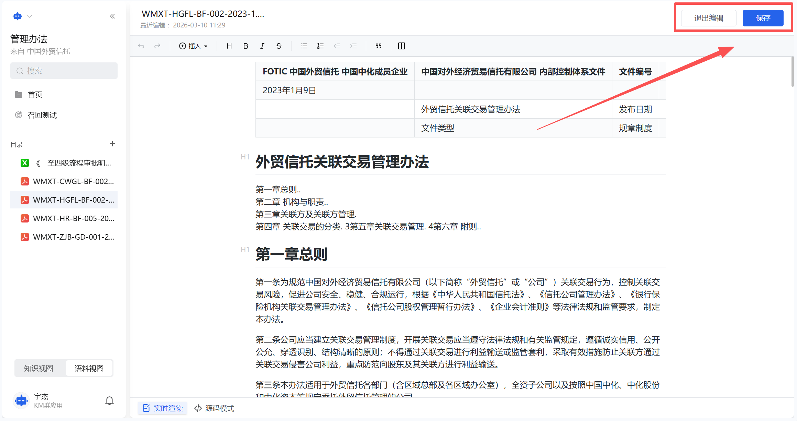

当手动修改解析内容并保存后，系统会自动判定文档内容发生变更，无需人工操作，文档会重新进入对应的清洗管线，从文档解析节点开始，依次执行后续所有的处理流程，保证后续的语料拆分、向量索引等环节，均基于最新的手动修改后的解析内容执行。

## 四、语料切片精细化管理操作
管线全部执行完成后，可进入文档的语料切片页面，对系统自动拆分的语料切片进行全维度的精细化管理，包括内容编辑、状态控制、合并重拆分、索引同步等操作，是优化 AI 检索精度的核心环节。

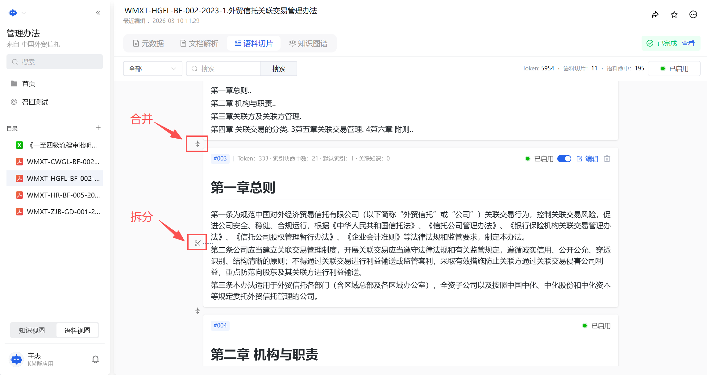

### （一）切片基础信息展示
语料切片页面会展示所有拆分后的切片列表，每一个切片都会清晰显示编号、Token 消耗数量、索引命中次数、关联知识数量，以及切片的启用禁用状态；页面顶部还会统计当前文档的总 Token 数、总切片数量、有效语料命中数，便于整体把控语料情况。

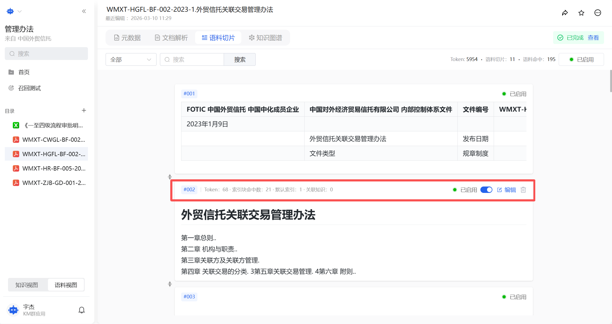

### （二）单切片编辑与检索配置
1、编辑切片核心内容：\
在切片编辑区域，可直接修改切片的原始文本内容，调整知识表达的准确性，适配业务需求。

2、查看索引块对应关系：\
页面中展示该切片对应的索引块内容（AI检索时的核心匹配依据），可同步查看索引块与切片原文的对应关系。

3、编辑概要信息与常见问法：

可查看系统自动生成的切片内容概要，也可手动编辑补充概要信息；
可添加、修改与该切片内容相关的常见问法，完善常见问法能大幅提升AI搜问时的语义匹配精度，让用户自然提问更易召回目标切片。

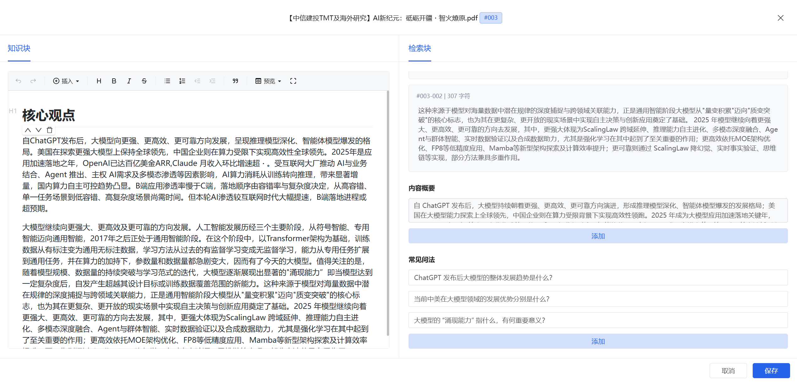

### （三）切片启用禁用控制与筛选
系统支持全局与单个两种模式的切片启用禁用控制，且禁用后的切片不会被 AI 检索到，不会出现在搜问的召回结果中：在切片列表页面的右上角，设有全局开关，可一键控制所有切片的启用或禁用状态，适用于批量调整语料检索范围；

每一个独立切片的操作区域，也设有单独的状态开关，可对单个切片进行启用或禁用，精准控制某一块语料是否参与检索；

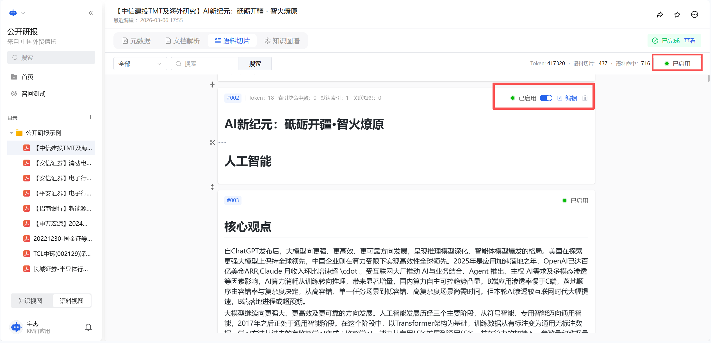

同时页面支持按切片状态进行筛选，可选择查看全部切片、仅已启用切片、仅已禁用切片，快速定位需要调整的目标切片，提升管理效率。

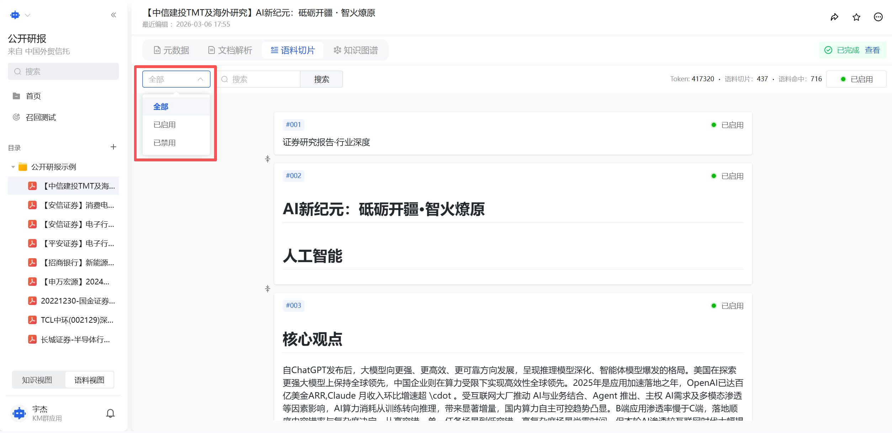

## 五、文档元数据管理与知识地图可视化
清洗流程中的生成摘要节点执行完成后，可对文档的元数据进行管理，同时可查看系统生成的知识地图，实现知识的可视化展示与人工优化。

### （一）文档元数据查看与编辑
进入文档的元数据页面，可查看文档的基础信息，包括文档格式、原始文件大小、上传时间、文件来源、唯一文件 ID 等核心信息；

页面中会展示系统自动生成的文档摘要，该摘要可直接进行手动编辑、修改、补充，完善文档的核心内容概括；

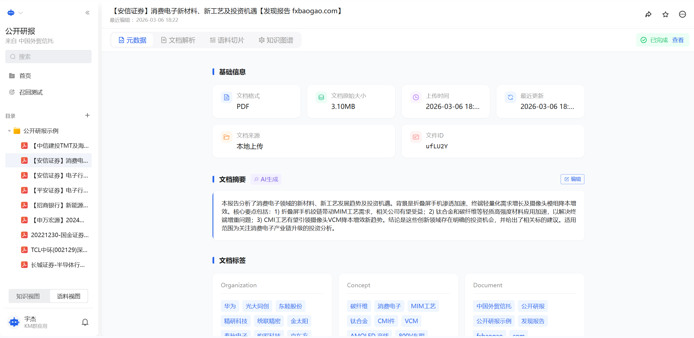

同时展示系统自动生成的文档标签，所有标签均支持手动编辑、删除、新增操作，可根据业务分类需求自定义标签体系，无需局限于系统自动生成的内容。

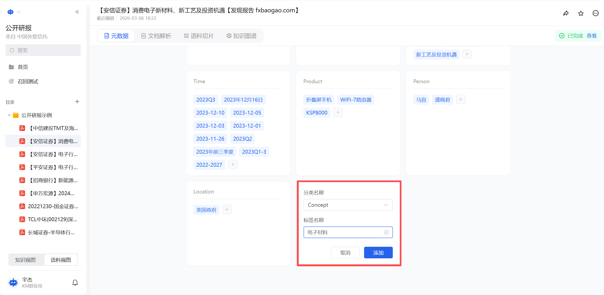

### （二）知识地图查看与展示
系统生成的知识地图无需额外操作，在知识库的知识视图页面右侧，设有专门的知识地图查看入口，点击即可展开可视化的知识地图；知识地图以节点与连线的形式，直观展示文档内部的知识结构与逻辑关联，帮助快速理解文档的核心框架，是文档知识可视化的重要呈现形式。

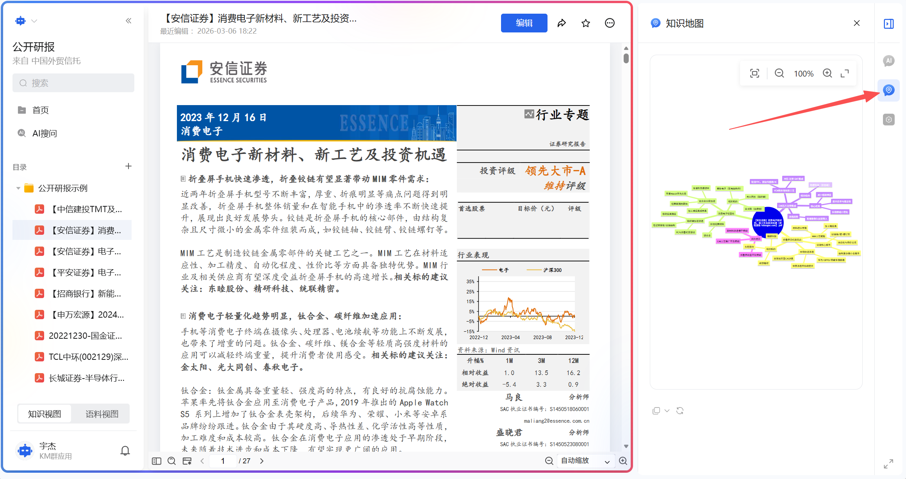

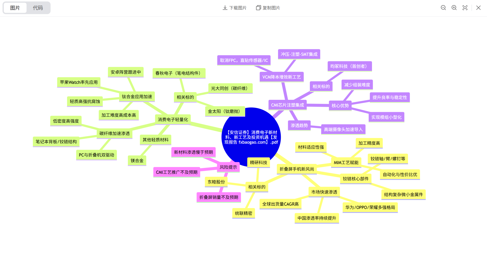