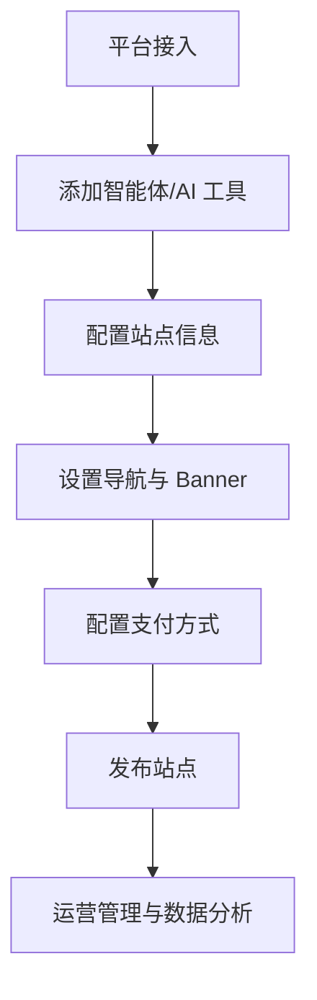

# 53AI Hub 管理后台用户手册

> 最后更新：2026 年 3 月 17 日  
> 后台地址：https://kmmix.53ai.com/console/?#/index

---

## 📋 目录结构

```
管理后台/
├── 📊 首页/仪表盘
├── 🧩 应用管理
│   ├── AI 产品.md       # 主流 AI 工具一键跳转与管理
│   ├── AI 工具.md       # AI 工具接入与分组管理
│   ├── 提示词.md        # 提示词配置与权限管理
│   └── 智能体.md        # 智能体接入与部署
├── 🎨 站点装修
│   ├── Banner 图.md     # 首页 Banner 配置
│   ├── 导航管理.md      # 前台导航栏设置
│   └── 模板风格.md      # 站点风格与主题配色
├── ⚙️ 站点配置
│   ├── 三方统计.md      # 第三方统计代码接入
│   ├── 单点登录.md      # SSO 登录 API 接入
│   ├── 平台接入.md      # 智能体/云计算/大模型平台接入
│   ├── 支付配置.md      # 微信/PayPal 支付设置
│   ├── 站点信息.md      # 站点基本信息与模板
│   ├── 站点域名.md      # 专属域名与独立域名绑定
│   └── 订阅服务.md      # 订阅套餐配置
└── 👥 运营管理
    ├── 注册用户.md      # 用户信息管理与编辑
    ├── 管理员.md        # 管理员权限设置
    ├── 订单数据.md      # 订单查看与手动管理
    └── 订阅服务.md      # 订阅服务套餐设置
```

---

## 🚀 快速入门

### 1. 登录后台
访问 https://kmmix.53ai.com/console/?#/index 使用管理员账号登录

### 2. 核心功能概览

| 模块 | 功能 | 用途 |
|------|------|------|
| **应用管理** | AI 产品/工具/提示词/智能体 | 管理前台展示的 AI 应用能力 |
| **站点装修** | Banner/导航/模板 | 自定义站点外观与导航结构 |
| **站点配置** | 平台接入/支付/域名 | 配置站点核心功能与第三方服务 |
| **运营管理** | 用户/订单/订阅 | 管理用户、订单与订阅套餐 |

### 3. 典型工作流程



---

## 📌 更新日志

### 2026-03-17
- ✅ 更新平台接入文档（扣子、Dify、火山方舟等）
- ✅ 更新智能体接入流程
- ✅ 更新提示词配置说明
- ✅ 添加单点登录 API 接入文档

---

## 🔗 相关资源

- **产品官网**: https://53ai.com
- **技术支持**: 查看平台接入文档获取各平台官方文档链接
- **API 文档**: 参见「单点登录」章节
