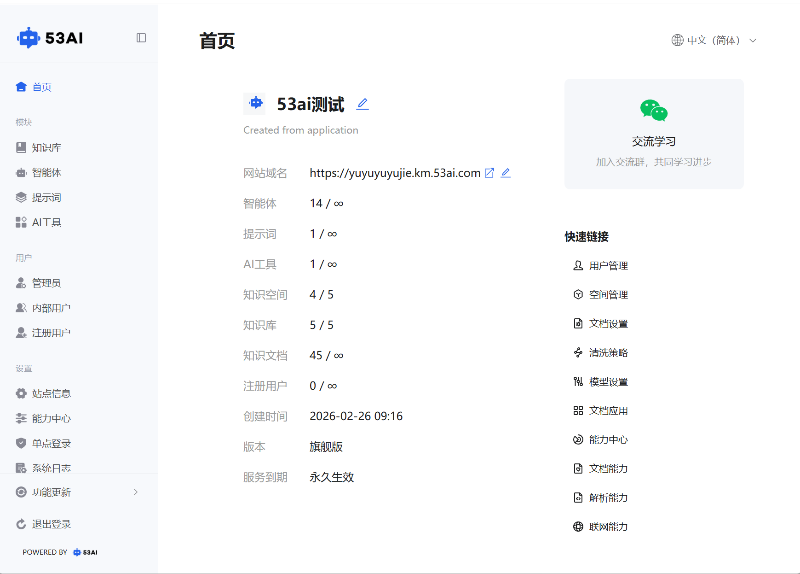
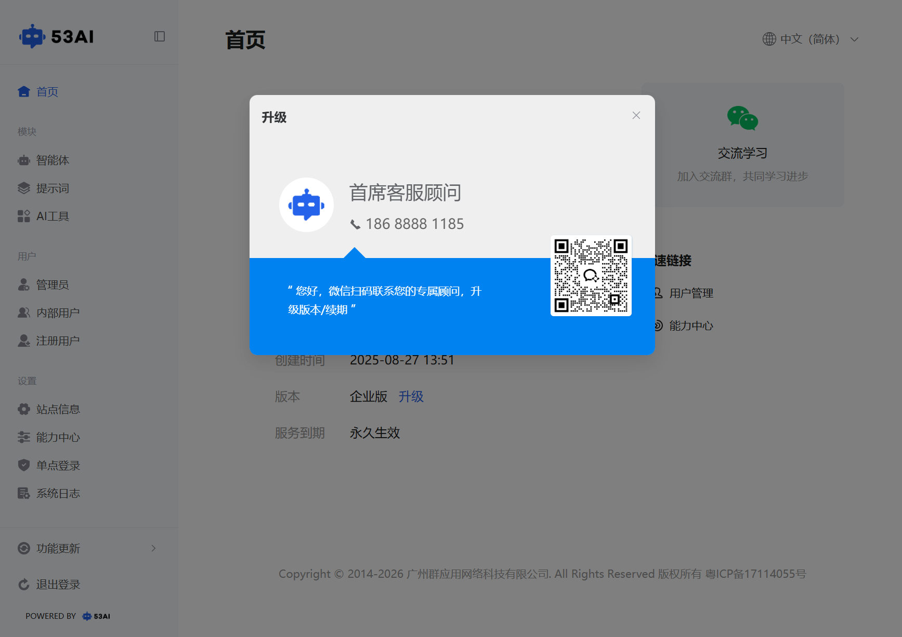

# 后台首页
「后台首页」是管理员进入系统后的首个页面，集中展示站点核心信息、资源使用情况与版本状态，同时提供快捷操作入口与多语言支持。
## 一、站点概览区（核心信息展示）
### 1、站点名称：
显示当前站点名称（如「53ai 测试」），点击右侧编辑图标可修改名称。
### 2、网站域名：
展示当前访问域名，支持复制与编辑操作。
### 3、资源使用统计：
直观展示各模块(智能体、提示词、AI 工具、知识文档、知识空间、知识库、注册用户)使用情况，格式为「已用数量 / 上限」。
### 4、版本与服务信息：
-创建时间：站点创建的精确时间（如2026-02-26  09:16）。\
-版本：当前使用的版本类型（如「创业版」「专业版」「企业版」「旗舰版」）。\
-服务到期：显示服务有效期（如「永久生效」）。

## 二、版本控制与资源限制
### 1、系统功能与资源配额受版本等级控制
-版本类型：创业版、专业版、企业版、旗舰版。\
-受控资源：智能体、提示词、AI 工具、知识空间、知识库、知识文档等模块的数量上限。\
-版本差异：高版本（如旗舰版）拥有更多资源配额与高级功能，低版本（如创业版）资源与功能受限。
### 2、版本升级
若当前版本为较低版本等，可点击「升级」按钮，弹出「首席客服顾问」窗口：\
-显示专属顾问电话（如186 8888 1185）与微信二维码。\
-扫码联系客服，可进行版本升级或服务续期，解锁更多资源与功能。

## 三、辅助功能与操作
### 1. 语言切换
点击右上角「中文（简体）」下拉菜单，可切换界面语言：
中文（简体）、中文（繁體）、English (US)、日本語。
切换后界面文字将立即更新为所选语言。

### 2. 交流学习
点击右侧「交流学习」卡片，可扫码加入交流群，获取产品使用教程与同行交流。

### 3. 快速链接
右侧「快速链接」板块提供高频功能入口，包括：
用户管理、空间管理、文档设置、清洗策略、模型设置。
文档应用、能力中心、文档能力、解析能力、联网能力。
点击即可跳转至对应配置页面，提升操作效率。