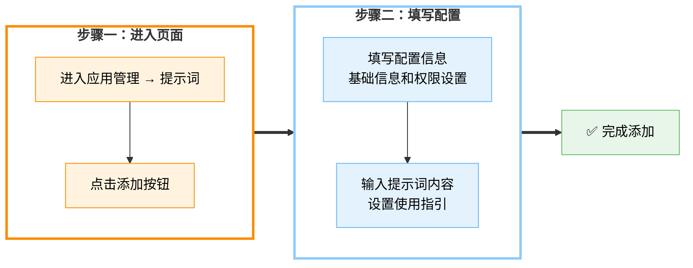

# 📝 提示词

**提示词**是一种用于引导大语言模型生成特定内容或完成特定任务的输入信息，通过明确的指令、背景设定或示例内容，帮助模型理解上下文并输出更符合预期的结果，常用于提升智能体在内容创作、数据处理、决策辅助等场景中的准确性与实用性。

在「**应用管理 → 提示词**」模块中，你可以添加使用频率较高的提示词一键部署至前台，为搭建智能体提供强大的提示词能力。同时，平台支持为每个提示词配置使用权限，你可以根据订阅等级或用户角色灵活管控访问范围，确保功能精准触达目标用户。


---

## 📦 功能概览

| 功能 | 说明 |
|------|------|
| **提示词管理** | 创建、编辑、删除提示词模板 |
| **分组管理** | 按场景或用途分类管理提示词 |
| **权限配置** | 设置提示词的访问权限（订阅等级/用户分组） |
| **使用指引** | 添加使用案例和场景说明，帮助用户快速上手 |
| **一键部署** | 将提示词快速发布到前台供用户使用 |

---

## ➕ 添加提示词



在「**应用管理 → 提示词**」页面，点击「**添加**」，进入提示词基础信息的设置。


### 步骤一：基础信息设置

| 字段 | 说明 | 要求 |
|------|------|------|
| **分组** | 选择提示词所属分类 | 必须选择已有分组 |
| **标题** | 提示词的展示名称 | 2-30 字，简洁明确 |
| **描述** | 简述提示词的用途和功能 | 50-100 字 |
| **图标** | 提示词的标识图标 | PNG/JPG，64×64px |

### 步骤二：使用范围（权限设置）

设置用户的使用权限，管控前台用户访问范围，使提示词可以精准抵达目标用户。

| 权限类型 | 说明 |
|----------|------|
| **公开** | 所有用户均可使用 |
| **订阅用户** | 仅付费订阅用户可用 |
| **指定分组** | 仅特定用户分组成员可用 |
| **管理员** | 仅管理员可见可用 |

添加完成后点击「**确定**」，进入提示词「**内容**」与「**使用指引**」界面。

---

## 📄 提示词内容

"提示词内容"用于指导大语言模型理解任务意图，明确生成方向，是驱动智能体完成各类操作的核心要素。通过精心设计的提示词内容，用户可以控制模型的语气、格式、逻辑结构和输出范围，广泛应用于自动写作、对话交互、数据分析、知识问答等场景，显著提升智能体的执行效率和输出质量。


### 提示词设计技巧

#### 1. 结构化提示词

```markdown
# 角色设定
你是一位专业的内容创作者，擅长撰写各类文章。

# 任务描述
根据用户提供的主题，撰写一篇 800-1000 字的文章。

# 输出要求
1. 文章结构清晰，包含引言、正文、结论
2. 语言流畅，表达准确
3. 内容原创，避免抄袭
4. 适当使用小标题分段

# 示例
主题：人工智能的未来
输出：[一篇完整的文章]
```

#### 2. 常用变量

| 变量 | 说明 | 示例 |
|------|------|------|
| `{{input}}` | 用户输入内容 | `请分析{{input}}` |
| `{{topic}}` | 主题/话题 | `写一篇关于{{topic}}的文章` |
| `{{style}}` | 写作风格 | `用{{style}}风格撰写` |
| `{{length}}` | 输出长度 | `生成{{length}}字的回复` |

#### 3. 提示词模板

**内容创作类：**
```
你是一位专业的{{role}}。请根据以下要求完成{{task}}：
- 主题：{{topic}}
- 风格：{{style}}
- 字数：{{length}}

请开始创作：
```

**数据分析类：**
```
请分析以下数据并提供洞察：

数据：{{data}}

分析维度：
1. 趋势分析
2. 异常检测
3. 关键发现
4. 建议措施

请以结构化格式输出分析结果。
```

**对话交互类：**
```
你是一位{{role}}，你的任务是{{task}}。

对话规则：
1. 保持友好专业的语气
2. 回答简洁明了
3. 主动询问澄清问题
4. 提供实用建议

用户：{{input}}
```

---

## 📖 使用指引

使用指引模块旨在通过 `"使用案例"` 和 `"使用场景"` 两个部分，帮助前台用户快速理解提示词的使用方式与应用范围。在前台使用提示词时，用户可通过侧边栏入口随时查看该部分内容，提升上手效率与使用体验。


### 使用案例

点击 `**添加**` 按钮，设置 `**输入**` 和 `**输出**`，创建使用案例，帮助用户更直观地了解提示词的操作流程，提升使用体验。


**案例格式：**

| 字段 | 说明 | 示例 |
|------|------|------|
| **输入** | 用户的实际输入内容 | `主题：人工智能的发展` |
| **输出** | 期望的模型输出结果 | `一篇关于 AI 发展的文章...` |
| **说明** | 案例的使用说明（可选） | `适用于撰写行业分析文章` |

### 使用场景

点击 `**添加**` 按钮，上传示图并设置场景描述，为应用添加更多实际使用场景，便于用户快速理解应用的适用范围。


**场景说明：**
- 描述该提示词适合的使用场景
- 说明能解决什么问题
- 提供使用建议和注意事项

---

## 📁 分组管理

在「**提示词**」页面，点击左上角的「**全部分组**」按钮，即可进行特定分组的管理。

如果你只想对某一分组下的提示词进行查看与编辑，在该分组前面的"□"内打上"√"，点击「**确定**」按钮即可。


你可以点击「**全部分组**」下的「**分组管理**」按钮，进行提示词分组的添加与修改。


### 分组操作

| 操作 | 方法 | 说明 |
|------|------|------|
| **新增分组** | 点击「**+ 添加**」，在弹出的文本框中输入分组名称（不超过 10 个字符），按下回车或点击确认完成创建 | 建议按场景或行业分类 |
| **命名或重命名** | 单击已有分组名称，直接编辑文本框内容，按回车保存 | 可随时修改 |
| **顺序调整** | 将鼠标悬停在分组左侧的拖拽手柄上，按住并拖动即可调整分组显示顺序 | 常用分组置顶 |

### 推荐分组

```
📝 内容创作
├── 文章写作
├── 文案撰写
├── 邮件模板
└── 社交媒体

💼 职场办公
├── 会议纪要
├── 工作报告
├── PPT 大纲
└── 数据分析

💻 编程开发
├── 代码生成
├── 代码审查
├── Bug 调试
└── 文档编写

📚 学习教育
├── 知识点讲解
├── 习题解答
├── 论文写作
└── 语言学习

🎨 创意设计
├── 创意构思
├── 设计建议
├── 配色方案
└── 文案创意
```

---

## ✏️ 编辑与删除

### 编辑提示词

1. 找到需要编辑的提示词
2. 点击卡片右上角的「**编辑**」按钮
3. 修改相关信息
4. 点击「**保存**」完成更新

### 删除提示词

1. 找到需要删除的提示词
2. 点击卡片右上角的「**删除**」按钮
3. 在确认弹窗中点击「**确定**」

> ⚠️ **警告**：删除后无法恢复，请谨慎操作！

---

## 💡 提示词设计最佳实践

### 1. CLEAR 原则

| 原则 | 说明 |
|------|------|
| **C**oncise（简洁） | 语言简洁明了，避免冗余 |
| **L**ogical（逻辑） | 结构清晰，逻辑连贯 |
| **E**xplicit（明确） | 指令明确，不含糊其辞 |
| **A**daptive（适应） | 适应不同场景和用户需求 |
| **R**eflective（反思） | 包含自我检查和修正机制 |

### 2. 提示词优化技巧

- **角色设定**：明确 AI 的角色和身份
- **任务描述**：清晰说明要完成的任务
- **输出格式**：指定期望的输出格式
- **示例提供**：提供输入输出示例
- **约束条件**：说明限制和要求

### 3. 常见错误避免

- ❌ 指令模糊不清
- ❌ 缺少上下文信息
- ❌ 期望输出不明确
- ❌ 忽视边界情况
- ❌ 缺少示例说明

---

## ❓ 常见问题

### Q1: 提示词长度有限制吗？
- 建议控制在 2000 字以内
- 过长的提示词可能影响模型理解

### Q2: 如何测试提示词效果？
- 在编辑页面使用预览功能
- 在前台实际使用测试
- 根据反馈持续优化

### Q3: 提示词可以导出分享吗？
- 当前版本支持复制提示词内容
- 批量导出功能开发中

### Q4: 如何优化提示词效果？
- 添加更明确的角色设定
- 提供具体的示例
- 细化输出要求
- 持续测试和迭代

---

## 🔗 相关文档

- [智能体管理](./智能体.md) - 智能体接入与配置
- [AI 工具管理](./AI 工具.md) - AI 工具添加与管理
- [AI 产品](./AI 产品.md) - AI 产品快捷入口

---

**最后更新**：2026 年 3 月 17 日
