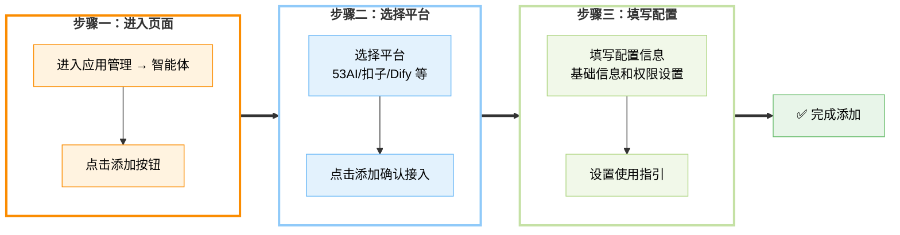

# 🤖 智能体

**智能体**是一类由大语言模型驱动的智能工具，能够根据提示完成任务拆解、信息分析、内容生成等操作，常用于辅助处理复杂或重复性高的工作。

在「**应用管理 → 智能体**」模块中，你可将预先搭建好的智能体（如"行业洞察""竞品分析""SWOT 分析"等）一键部署至前台，快速启动 AI 能力。同时，平台支持为每个智能体配置使用权限，你可以根据订阅等级或用户角色灵活管控访问范围，确保功能精准触达目标用户。


---

## 📦 功能概览

| 功能 | 说明 |
|------|------|
| **多平台接入** | 支持 53AI、扣子、Dify、FastGPT 等多个智能体平台 |
| **智能体管理** | 创建、编辑、删除智能体应用 |
| **权限配置** | 设置智能体的访问权限和使用范围 |
| **使用指引** | 添加使用案例和场景说明 |
| **调试预览** | 发布前测试智能体效果 |

---

## ➕ 添加智能体



在「**应用管理 → 智能体**」页面，点击「**添加**」后，首先从下拉列表中选择已接入的平台（如 53AI、Dify、FastGPT 等）。

> ⚠️ **注意**：确保目标平台已在「**站点配置 → 平台接入**」完成授权或 API 配置。

选中智能体平台后，点击「**添加**」进入选择智能体并进行基础信息的设置。


---

## 🔧 以扣子平台为例

### 步骤一：添加基础信息

- **选择智能体**：设置相应工作空间与智能体
- **基础信息**：创建应用时，你需要给应用起一个名字、选择合适的图标，或者上传喜爱的图片用作图标、设置分组、使用一段清晰的文字描述此应用的用途，以便后续应用在团队内的使用。


| 字段 | 说明 | 要求 |
|------|------|------|
| **工作空间** | 选择扣子平台的工作空间 | 必须选择 |
| **智能体** | 选择要接入的智能体 | 从已发布的智能体中选择 |
| **应用名称** | 在前台展示的名称 | 2-30 字 |
| **图标** | 应用标识图标 | PNG/JPG，64×64px |
| **分组** | 所属分类 | 必须选择已有分组 |
| **描述** | 功能简介 | 50-100 字 |

---

### 步骤二：应用配置

应用配置是将接入的智能体正式投入使用前的关键设置步骤，主要用于补充开场白和提问引导等欢迎语信息、配置权限范围、启用拓展功能，并支持调试与预览效果，确保智能体以合适的身份、方式和范围出现在前端。


#### 欢迎语

设置适当的开场白，或对用户进行提问引导。

**示例：**
```
你好！我是你的智能助手，可以帮你：
- 分析行业趋势
- 生成营销文案
- 解答专业问题

请告诉我你需要什么帮助？
```

#### 拓展设置

根据智能体实际应用场景，决定是否开启以下功能：

| 功能 | 说明 | 适用场景 |
|------|------|----------|
| **文档解析** | 支持上传和解析文档 | 文档分析、内容提取 |
| **图片视觉** | 支持图片识别和理解 | 图像分析、OCR 识别 |
| **联网搜索** | 支持实时网络搜索 | 最新资讯、数据查询 |
| **代码执行** | 支持代码运行 | 数据分析、计算任务 |

#### 使用范围

在配置智能体时，需要选择该智能体的「**使用权限**」。根据选择，智能体的使用权限将仅限于对应订阅等级的用户以及对应分组的内部用户。

| 权限类型 | 说明 |
|----------|------|
| **公开** | 所有用户均可使用 |
| **黄金会员** | 仅黄金及以上订阅用户可用 |
| **钻石会员** | 仅钻石订阅用户可用 |
| **指定分组** | 仅特定用户分组成员可用 |
| **管理员** | 仅管理员可见可用 |

#### 调试与预览

在编排完助手之后，你可以在发布成应用之前进行调试与预览，查看助手的任务完成效果。

**调试功能：**
- 实时测试智能体响应
- 查看中间执行过程
- 调整参数优化效果
- 保存测试记录

---

### 步骤三：使用指引

使用指引模块旨在通过 `"使用案例"` 和 `"使用场景"` 两个部分，帮助前台用户快速理解智能体的使用方式与应用范围。在前台使用智能体时，用户可通过侧边栏入口随时查看该部分内容，提升上手效率与使用体验。


#### 使用案例

点击 `**添加**` 按钮，设置 `**输入**` 和 `**输出**`，创建使用案例，帮助用户更直观地了解智能体的操作流程，提升使用体验。


**案例格式：**

| 字段 | 说明 | 示例 |
|------|------|------|
| **输入** | 用户的实际输入 | `请分析新能源汽车行业趋势` |
| **输出** | 智能体的预期输出 | `一份完整的行业分析报告...` |
| **说明** | 案例说明（可选） | `适用于行业研究和市场分析` |

#### 使用场景

点击 `**添加**` 按钮，上传示图并设置场景描述，为应用添加更多实际使用场景，便于用户快速理解应用的适用范围。


**场景说明内容：**
- 适用场景描述
- 解决的问题
- 使用建议
- 注意事项

---

## 📁 分组管理

在「**智能体**」页面，点击右上角的「**分组**」按钮，即可进入分组管理界面。你可以在此创建多个分组并通过拖拽调整显示顺序，为后续的智能体配置提供清晰分类。配置应用时，仅能选择已有分组，建议提前设置好对应分组，以提升整体管理效率与使用体验。


### 分组操作

| 操作 | 方法 | 说明 |
|------|------|------|
| **新增分组** | 点击「**+ 添加**」，输入分组名称（不超过 10 个字符），按下回车或点击确认完成创建 | 建议按功能或行业分类 |
| **命名或重命名** | 单击已有分组名称，直接编辑文本框内容，按回车保存 | 可随时修改 |
| **顺序调整** | 将鼠标悬停在分组左侧的拖拽手柄上，按住并拖动即可调整分组显示顺序 | 常用分组置顶 |

### 推荐分组

```
📊 数据分析
├── 行业洞察
├── 竞品分析
├── 市场调研
└── 数据可视化

💼 商业办公
├── SWOT 分析
├── 商业计划书
├── 营销策划
└── 财务报告

💻 技术开发
├── 代码助手
├── 架构设计
├── 技术文档
└── Bug 诊断

📚 教育培训
├── 课程辅导
├── 习题解答
├── 论文指导
└── 语言学习

🎨 创意设计
├── 创意构思
├── 设计方案
├── 文案创作
└── 视觉建议
```

---

## ✏️ 编辑与删除

### 编辑智能体

1. 找到需要编辑的智能体卡片
2. 点击「**编辑**」按钮
3. 修改相关信息
4. 点击「**保存**」完成更新

### 删除智能体

1. 找到需要删除的智能体卡片
2. 点击「**删除**」按钮
3. 在确认弹窗中点击「**确定**」

> ⚠️ **警告**：删除后无法恢复，请谨慎操作！

---

## 💡 智能体设计最佳实践

### 1. 明确定位

- 清晰定义智能体的核心功能
- 确定目标用户群体
- 设定合理的能力边界

### 2. 优化提示词

- 设计清晰的角色设定
- 提供详细的任务说明
- 添加充分的示例
- 设置合理的输出格式

### 3. 测试迭代

- 发布前充分测试
- 收集用户反馈
- 持续优化改进
- 定期更新维护

### 4. 用户体验

- 设置友好的欢迎语
- 提供清晰的使用指引
- 设计合理的交互流程
- 提供及时的错误提示

---

## ❓ 常见问题

### Q1: 支持哪些智能体平台？
- 53AI、扣子、Dify、FastGPT、腾讯元器、千帆 AppBuilder 等
- 持续接入更多平台

### Q2: 如何切换智能体平台？
- 每个智能体独立配置平台
- 可以混合使用多个平台

### Q3: 智能体更新后需要重新发布吗？
- 源平台更新后，Hub 端自动同步
- 建议重新测试确认效果

### Q4: 如何统计智能体使用情况？
- 在运营管理 → 订单数据中查看
- 支持导出使用报告

---

## 🔗 相关文档

- [平台接入](../站点配置/平台接入.md) - 智能体平台授权配置
- [提示词管理](./提示词.md) - 提示词设计与配置
- [AI 工具管理](./AI 工具.md) - AI 工具添加与管理

---

**最后更新**：2026 年 3 月 17 日
