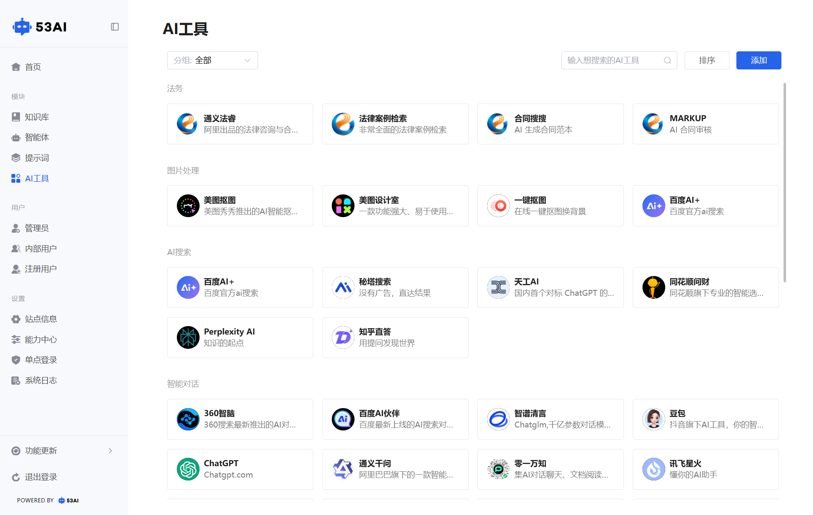
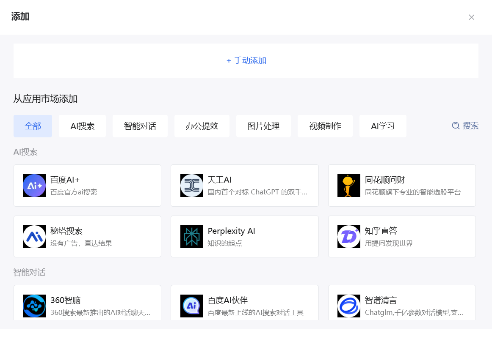
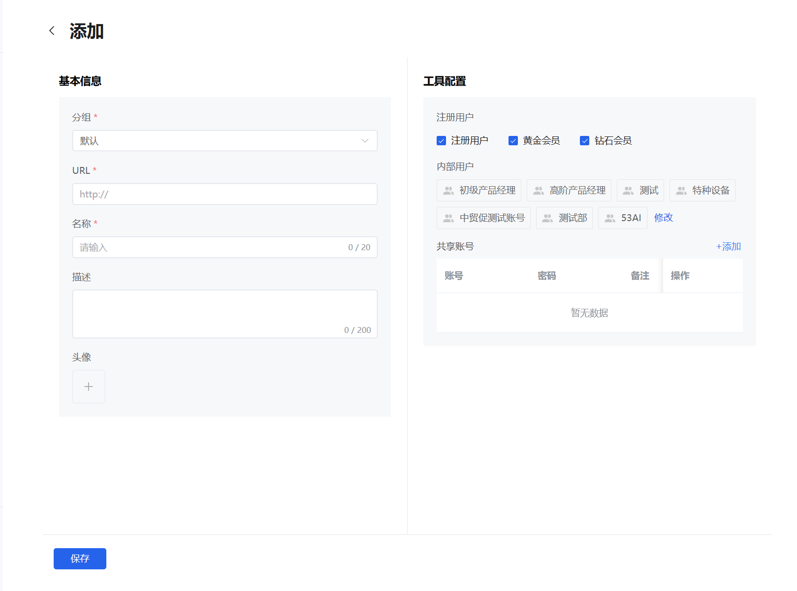
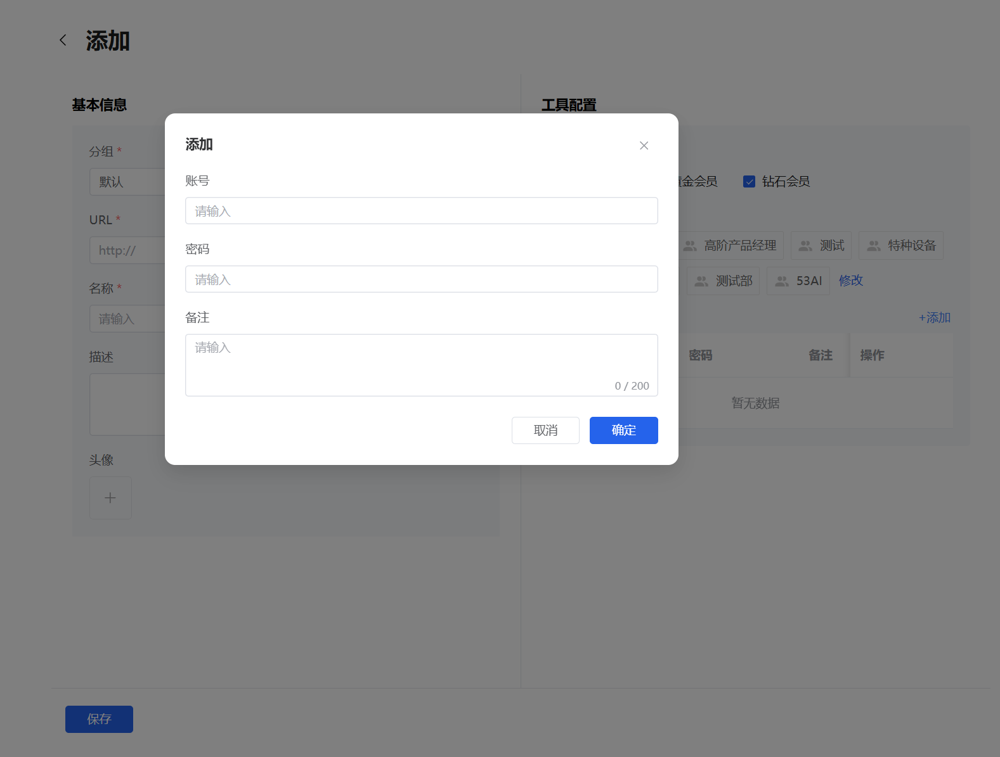

# AI工具
「AI 工具」模块是 53AI 平台的第三方 AI 能力聚合入口，将法务、图片处理、AI 搜索、智能对话等多场景的专业 AI 工具整合到平台内，通过统一的权限与账号管理，让用户可便捷调用各类 AI 能力，同时实现精细化运营与资源共享。

## 一、添加 / 编辑 AI 工具配置

### 1. 基本信息（必填项）
分组：选择工具所属的业务分组（如「法务」「图片处理」），用于前台分类展示。
URL：填写该 AI 工具的官方访问地址（如 https://app.markup.cc/），用户点击「访问」时将跳转至此地址。\
名称：工具在前台显示的名称（最多 20 字符）。\
描述：补充工具的功能说明（最多 200 字符），帮助用户理解工具用途。\
头像：上传工具的图标，用于前台卡片展示，提升辨识度。

### 2. 工具配置（权限 + 共享账号）
注册用户权限：\
勾选该工具对注册用户的可用会员类型（如「注册用户」「黄金会员」「钻石会员」），仅对应会员等级的用户可在前台看到并访问该工具。\
内部用户权限：添加 / 选择内部用户分组（如「测试部」「53AI」），控制内部员工的可见范围，仅组内成员可访问。

共享账号管理：\
点击「+ 添加」，可录入该 AI 工具平台的共享账号信息（账号、密码、备注）。\
这些共享账号由管理员预先配置，用户使用工具时可直接调用，无需自行注册，实现资源共享。\
支持对已有共享账号进行编辑 / 删除操作。

