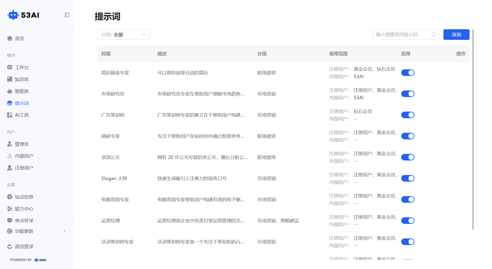
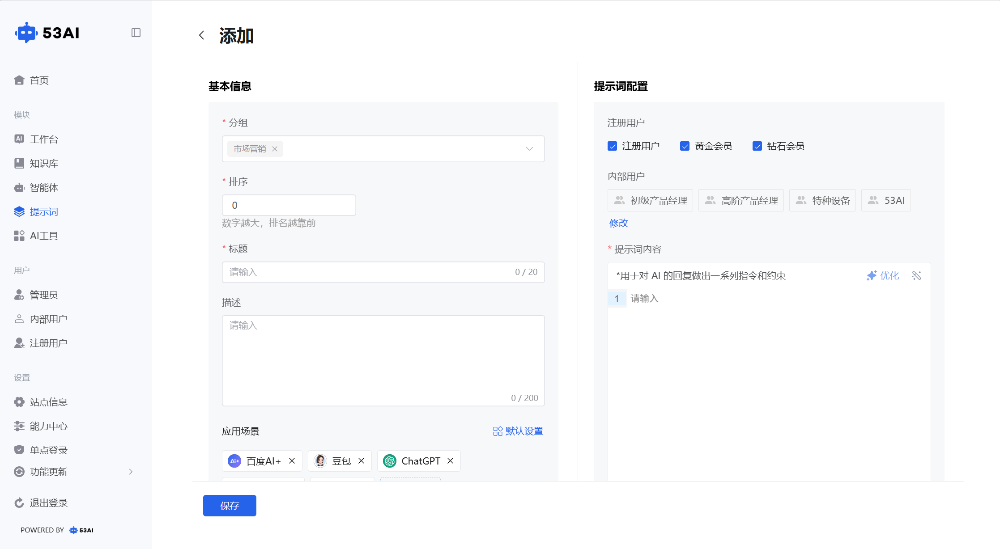

# 提示词
## （一）功能说明
提示词后台管理页面用于集中管理和配置系统中的提示词资源。支持按分组筛选，顶部提供搜索框和“添加”按钮，便于快速查找或新增提示词。列表显示标题、描述、所属分组、使用范围及启用状态。管理员可通过开关控制提示词的启停，点击“编辑”可修改内容，“删除”可移除无效项。

## （二）添加 / 编辑提示词配置
点击「添加」或编辑已有提示词，进入配置页面，分为基本信息、提示词配置、使用说明三大区域：

### 1. 基本信息（必填项 + 可选配置）
分组（必填）：选择提示词所属的业务分组（如「市场营销」「职场提效」），用于分类管理与筛选。\
排序（必填）：设置数字，数字越大，提示词在前台展示的位置越靠前。\
标题（必填）：提示词在前台显示的名称（最多 20 字符），如「广告策划师」。\
描述（可选）：补充提示词的功能说明（最多 200 字符），帮助用户理解用途。\
应用场景（可选）：选择该提示词适用的 AI 平台（如百度 AI+、豆包、ChatGPT、腾讯元宝、Kimi 等），可点击「+ 添加」扩展平台范围，也可点击「默认设置」恢复默认平台配置。

### 2. 提示词配置（权限 + 指令内容）
注册用户权限：勾选该提示词对注册用户的可用会员类型（如「注册用户」「黄金会员」「钻石会员」），仅对应会员等级的用户可调用。\
内部用户权限：选择该提示词对内部用户的可用分组（如「初级产品经理」「测试部」「53AI」），可点击「修改」调整可见分组，仅组内成员可调用。\
提示词内容（必填）：编写对 AI 回复的指令与约束（如角色定义、输出格式要求、业务规则等），支持点击「优化」按钮优化提示词，点击清空按钮重置内容。

### 3. 使用说明
使用场景：添加该提示词的适用业务场景说明。\
使用案例：添加具体的使用示例，帮助用户快速上手。

