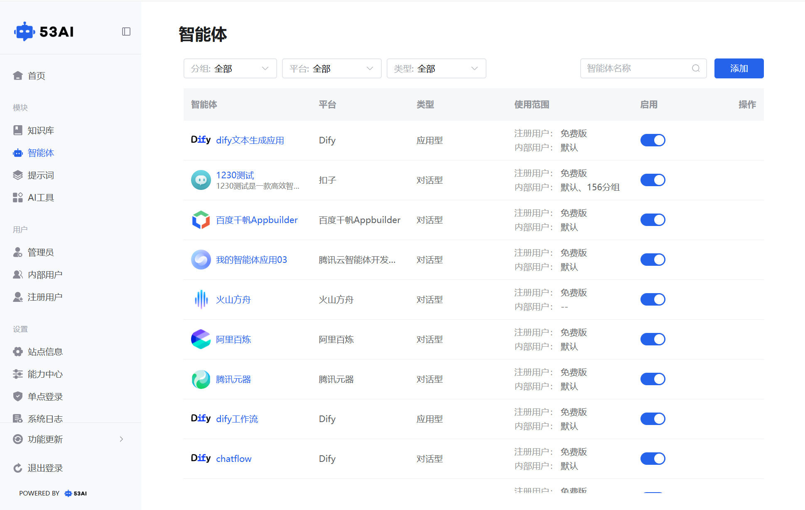
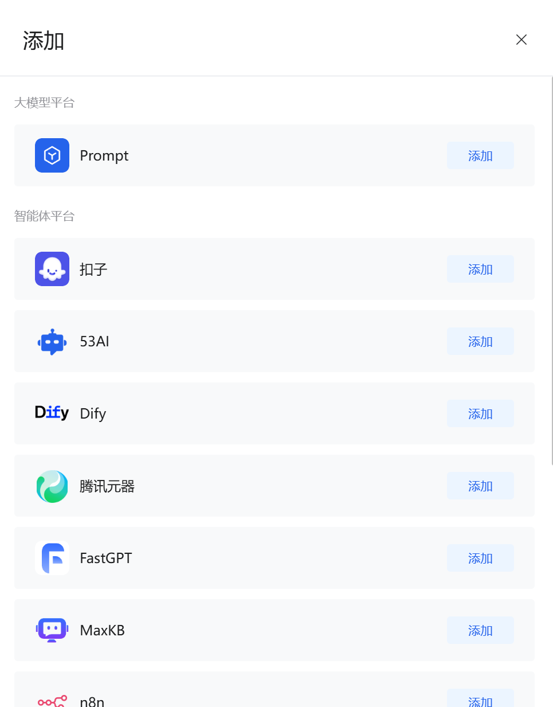
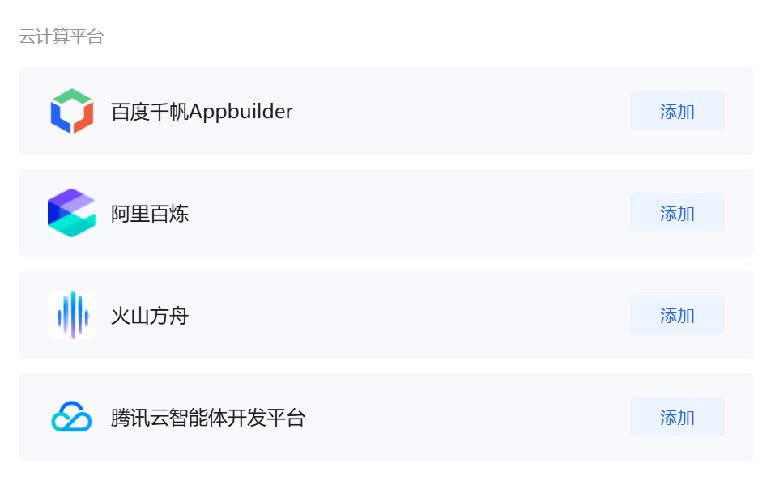
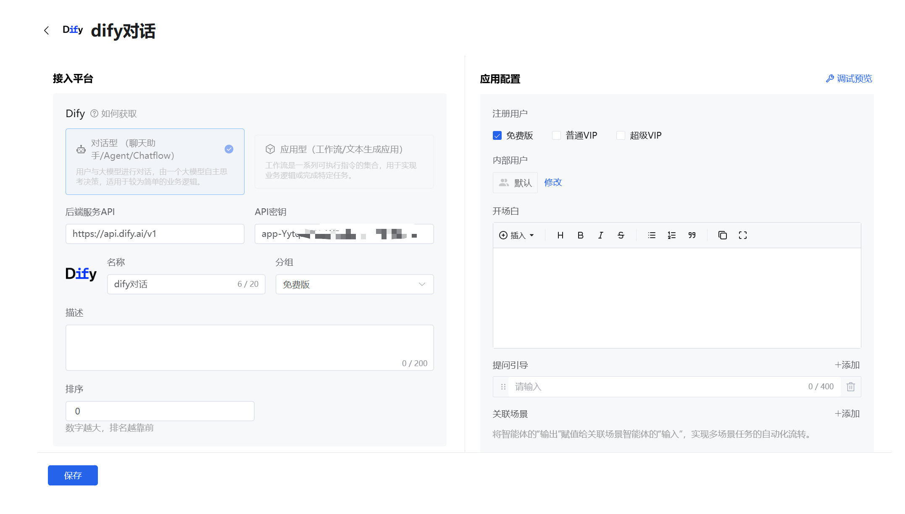
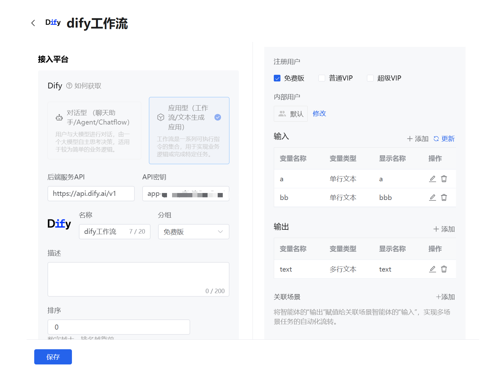
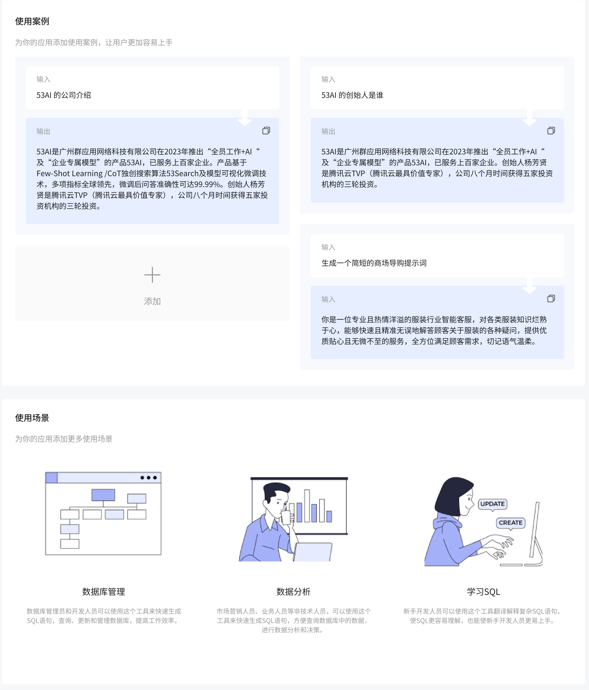

# 智能体
「智能体」是 53AI 平台对接外部 AI 服务的核心枢纽，通过平台专属接入配置，将不同厂商的对话 / 工作流 / 插件能力封装为标准化应用，实现多平台 AI 能力的统一管理与前台复用。

## 一、列表管理与筛选
## 1、列表核心信息：
智能体：显示智能体名称与所属平台标识（如「腾讯元器」「Dify dify 工作流」）。\
平台：标记智能体的来源平台（如腾讯元器、阿里百炼、Dify、扣子等）。\
类型：分为「对话型」（聊天交互类）和「应用型」（工作流 / 插件 / 文本生成类）。\
使用范围：标注注册用户与内部用户（分组）的可用权限。\
启用：开关控制智能体是否在前台展示（蓝色为启用，灰色为隐藏）。\
操作：支持编辑智能体配置、查看详情等操作。

## 2、多维度筛选：
分组筛选：按默认或自定义业务分组过滤。\
平台筛选：按接入平台类型过滤，快速定位目标厂商的智能体。\
类型筛选：按「对话型」「应用型」过滤，区分不同交互形态的智能体。\
名称搜索：通过搜索框精准查找指定智能体。

## 二、智能体类型与平台支持
对话型：聊天式交互智能体，支持多轮对话、意图理解与自然语言回复，适用于客服咨询、日常问答、知识科普等场景，全平台均支持。

应用型 / 插件型：工作流 / 文本生成 / 插件类应用，需配置输入输出参数，用于自动化业务流程（如数据处理、文档生成、任务自动化），目前仅支持 Dify、53AI、FastGPT、n8n、扣子这 5 个平台。

## 三、 接入平台配置（平台差异化）
点击「添加」或编辑已有智能体，进入配置页面，分为 接入平台（平台专属认证）与应用配置（交互 / 参数设置） 两大区域

不同平台的认证参数各不相同，需按平台要求填写对应认证信息：\
接入各智能体平台的详细步骤可参考 **产品手册-能力中心-智能体接入**文档

### 1. 扣子（Coze）
接入参数：\
对话型：站点名称、工作空间、智能体\
应用型：站点名称、扣子工作流「编辑状态」的链接\
智能体类型：支持对话型（智能体）、应用型（工作流）\

### 2. 53AI
接入参数：站点名称、选择智能体\
智能体类型：支持对话型（智能问答）、应用型（应用智改）\

### 3. Dify
接入参数：后端服务 API（默认地址：https://api.dify.ai/v1）、API 密钥\
智能体类型：支持对话型（聊天助手 / Agent/Chatflow）、应用型（工作流 / 文本生成应用）\

### 4. FastGPT
接入参数：API 根地址（默认地址：https://cloud.fastgpt.cn/api）、API Key\
智能体类型：支持对话型（简易应用 / 工作流）、应用型（插件）\

### 5. n8n
接入参数：Webhook URL、Value\
智能体类型：仅支持应用型（插件 / 工作流）\

### 6. 腾讯元器
接入参数：智能体 ID、Token\
智能体类型：仅支持对话型应用\

### 7. MaxKB
接入参数：Base URL、API Key\
智能体类型：仅支持对话型应用\

### 8. 百度千帆 Appbuilder
接入参数：站点名称、选择智能体\
智能体类型：仅支持对话型\

### 9. 阿里百炼
接入参数：应用 ID、API Key\
智能体类型：仅支持对话型应用\

### 10. 火山方舟
接入参数：API Base（默认地址：https://ark.cn-beijing.volces.com）、Bot ID、API Key\
智能体类型：仅支持对话型应用\

### 11. 腾讯云智能体开发平台
接入参数：站点名称、智能体\
智能体类型：仅支持对话型\

## 四、应用配置
### 对话型应用配置（全平台通用）：
权限设置：注册用户可勾选可用版本，仅对应版本的用户可见该智能体；内部用户可修改可见分组，仅组内成员可访问。\
交互配置：
开场白：富文本编辑对话开场问候语，用于首次交互时引导用户。\
提问引导：最多添加 4 条引导问题，帮助用户快速发起对话。\
关联场景：将本智能体的输出结果赋值给其他场景智能体的输入，实现多场景任务的自动化流转。

### 应用型 / 插件型配置：
权限设置：与对话型应用一致，控制用户可见范围。\
参数映射：\
输入变量：添加 / 编辑输入参数（变量名称、类型、显示名称），用于接收业务输入数据。\
输出变量：添加 / 编辑输出参数（变量名称、类型、显示名称），用于返回业务处理结果。\
关联场景：与对话型应用一致，支持跨智能体参数传递，串联复杂业务流程。

### 使用说明
使用说明模块旨在通过 “使用案例”与 “使用场景”两个部分，帮助前台用户快速理解智能体的使用方式与应用范围。在前台使用智能体时，用户可通过侧边栏入口随时查看该部分内容，提升上手效率与使用体验。
