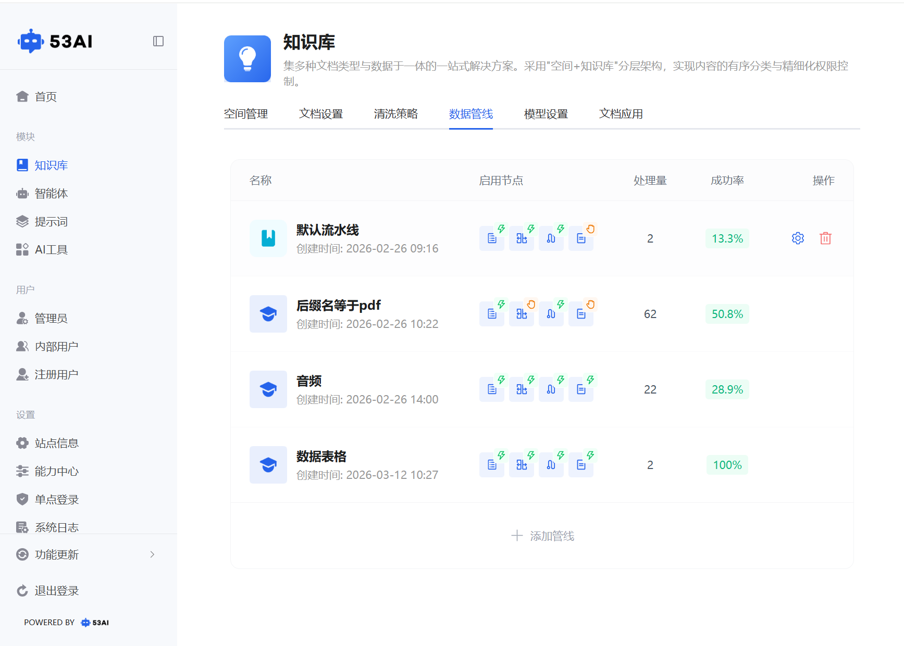
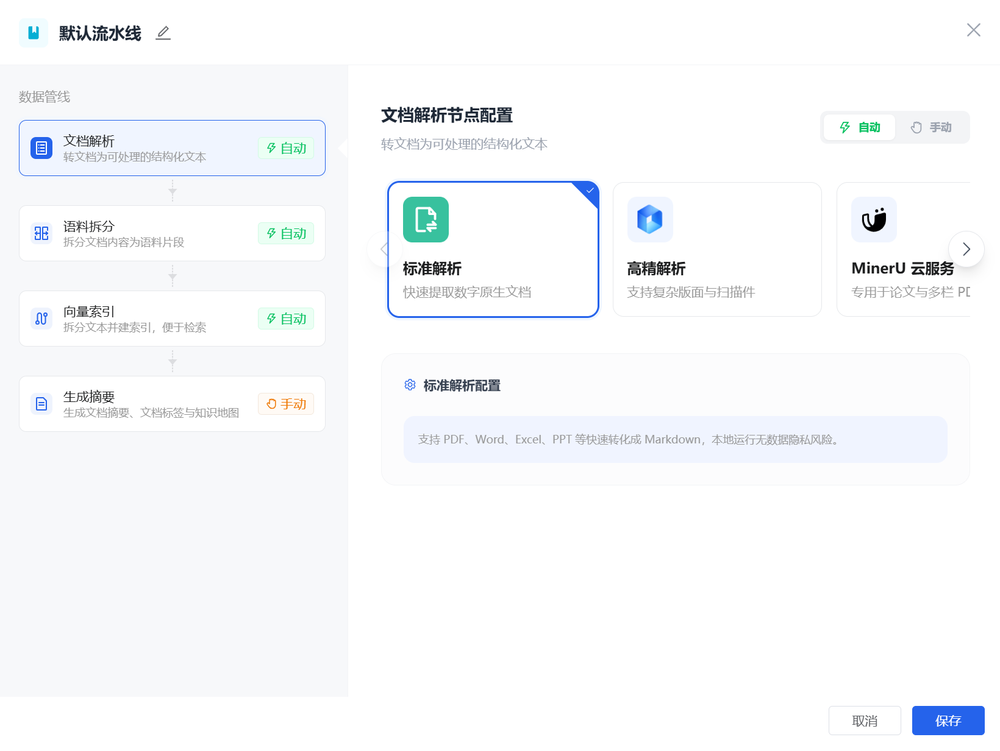
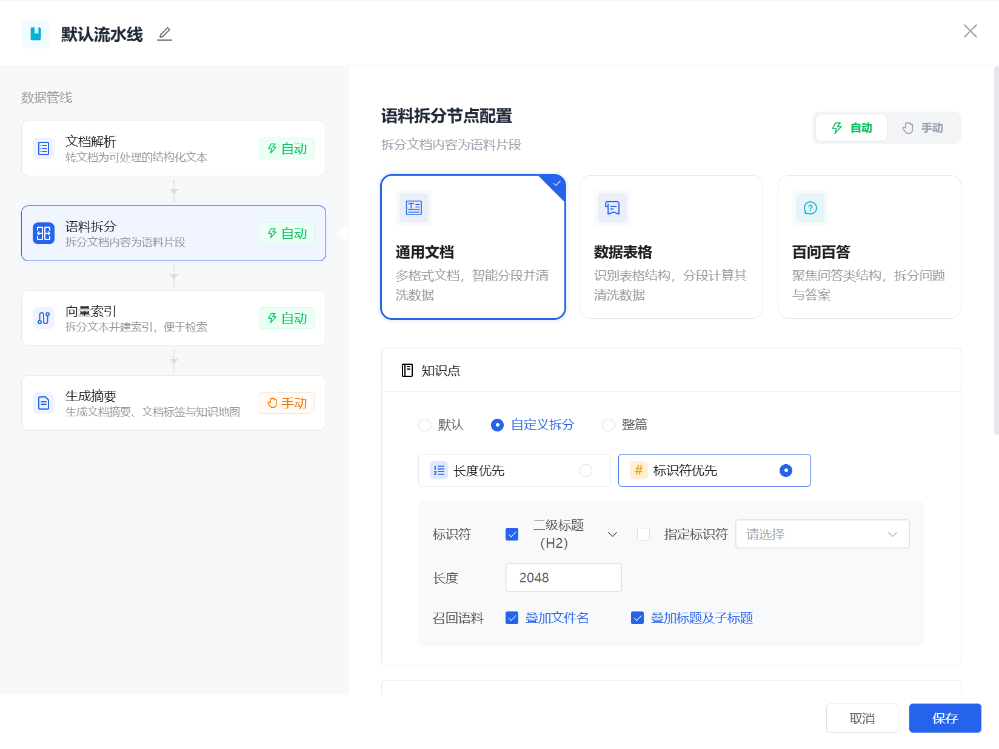
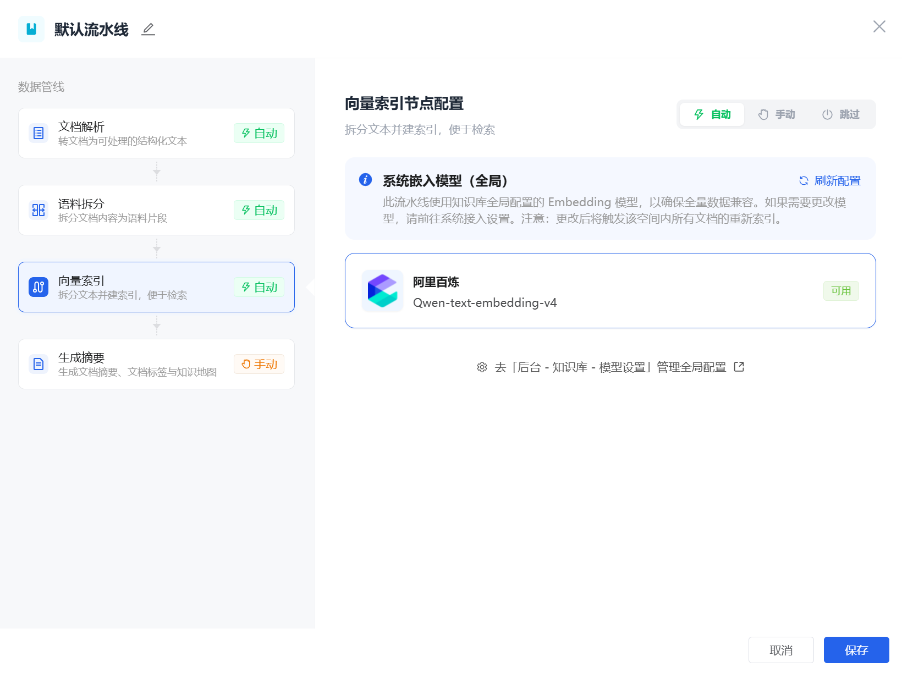
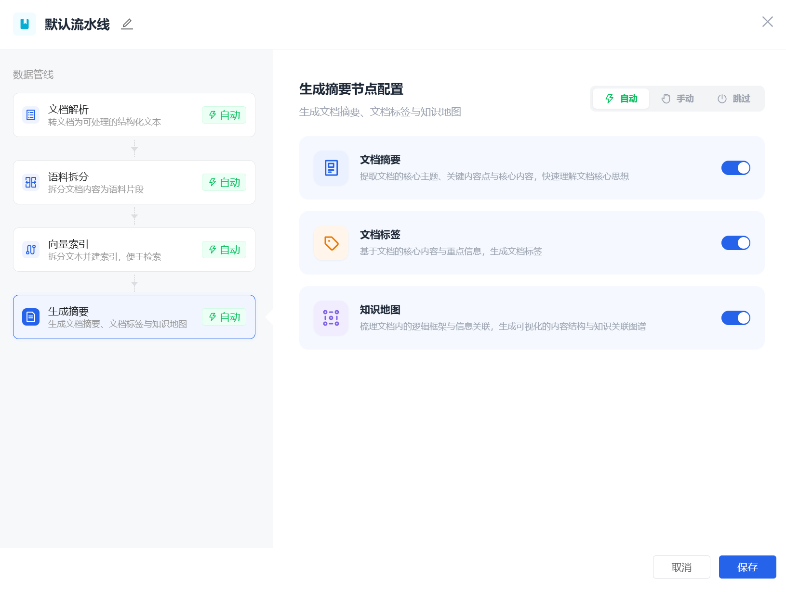

# 知识库 - 数据管线
「数据管线」是知识库文档处理的自动化核心流水线，通过 “解析→拆分→索引→生成” 四步标准化流程，实现文档从原始文件到可检索知识资产的全自动 / 半自动处理，同时支持自定义解析规则与执行模式，适配不同文档类型的处理需求。

## 一、管线列表展示信息
-管线名称：默认管线 / 自定义命名的管线\
-启用节点：展示当前实际生效的处理步骤，被跳过的节点不会显示\
-处理总量：当前管线总共处理的文档数量\
-成功数：处理完成且无异常的文档数量\
-成功率：成功数 / 处理总量，以百分比展示\
-操作：编辑管线配置、查看处理详情、删除管线

## 二、四大管线节点详细配置
### 1. 第一步：文档解析（格式转换）
#### 核心作用：
将上传的原始文档（PDF、Word、Excel 等）转换为系统可处理的结构化文本，为后续拆分做准备。
#### 配置规则：
可选解析工具：下拉选择已在「能力中心 - 解析能力」模块接入的解析服务（如标准解析、高精解析、MinerU 云服务等）。
#### 执行模式：
支持自动 / 手动切换，自动模式下解析环节全自动完成。

### 2. 第二步：语料拆分（切片处理）
#### 核心作用：
将解析后的结构化文本，按预设规则拆分为独立的 “语料切片”，提升后续检索的精准度。
#### 配置规则：
拆分类型：支持通用文档（多格式智能拆分）、数据表格（识别表格结构拆分）、百问百答（聚焦问答结构拆分）。
#### 拆分规则：
拆分策略：支持「长度优先」（按字符数拆分，如 2048 字符 / 切片）、「标识符优先」（按标题层级 H2/H3 拆分）。
#### 召回语料：
可勾选「叠加文件名」「叠加标题及子标题」，使得召回的切片能附加上信息。
#### 执行模式：
支持自动 / 手动切换，自动模式下按规则全自动切片。

### 3. 第三步：向量索引（语义检索）
#### 核心作用：
将拆分后的语料切片，通过嵌入模型转换为向量数据，构建可检索的向量索引，实现语义化搜索。
#### 配置规则：
嵌入模型：默认使用知识库全局配置的 Embedding 模型（如阿里百炼 Qwen-text-embedding-v4），可在「模型设置」中全局修改。
#### 执行模式：
支持自动 / 手动 / 跳过（仅向量索引与生成摘要支持跳过），跳过则不生成向量索引，文档仅保留原始文本。
#### 刷新配置：
可手动刷新模型配置，确保全量数据兼容。

### 4. 第四步：生成摘要（知识增强）
#### 核心作用：
对文档进行智能内容增强，生成摘要、标签与知识地图，提升文档的可读性与检索效率。
#### 功能开关：
可独立开启 / 关闭文档摘要（提取核心主题）、文档标签（生成核心关键词）、知识地图（梳理逻辑框架）。
#### 执行模式：
支持自动 / 手动 / 跳过，跳过则不生成任何摘要类内容；手动模式下可灵活选择开启哪些功能。

## 三、创建自定义数据管线
1、点击管线列表下方的「+ 添加管线」按钮，弹出创建弹窗。\
2、填写管线名称（最多 20 字符，如 “PDF 专属管线”“音频处理管线”），点击「确定」。\
3、进入管线编辑页，依次配置文档解析、语料拆分、向量索引、生成摘要四大节点的工具与规则。\
4、完成配置后点击「保存」，新管线将生效，可在空间内按需绑定使用。\
5、即使未配置自定义数据管线，系统也会有默认流水线。