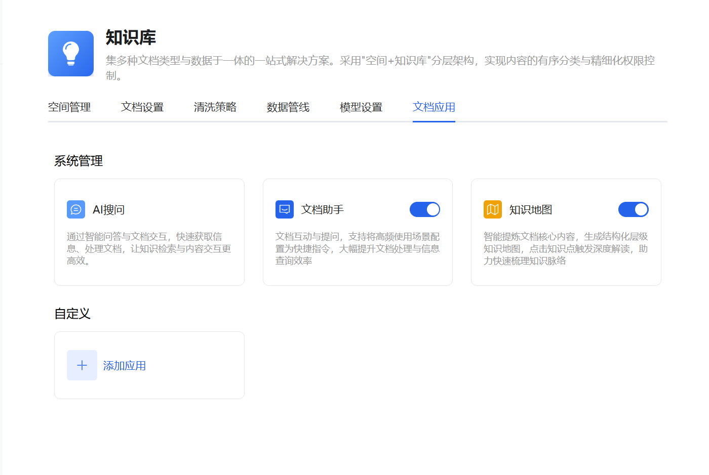
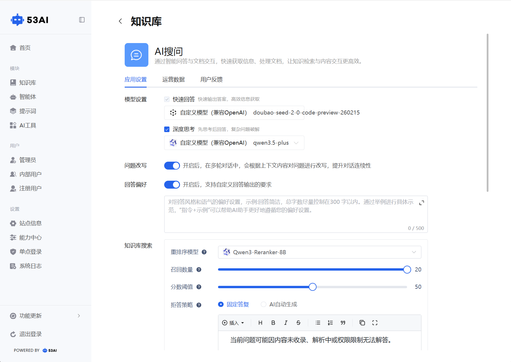
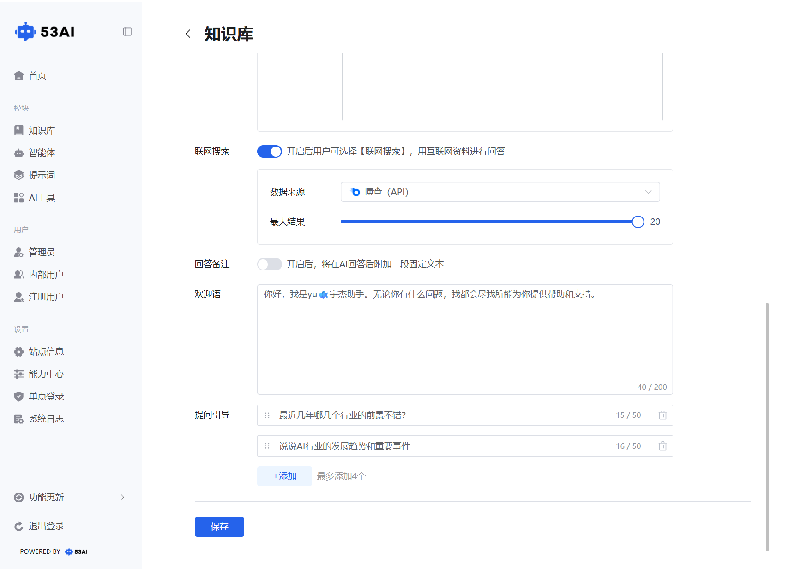
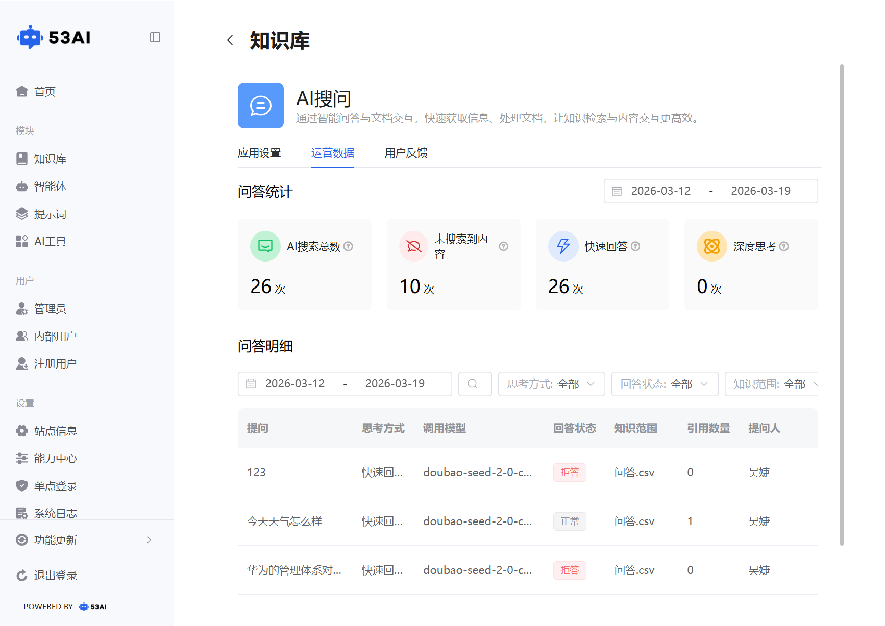
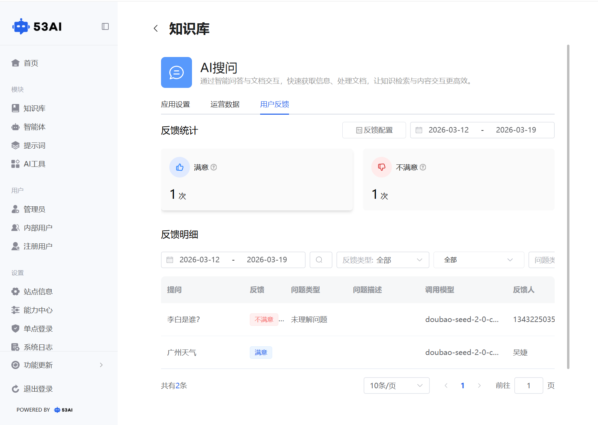
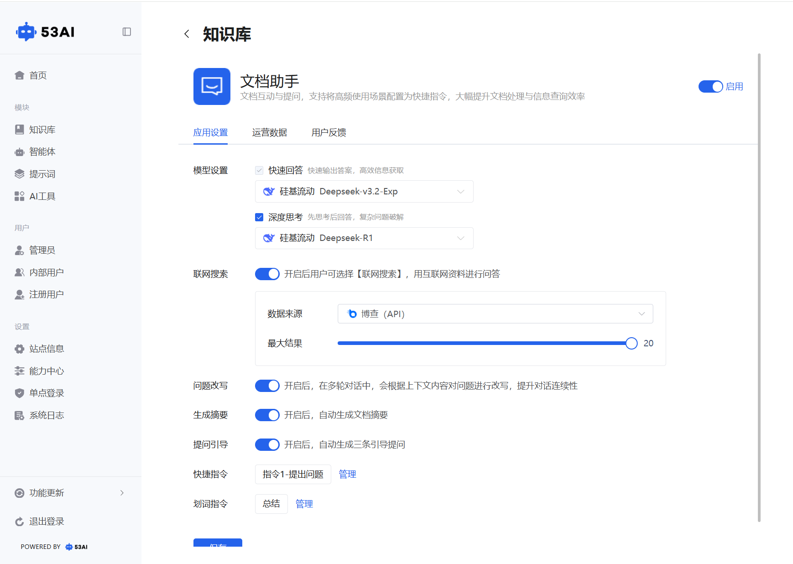
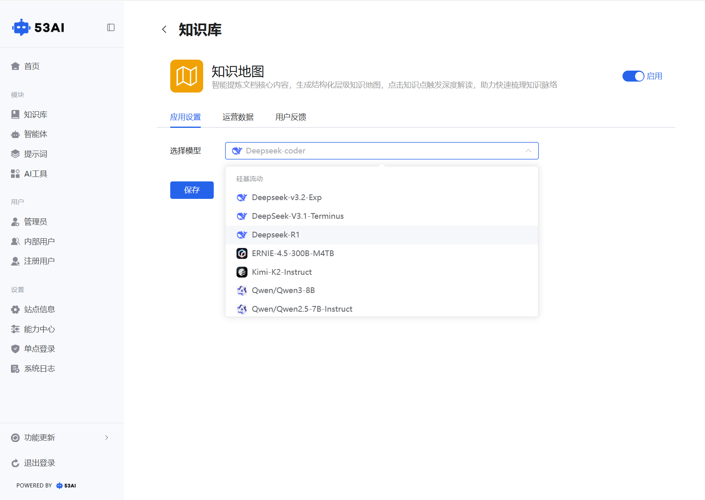
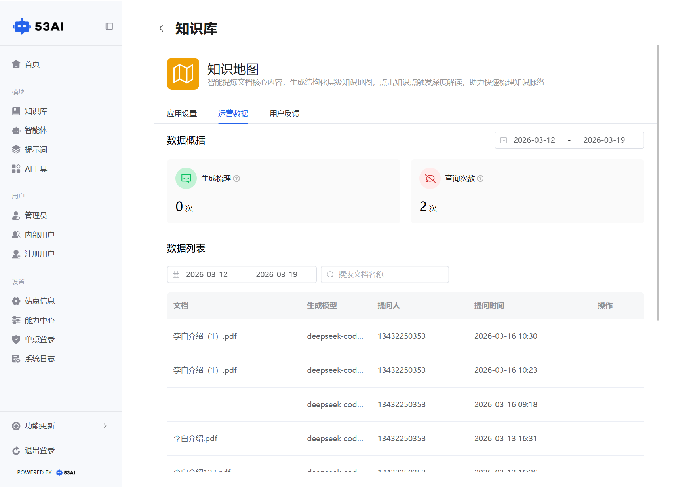
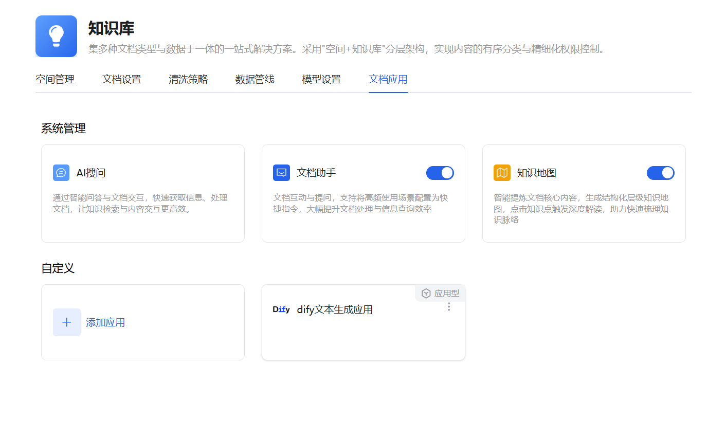
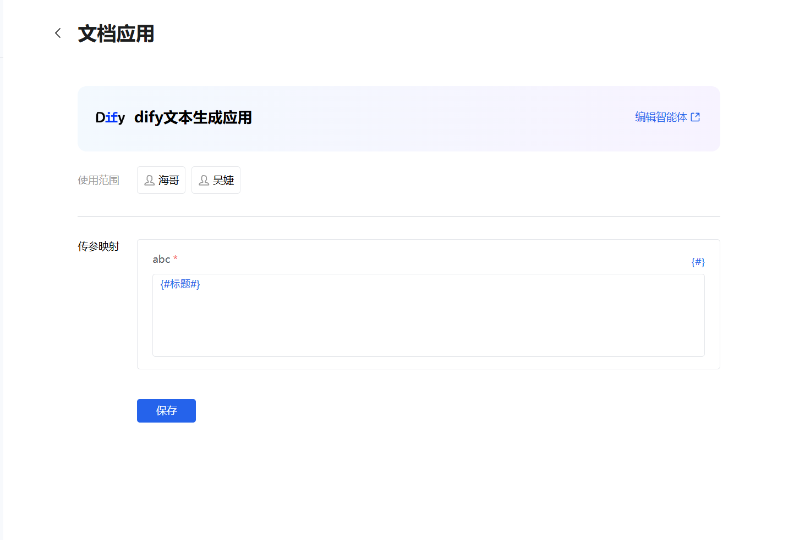

# 知识库 - 文档应用
「文档应用」是知识库的前端交互与价值输出层，通过「系统内置应用 + 自定义应用」的组合，实现从 “文档检索” 到 “智能交互” 的全场景知识服务，让知识资产可被高效查询、深度解读与灵活复用。

## 一、系统管理应用
### （一）AI 搜问
核心定位：面向用户的全局知识库问答入口，可检索多个文档的语料切片，从切片中提取答案并回答用户问题，是知识库的核心检索交互方式。

1、应用设置：\
模型设置：\
快速回答：勾选后，优先调用轻量模型（如doubao-seed-2-0-code-preview-260215）快速输出答案，适合高效信息获取。\
深度思考：勾选后，调用更强模型（如qwen3.5-plus）先思考后回答，适合复杂问题拆解。\
问题改写：开启后，多轮对话中会根据上下文改写问题，提升对话连续性。\
回答偏好：开启后，可自定义回答输出格式与要求。\
知识库搜索：\
重排序模型：选择对检索到的语料切片进行重排序的模型（如Qwen3-Reranker-8B），提升答案精准度。\
召回数量：滑动设置单次检索返回的语料切片数量。\
分数阈值：滑动设置语料切片的最低匹配分数阈值，低于阈值的切片不会被召回。\
拒答策略：当无匹配语料时，可选择「固定答复」（预设文本）或「AI 自动生成」（由 AI 生成拒答内容）。\
联网搜索：开启后，用户可选择「联网搜索」，用博查 (API) 等外部数据源补充回答，最大结果数可设（默认 20 条）。\
回答备注：开启后，在 AI 回答后附加固定文本。\
欢迎语：设置 AI 搜问的开场问候语（最多 200 字符）。\
提问引导：最多添加 4 条引导问题，帮助用户快速发起对话。

2、辅助标签页：\
运营数据：查看 AI 搜问的使用频次、用户行为等数据。

用户反馈：查看用户对回答的满意度反馈，用于优化模型与策略。

### (二)文档助手
核心定位：聚焦于单个文档内的 AI 助手，仅在当前打开的文档内检索语料，提供文档内的精准问答与操作，范围比 AI 搜问更局限，功能更偏向文档操作。

1、应用设置：\
模型设置：支持「快速回答」（默认开启，如Deepseek-v3.2-Exp），可选「深度思考」。\
联网搜索：同 AI 搜问，可开启并配置博查 (API) 数据源与最大结果数。\
问题改写：开启后，多轮对话中自动改写问题，提升对话连续性。\
生成摘要：开启后，自动生成当前文档的摘要。\
提问引导：开启后，自动生成 3 条引导提问。\
快捷指令：可管理高频操作指令（如 “总结全文”“提取表格”），配置为一键快捷指令。\
划词指令：可管理选中文本后的快捷操作指令。

2、差异对比：\
与 AI 搜问相比，文档助手仅作用于单文档，不跨文档检索；更侧重文档内操作（如生成摘要、划词操作），而 AI 搜问侧重跨文档知识检索。

### （三）知识地图
核心定位：智能提炼文档核心内容，生成结构化层级知识地图，可视化展示文档的知识脉络与逻辑框架，点击知识点可触发深度解读。

1、应用设置：\
选择模型：配置生成知识地图的 AI 模型（如Deepseek-coder）。\
启用开关：控制是否在前端展示知识地图功能。\
2、运营数据：\
查看「生成梳理次数」「查询次数」，按时间范围筛选，可追溯文档知识地图的使用情况。\
数据列表展示：文档名称、生成模型、提问人、提问时间等。\
3、用户反馈：
统计「满意 / 不满意」反馈次数，查看反馈明细，用于优化知识地图的生成质量。

## 二、自定义应用
核心定位：支持添加第三方智能体（如 Dify、百度千帆 AppBuilder、火山方舟等），构建专属文档应用，实现高度定制化的知识交互。

1. 添加自定义应用\
点击「+ 添加应用」，弹出应用列表，可按分组筛选。\
选择目标智能体（如「Dify 文本生成应用」「1230 测试」），点击确认添加。
2. 配置自定义应用\
使用范围：设置该应用的可见用户，精细化权限控制。\
传参映射：将文档变量（{#标题#}/{#摘要#}/{#全文#}）映射到智能体的输入参数，实现文档内容与智能体的自动联动。\
编辑智能体：点击「编辑智能体」，跳转到智能体配置页，可修改智能体的对话逻辑、模型等。\
保存配置：完成设置后点击「保存」，该应用将在前端生效，用户可在文档内调用。

