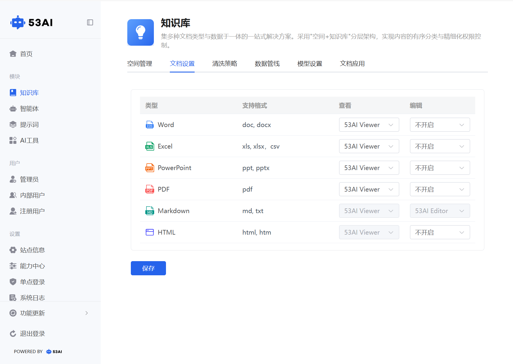

# 知识库 - 文档设置
「文档设置」模块用于配置不同类型文档的查看方式与编辑能力，支持多引擎兼容，让文档在系统内可高效预览与在线编辑，同时适配不同业务场景的文档处理需求。

## 一、文档类型与配置选项
| 文档类型 | 支持格式 | 查看方式可选值 | 编辑方式可选值 |
|----------|----------|----------------|----------------|
| Word | doc, docx | 53AI Viewer / WPS WebOffice | 不开启 / WPS WebOffice |
| Excel | xls, xlsx, csv | 53AI Viewer / WPS WebOffice | 不开启/ WPS WebOffice |
| PowerPoint | ppt, pptx | 53AI Viewer / WPS WebOffice | 不开启/ WPS WebOffice |
| PDF | pdf | 53AI Viewer/ WPS WebOffice | 不开启/ WPS WebOffice |
| Markdown | md, txt | 53AI Viewer | 53AI Editor |
| HTML | html, htm | 53AI Viewer | 不开启 / 百度编辑器 |