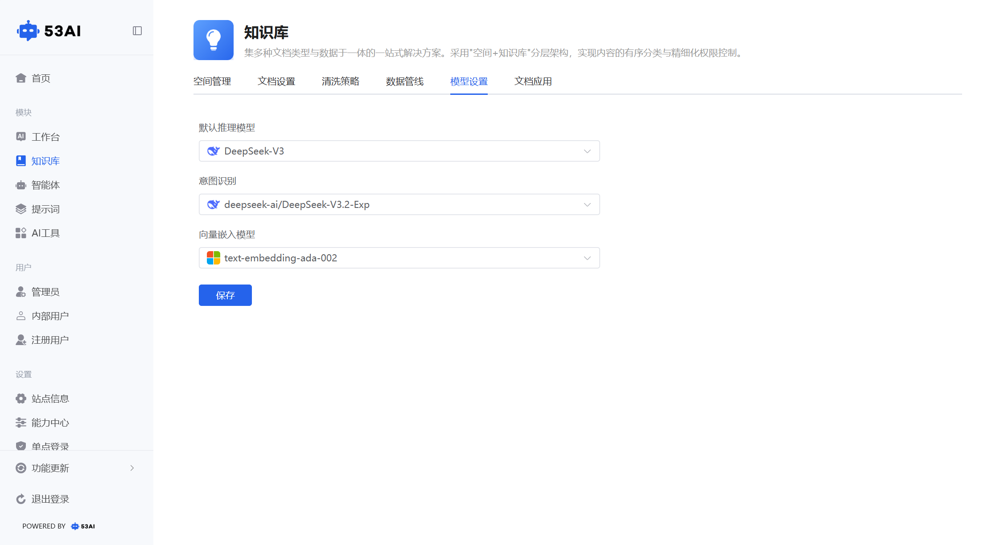

# 知识库 - 模型设置
「模型设置」是知识库所有 AI 交互能力的底层算力调度中心，通过统一的模型配置，管控从 “意图识别→文本推理→向量检索” 的全链路 AI 模型，确保不同场景的回答质量、响应速度与检索精度达到最佳平衡。

## 一、三大核心模型配置项
### 1. 默认推理模型（核心问答模型）
配置项：下拉选择大语言模型\
作用：\
这是系统最核心的对话推理模型。当用户在AI 搜问或文档助手中提问时，系统默认使用此模型进行意图理解、逻辑推理与答案生成。适合复杂问题解答、多轮对话延续、复杂文档摘要生成等场景。\
配置示例：全局问答、文档摘要生成都将调用该模型。
### 2. 意图识别（用户意图分类模型）
配置项：下拉选择专用意图识别模型\
作用：\
负责解析用户提问的核心意图。上传文档或发起问答时，系统先通过该模型判断用户意图（如 “提取表格”“总结全文”“查找特定信息”），再路由到对应的处理逻辑或管线。
确保高匹配度的意图分类，为后续精准检索打基础。\
配置示例：文档上传、提问发起时的意图识别准确率更高。
### 3. 向量嵌入模型（语义检索模型）
配置项：下拉选择文本向量化模型\
作用：\
负责将语料切片（来自数据管线的语料拆分）转换为计算机可理解的向量数据。
是语义检索的核心：只有通过该模型生成向量，语料才能被高效检索。
同时也用于重排序模型的输入数据处理（若有配置）。\
配置示例：知识库内的语料解析、向量索引、相似度计算都将基于此模型的向量空间。