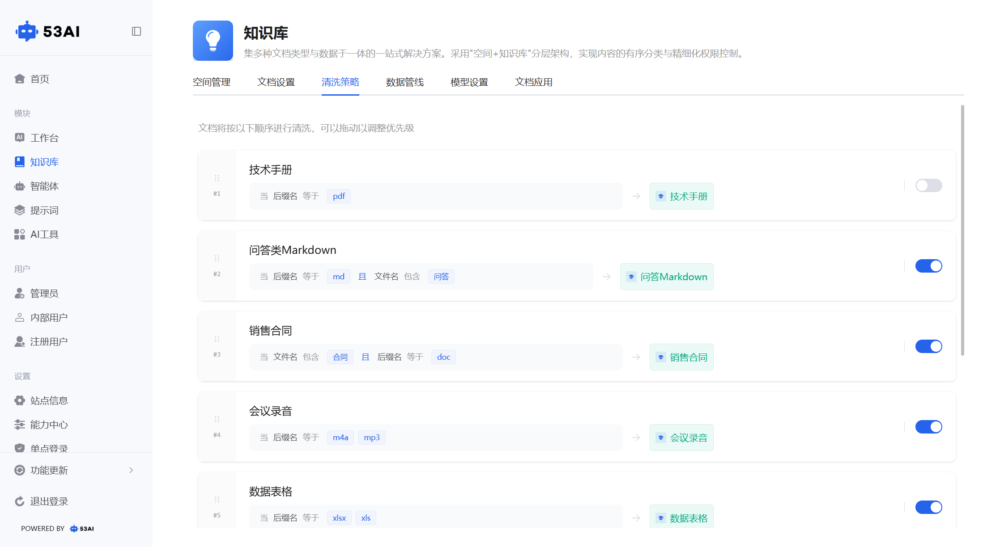
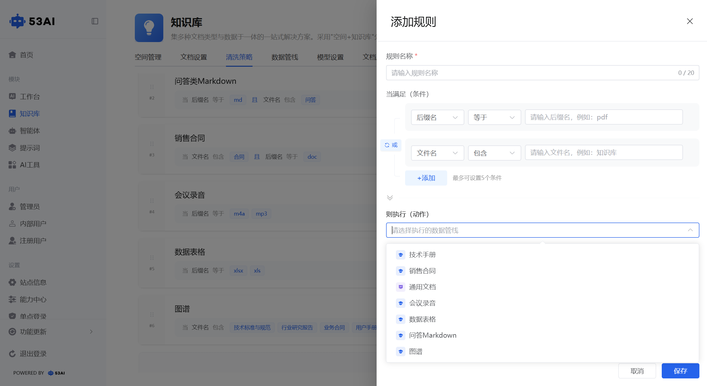
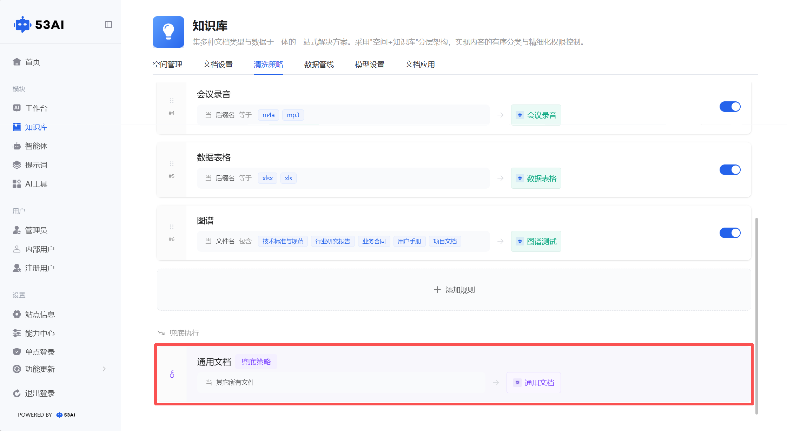

# 知识库 - 清洗策略
「清洗策略」是文档与数据管线之间的路由调度核心，通过「条件匹配→管线执行」的规则引擎，让不同类型的文档自动匹配到最合适的数据管线进行处理，实现文档处理的精细化、自动化调度。

## 一、规则列表展示信息
每条清洗规则以卡片形式展示，包含以下信息：\
1、规则名称：自定义的规则标识（如「CSV」「音频」「数据表格」）。\
2、匹配条件：展示当前规则的触发条件（如「当 后缀名 等于 csv」「当 后缀名 等于 mp3、wav、aac、amr」）。\
3、执行管线：展示满足条件后将执行的数据管线名称（如「默认流水线」「音频」「数据表格」）。\
4、启用开关：右侧蓝色开关控制规则是否生效（开启状态下才会参与匹配）。

## 二、创建 / 编辑清洗规则
点击「+ 添加规则」或点击已有规则进入编辑页，可配置完整的「条件 - 动作」路由规则：
1. 规则名称\
填写规则名称（最多 20 字符），用于标识该规则（如「PDF 专属规则」「音频文件规则」）。
2. 匹配条件配置\
条件维度：支持按「后缀名」或「文件名」进行匹配。\
匹配运算符：\
等于：精确匹配（如后缀名等于pdf）。\
包含：文件名 / 后缀名包含指定字符。\
开头是：文件名 / 后缀名以指定字符开头。\
结尾是：文件名 / 后缀名以指定字符结尾。\
多条件组合：\
最多可添加5 个条件，条件之间支持「且」「或」逻辑组合：\
或：满足任意一个条件即触发规则（如音频规则匹配mp3/wav/aac/amr）。\
且：必须同时满足所有条件才触发规则。\
可点击「+ 添加」新增条件行，点击条件间的「且 / 或」按钮切换逻辑关系。
3. 执行动作配置\
选择满足条件后要执行的数据管线，下拉列表展示所有已创建的数据管线（如「默认流水线」「后缀名等于 pdf」「音频」「数据表格」）。\
文档匹配到该规则后，将自动进入所选管线，按管线配置完成「解析→拆分→索引→摘要」的全流程处理。
4. 保存规则\
完成条件与动作配置后，点击「保存」，新规则将加入规则列表，可拖拽调整优先级。

## 三、默认兜底策略
1、位于规则列表最底部，标记为「兜底策略」，不可删除、不可禁用。\
2、匹配条件：「当 其它所有文件」，即所有未匹配到自定义规则的文档，都会执行此策略绑定的默认流水线。\
3、确保无遗漏处理：即使没有配置任何自定义规则，所有文档也会通过兜底策略进入默认管线处理。

