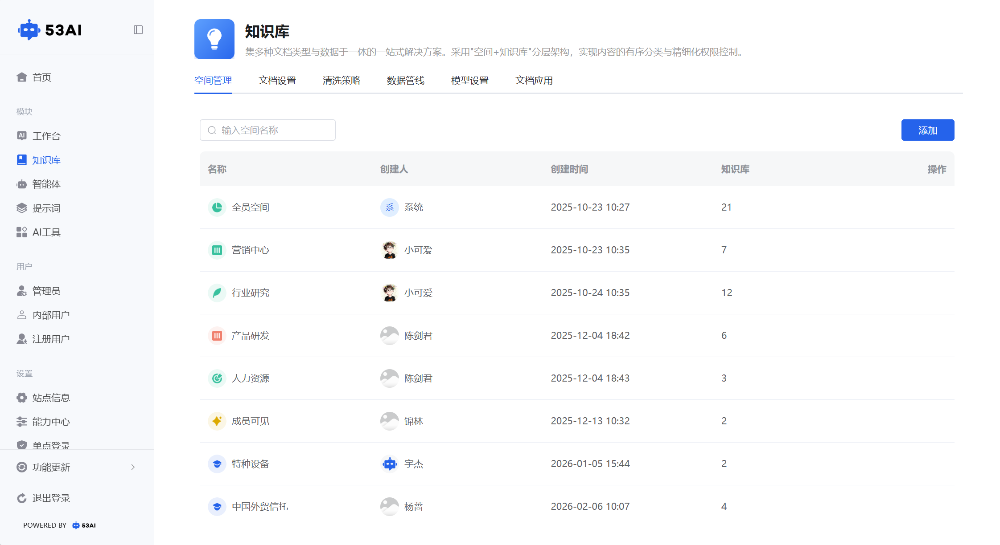
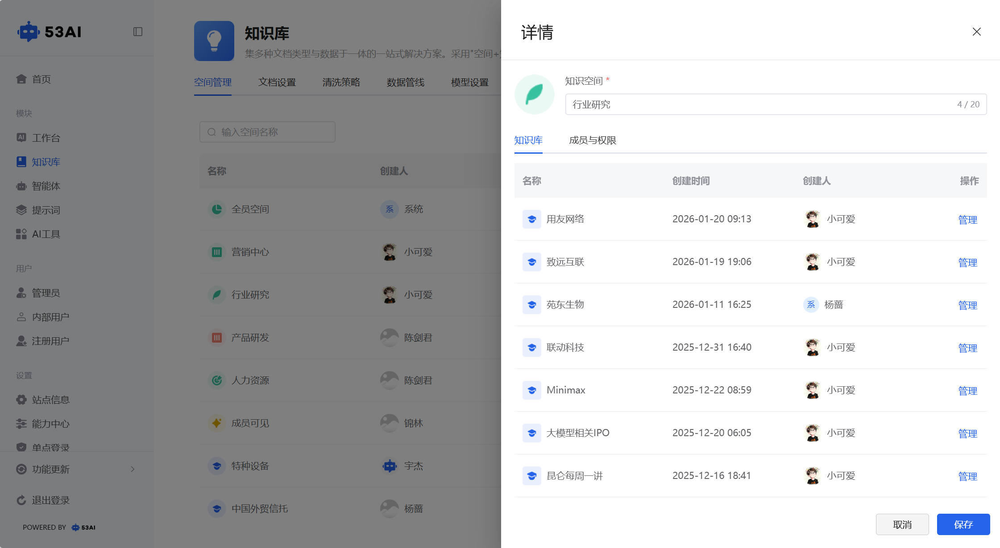
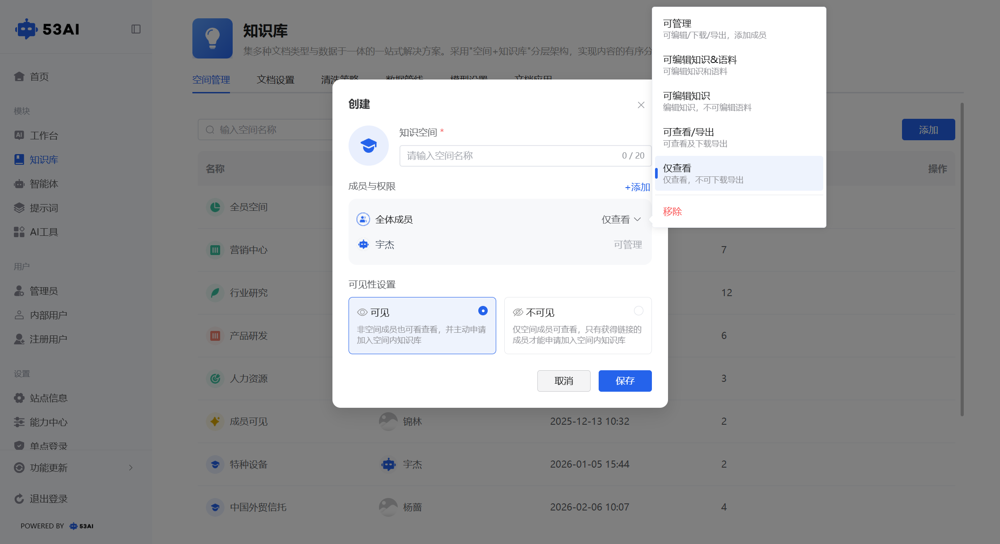
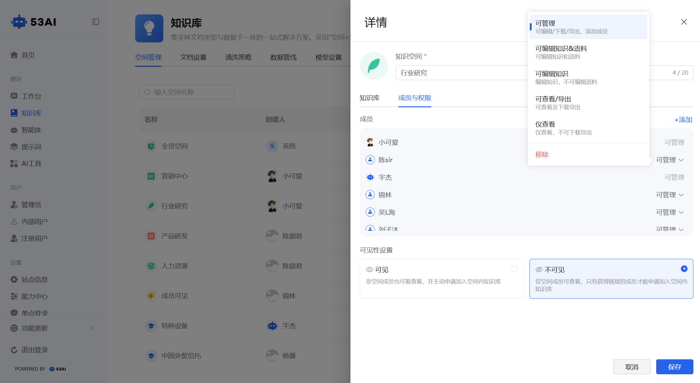

# 知识库 - 空间管理
「空间管理」是知识库的顶层组织单元，采用 “空间 + 知识库” 分层架构，实现内容的有序分类与精细化权限管控，让知识资产可按业务场景、团队范围进行隔离与共享。

## 一、知识空间核心操作
### 1. 查看与搜索空间
进入页面后，可浏览所有知识空间（如「全员空间」等）。\
顶部搜索框输入空间名称，可快速定位目标空间。\
列表展示：\
系统默认空间：「全员空间」由系统创建，默认对所有用户开放。\
自定义空间：由管理员创建，可自定义权限与可见范围。\
显示每个空间关联的知识库数量（如「权限测试」空间下有 2 个知识库）。

### 2. 创建知识空间
点击右上角「创建」按钮，弹出创建窗口：

#### 空间名称：
填写自定义空间名称（最多 20 字符）。

#### 成员与权限：
默认包含「全体成员」（权限为「仅查看」），可点击「+ 添加」加入更多用户。\
为成员分配不同权限级别：\
可管理：可编辑 / 下载 / 导出，添加成员。\
可编辑知识 & 语料：可编辑知识和语料。\
可编辑知识：可编辑知识，不可编辑语料。\
可查看 / 导出：可查看并下载导出。\
仅查看：仅查看，不可下载导出。

#### 可见性设置：
可见：非空间成员也可查看，并主动申请加入空间内知识库。\
不可见：仅空间成员可查看，只有获得链接的成员才能申请加入。

### 3. 管理空间详情
点击目标空间，进入「详情」窗口：
#### 空间信息：
可修改空间名称
关联知识库：展示该空间下所有知识库（如「代码」「听悟测试」），可点击「管理」进入知识库配置页。
#### 成员与权限：
可添加 / 移除成员，调整成员权限级别。

