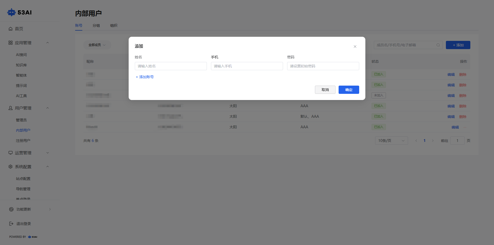
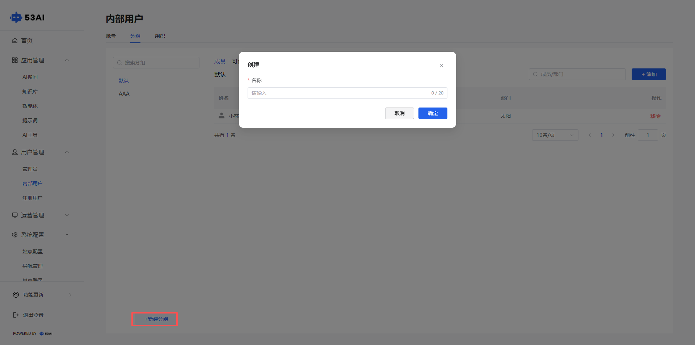
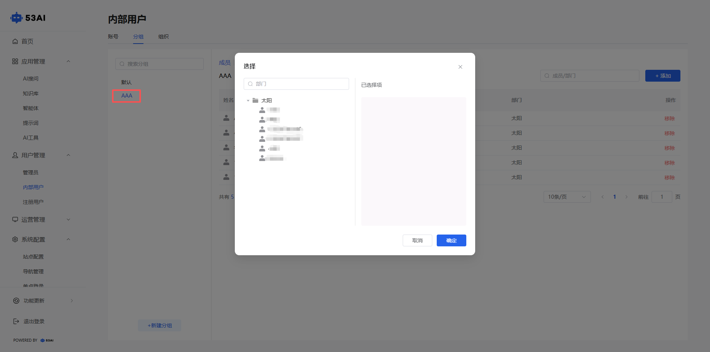
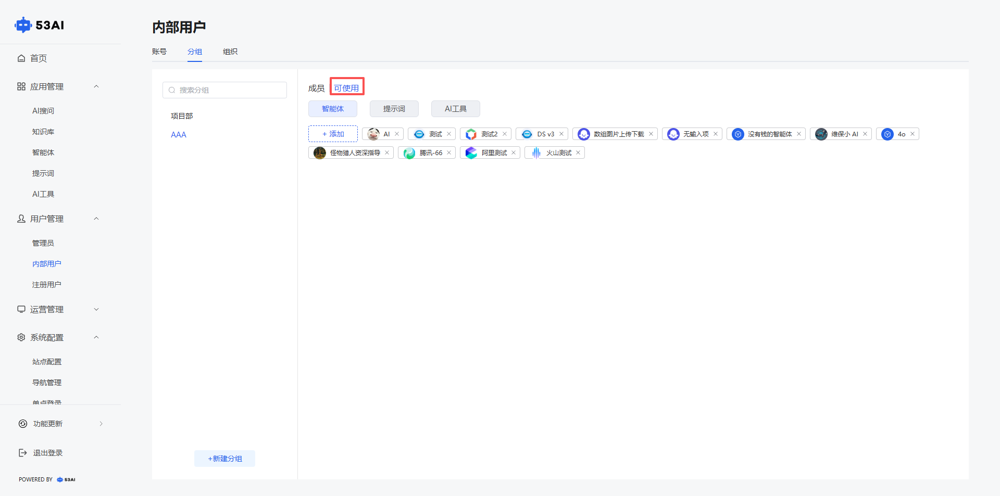
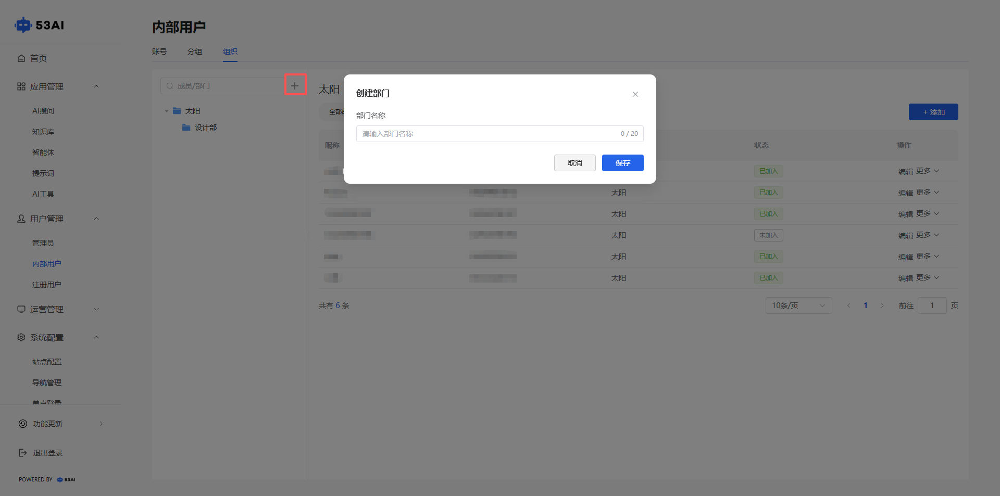

# 内部用户
## 一、功能说明
内部用户管理页面用于统一管理企业内部成员账号。\
支持按账号、分组、组织等维度查看用户信息，包括昵称、手机号、所属部门、分组、所使用的智能体/提示词和AI工具及加入状态（已加入/未加入）。\
顶部提供搜索框和“+ 添加”按钮，便于快速查找或新增用户。每条记录支持“编辑”和“删除”操作，实现灵活维护。

## 二、操作步骤
1.点击右上角的“+ 添加”按钮添加账号，填写对应账号信息。

2.顶部点击“分组”按钮，可添加用户组别。

3.选择对应组别，点击“添加”按钮，可将所需成员添加到该组别。

4.切换右上角的“可使用”按钮，可管理分配对应组别的智能体/提示词/AI工具。

5.顶部点击“组织”按钮，可根据企业组织架构进行成员管理。

