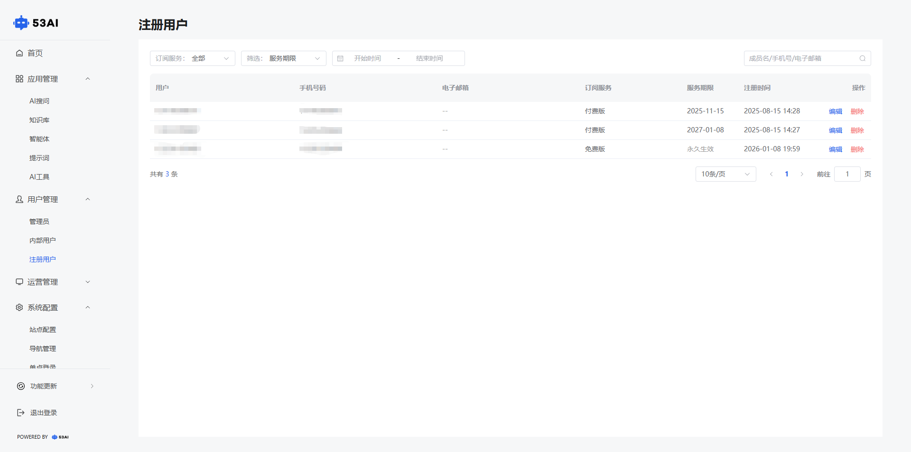
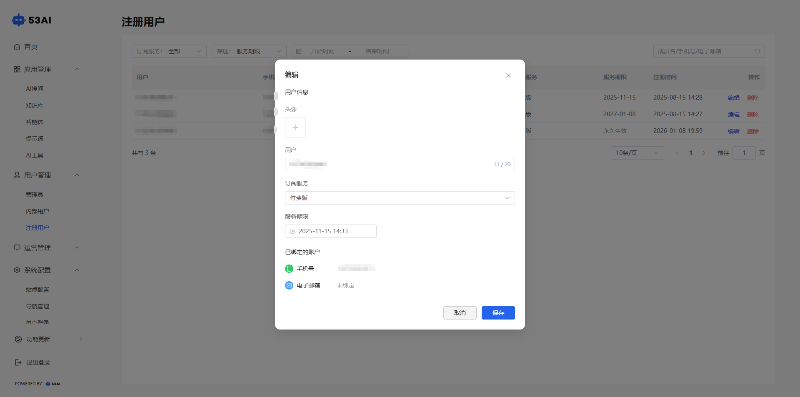
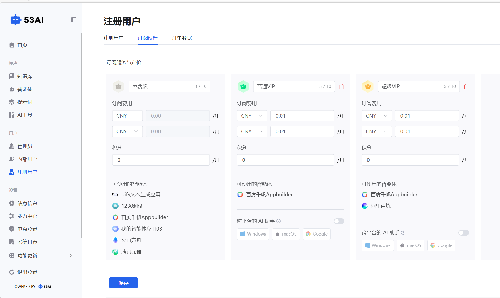
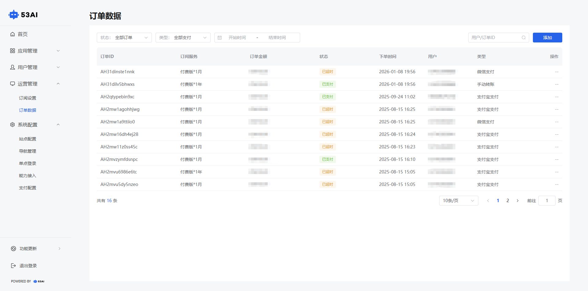
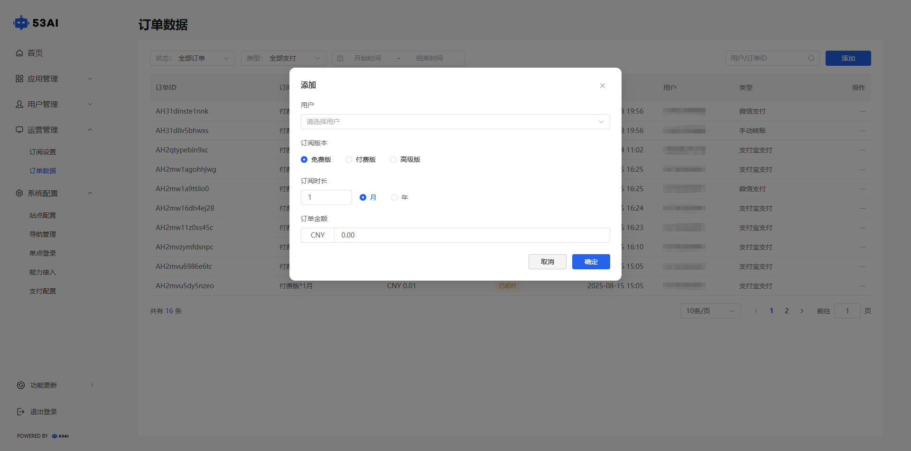

# 注册用户
## 一、功能说明
注册用户管理页面用于查看和管理平台外部注册用户。\
支持按订阅服务（免费版/付费版等）、服务期限、时间范围及用户信息进行筛选，便于精准查询。\
列表展示用户姓名、手机号、邮箱、订阅类型、服务到期时间及注册时间等关键信息。\
管理员可对用户进行“编辑”或“删除”管理操作，实现账户维护。

## 二、操作步骤
在注册用户界面，可以查看用户的数据，包括用户名、手机号码、电子邮箱、订阅方式、服务期限、注册时间等信息。\
1.用户信息编辑\
点击用户右侧的“编辑”按钮，可以对该用户的基本信息进行设置与修改。\
●**头像**：点击“头像”区域，可对用户的头像进行修改。\
●**用户**：输入或修改用户名称，建议在 20 字以内。\
●**登录密码**：输入内容可修改用户登录密码，保留空白则密码不变更。\
●**订阅服务**：查看与修改用户订阅类型，为 免费版、付费版或高级版。\
●**服务期限**：查看与修改用户的服务期限，可设定为用户服务至的具体期限。\
●**已绑定的账户**：查看用户绑定的手机号、电子邮箱等信息，不可进行修改。\
2.点击用户右侧的“删除”按钮，可对该用户及现有的基本信息进行删除。

## 三、运营管理

### 2.3.1 订阅设置

（一）功能说明

在订阅设置页面，可以进行订阅服务的套餐设置，支持设定多种套餐供你的客户订阅使用。

（二）操作步骤
在“订阅设置”页面，管理员可灵活配置多种套餐：\
●**图标**：选择专属图标，便于用户识别\
●**名称**：自定义套餐标题，突出核心定位，建议在 10 字以内\
●**订阅费用**：设置 支付币种 和 月度/年度收费标准\
●**积分**：分配消耗或赠送的积分额度\
●**权益内容**：列出套餐包含的功能与服务（如可使用的智能体、AI助手）\
点击“保存”即生效。

完成配置后，用户可在前台根据需求选择对应订阅方案。

2.3.2 订单数据

（一）功能说明
通过订单数据，对订阅用户进行订单管理，可查看用户订阅的套餐类型、订单金额、支付状态、订阅时间、用户名称、支付类型等信息。

（二）操作步骤
点击运营管理，进入订单数据页面，查看或修改用户订单情况。 包括订单 ID、订阅服务、订单金额、状态、下单时间、类型等信息。\
●手动转账确定：未进行确认的“手动转账”，点击待确认按钮，手动进行确认，出现提示弹窗，点击确定。\
●手动添加订单：未自动加入订单列表的订单进行手动添加，点击订单数据页面右上角添加按钮，选择需要添加的用户、订阅版本、订阅时长、订单金额，核对无误后点击确定。

