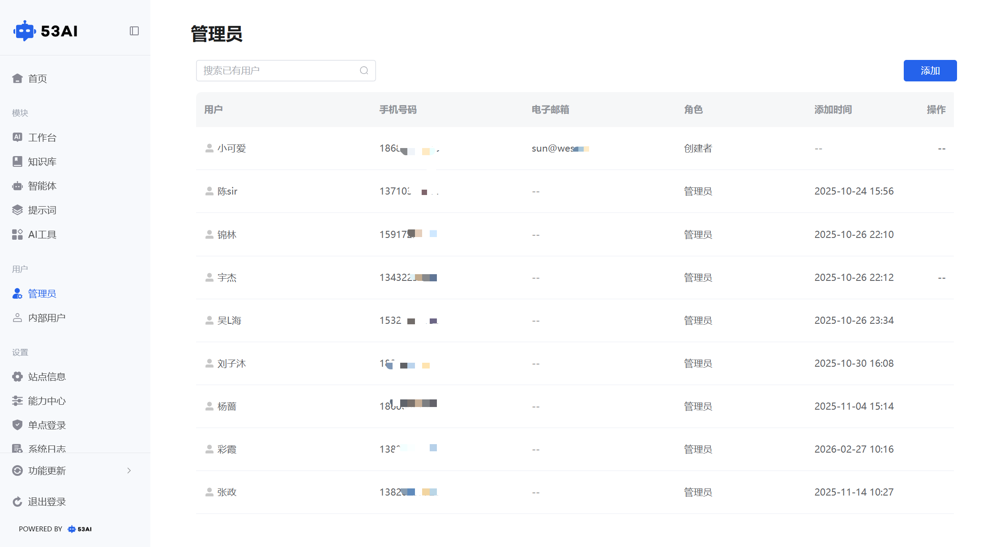
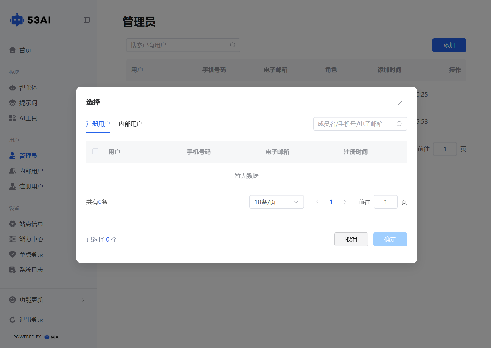
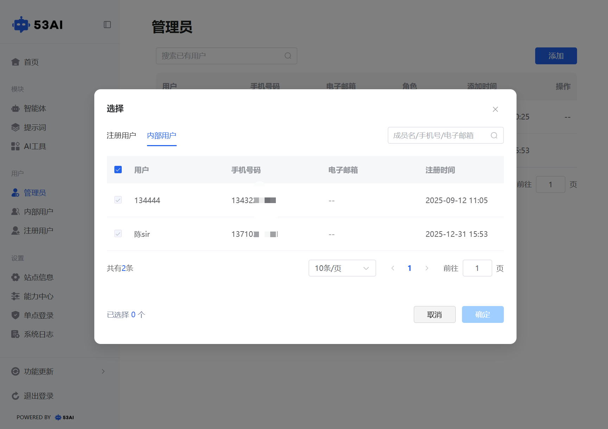

# 管理员
## 一、功能说明
管理员管理页面用于查看和维护系统中的管理员账号。只有管理员才能进入系统后台进行管理。页面展示用户姓名、手机号、邮箱、角色（如管理员、创建者）、添加时间等信息，支持通过搜索框快速查找特定用户。可新增管理员账号，并移除不再需要的账户。

## 二、操作步骤
点击页面右上角“添加”按钮，进行新管理员的添加操作：

●注册用户：在目前已注册的用户名单中选择用户使其成为管理员，在选定用户前面的“□”里面打上“√”。\
●内部用户：选择公司内已有的内部用户添加为管理员，在选定用户前面的“□”里面打上“√”。

