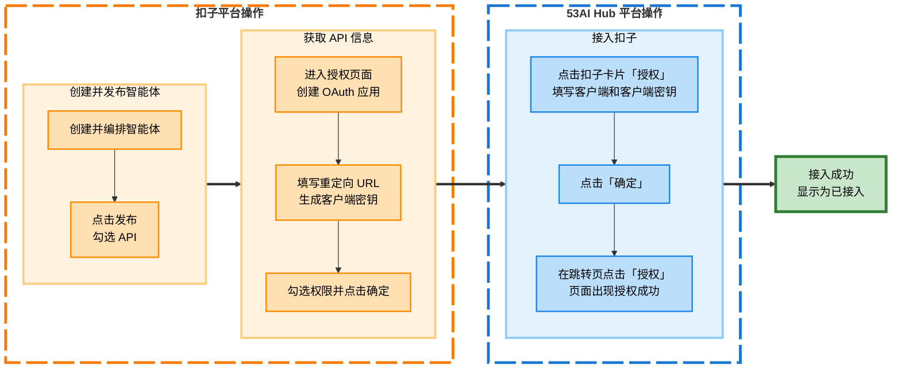
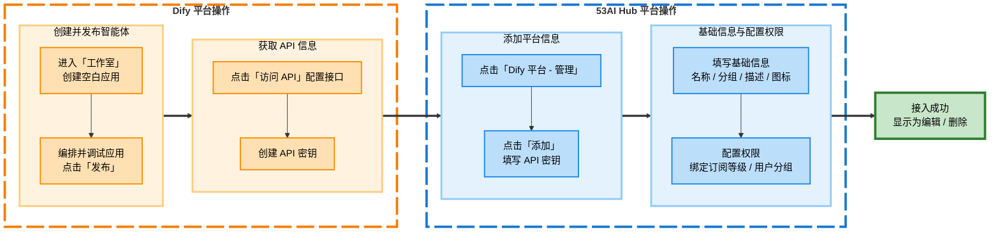
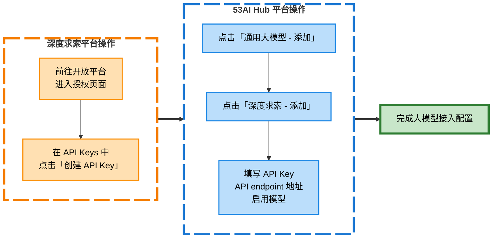

# ⚙️ 平台接入

**平台接入**是配置 53AI Hub 站点的关键步骤之一。你可以通过平台接入**将各个智能体开发平台、云计算平台和大模型平台接入 53AI Hub，实现智能体的统一发布和运营**。

> 💡 **产品定位**：53AI Hub 是智能体（AI Agent）的**发布与运营平台**，本身不提供智能体开发及编排能力。你需要将外部平台中开发好的智能体接入到 53AI Hub。


---

## 📦 支持的平台

### 1. 智能体平台

支持市场上主流的智能体开发平台开发的智能体统一接入 53AI Hub，进行统一发布和运营。

> ✅ **已支持平台**：扣子、千帆 AppBuilder、Dify、53AI Studio、腾讯元器、FastGPT

### 2. 云计算平台

支持主流的云计算平台上开发的智能体统一接入 53AI Hub，进行统一发布和运营。

> ✅ **已支持平台**：阿里百炼、火山方舟、百度千帆 AppBuilder

### 3. 大模型平台

支持主流大模型平台的基座模型能力直接接入 53AI Hub，为用户直接提供基座模型能力。

> ✅ **已支持平台**：OpenAI、硅基流动、深度求索及其它兼容 OpenAI 接口的大模型平台

---

## 🔗 开始接入

点击 **站点配置 → 平台接入** 进入配置页面

### 智能体平台接入


#### 方式一：统一授权（扣子、千帆 AppBuilder）

支持将平台开发的全部智能体进行统一授权，一次性接入所有智能体。

**以扣子平台为例：**



**详细操作步骤：**

**步骤 1：在扣子平台创建并发布智能体**
1. 在扣子平台创建并编排所需的智能体
2. 点击「发布」按钮
3. 在「选择发布平台 - API」区域，**勾选 API 权限**


**步骤 2：获取 OAuth 应用信息**
1. 前往 [扣子开放平台授权页面](https://www.coze.cn/open/oauth/apps)
2. 创建一个 OAuth 应用，客户端类型选择「Web 后端应用」
3. 在「重定向 URL」栏粘贴地址：
   ```
   https://hubapi.53ai.com/api/callback/cozecn/auth/
   ```
   （可在平台接入 > 授权扣子 > 弹窗操作指引中直接复制）
4. 点击「生成客户端密钥」
5. 勾选所需权限并点击「确定」完成设置


**步骤 3：在 53AI Hub 中完成接入**
1. 点击平台接入中的扣子卡片的「授权」
2. 将扣子中获取的**客户端 ID**和**客户端密钥**填入对应表单
3. 点击「确定」，并在跳转页点击「授权」
4. 页面出现「授权成功」提示后返回 Hub
5. 若扣子图标下方显示为「编辑/删除」，表示接入成功


---

#### 方式二：逐一添加（53AI、Dify、腾讯元器）

支持将平台开发的智能体逐一添加，适合选择性接入部分智能体。

**以 Dify 平台为例：**



**详细操作步骤：**

**步骤 1：在 Dify 中创建智能体**
1. 进入「工作室」页面，点击「创建空白应用」
2. 编排智能体，完成调试预览后点击「发布」
3. 点击「访问 API」进入接口配置页
4. 右上角点击「API 密钥」→「创建密钥」获取授权信息


**步骤 2：在 53AI Hub 中添加平台**
1. 前往平台接入页，点击「Dify 平台 - 管理」
2. 点击「添加」，将 `API 密钥` 填入表单
3. 点击「保存」完成平台信息配置

**步骤 3：配置智能体基础信息**
1. 接入成功后，补充该智能体的基础信息：
   - **名称**：简洁明确的智能体名称
   - **分组**：选择或创建合适的分组
   - **描述**：清晰描述智能体用途
   - **图标**：上传或选择代表性图标
2. 基础信息将展示在前台，便于使用者识别功能

**步骤 4：设置访问权限**
1. 配置智能体的使用权限
2. 可根据订阅等级或用户分组配置使用范围
3. 实现权限精细化管理


---

### 云计算平台接入

> ⚠️ **注意**：当前版本云计算平台功能正在完善中

#### 阿里百炼、火山方舟（逐一添加）

**以火山方舟为例：**

**步骤 1：在火山方舟中获取凭证**
1. 在火山引擎中搭建所需的智能体
2. 进入「系统管理 - API Key 管理」，点击「创建 API Key」获取密钥
3. 前往「应用实验室 - 我的应用」，在对应应用下方查看并复制 `Bot ID`


**步骤 2：在 53AI Hub 中配置**
1. 前往平台接入页，点击「火山方舟 - 管理」
2. 点击「添加」，将 `API Key` 和 `Bot ID` 填入表单
3. 点击「保存」完成平台信息配置
4. 补充智能体基础信息和权限设置

---

### 通用大模型接入


**以深度求索（DeepSeek）为例：**



**详细操作步骤：**

1. 前往深度求索开放 [平台授权页面](https://platform.deepseek.com/)
2. 在「API Keys」栏目点击「创建 API Key」获取密钥
3. 在 53AI Hub 平台接入页点击「添加」
4. 选择「深度求索」，输入 `API Key`
5. 选择要启用的模型
6. 点击「保存」完成大模型接入配置


---

## 📚 使用模型

配置完模型后，就可以在应用中使用这些模型：

1. 进入 **应用管理 → 智能体** 页面
2. 创建或编辑智能体时，在模型选择下拉框中即可看到已接入的模型
3. 选择合适的模型进行配置


---

## ❓ 常见问题

### Q1: 接入失败怎么办？
- 检查 API Key 是否正确
- 确认网络连接正常
- 查看对应平台的 API 文档确认权限配置

### Q2: 如何切换已接入的平台？
- 进入平台接入页面
- 找到对应平台卡片
- 点击「编辑」修改配置信息

### Q3: 支持同时接入多个相同平台吗？
- 支持，可以添加多个相同平台的不同账号/项目
- 每个接入会显示为独立的卡片

### Q4: 接入后多久生效？
- 配置保存后立即生效
- 前台可能需要刷新页面查看最新内容

---

## 🔗 相关文档

- [智能体管理](./应用管理/智能体.md)
- [AI 工具管理](./应用管理/AI 工具.md)
- [单点登录](./站点配置/单点登录.md)
