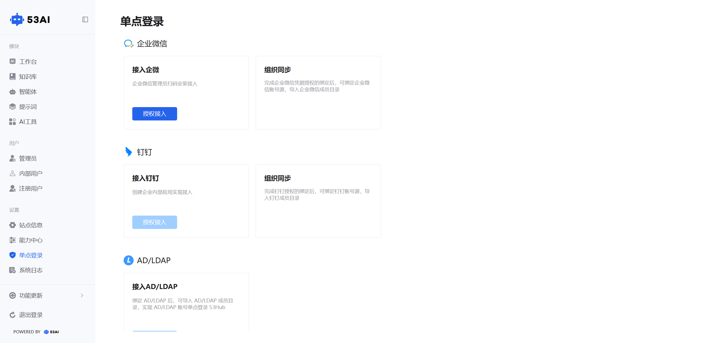
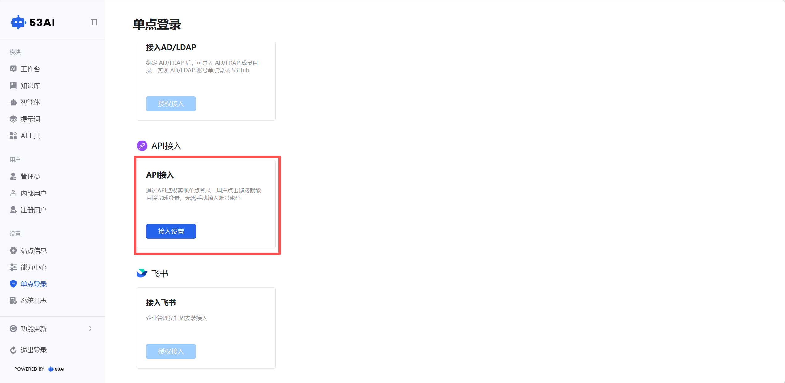
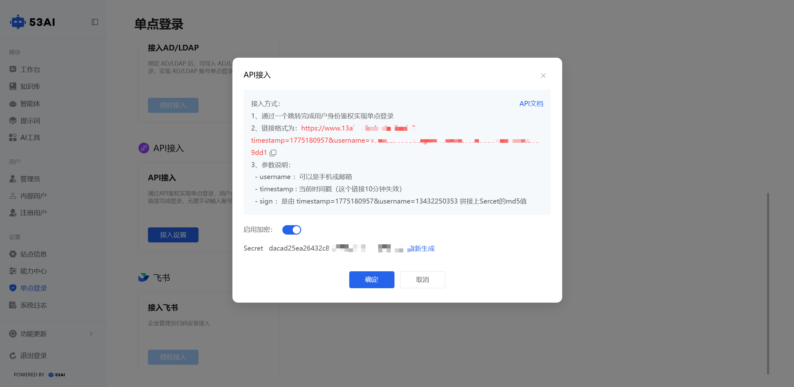
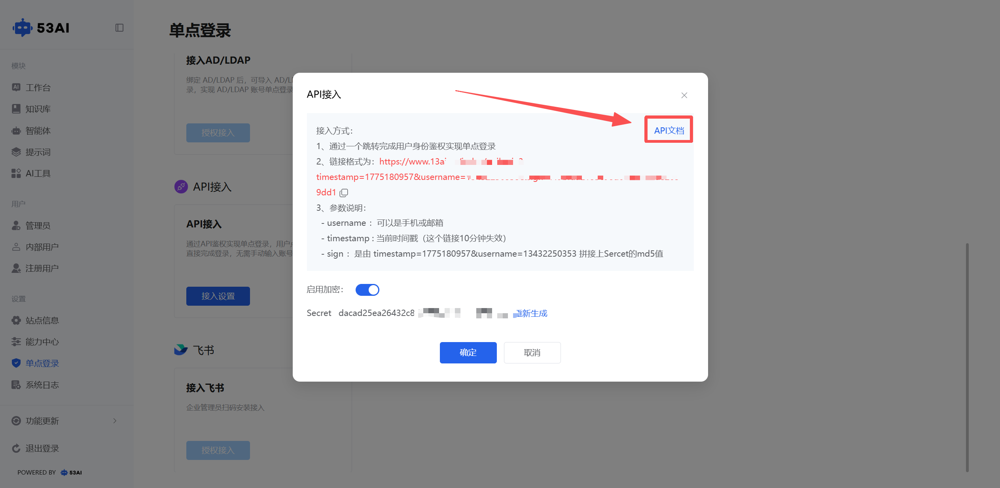

# 单点登录
## 一、功能入口与页面说明
1、入口：\
在左侧菜单栏「设置」分类下，点击「单点登录」选项，即可进入配置页面。\
2、页面分区：\
企业微信：面向企业用户，实现企微账号一键登录与组织同步。\
API 接入：面向系统集成场景，通过 API 鉴权实现免密单点登录。\
3、核心操作按钮：\
授权接入：触发企业微信授权流程。\
接入设置：打开 API 接入配置窗口，查看参数与密钥。

## 二、企业微信单点登录

1. 接入企微（授权流程）\
点击「授权接入」按钮，弹出「接入企微」窗口，提示需由企业微信管理员扫码安装。
已有企微：点击「前往企微授权」，跳转到企微授权页面，管理员扫码完成应用安装与授权。\
未注册企微：点击「去注册企微」，先完成企业微信账号注册，再进行授权。
2. 组织同步\
完成企微授权绑定后，可开启组织同步功能：\
绑定企业微信账号源，自动导入企业成员目录。\
内部员工可直接通过企微身份登录产品，无需额外注册账号，实现企业级身份管理。

## 三、API 接入单点登录

1、功能开启\
点击「API 接入」板块的开关（蓝色为开启），启用 API 免密登录能力。\
点击「接入设置」按钮，进入配置窗口查看详细规则。\

2、接入配置与参数说明\
核心原理：通过带签名的跳转链接实现用户身份鉴权，用户点击链接即可直接登录，无需输入账号密码。

链接格式：\
https://{你的站点地址}/index/apilogin?timestamp={时间戳}&username={用户账号}&sign={签名}

参数说明：\
username：用户的登录账号（支持手机号或邮箱格式）。\
timestamp：当前时间戳（单位：毫秒），该链接10 分钟内有效，超时需重新生成。\
sign：安全签名，由 timestamp={xxx}&username={xxx} 拼接 Secret 后，取 MD5 值生成。

密钥管理：\
系统自动生成Secret密钥（用于签名计算），可点击「重新生成」更换密钥，提升安全性。\
开启「启用加密」开关（默认开启），确保登录链接的安全性。\
API 文档：点击右上角「API 文档」，可查看完整的接入技术说明。
