# 站点信息
## 一、功能说明
「站点信息」模块用于自定义产品前端展示样式、站点定位与基础配置，让你的 AI 产品更贴合品牌与业务场景。

## 二、具体信息步骤
### （一）站点信息
#### 1、品牌与展示配置
-Logo：\
支持上传矩形 Logo，建议尺寸 600×200px，格式为 .jpg/.png，大小不超过 2M。
点击「修改」可替换已有 Logo。

-ico：\
上传浏览器标签页图标，建议尺寸 64×64px。

-站点名称：\
填写站点对外展示名称（最多 120 字符），将显示在浏览器标题与前端页面。

-关键词：\
可输入多个关键词，用于 SEO 优化，输入后按回车确认。

-站点描述：\
填写站点简介（最多 200 字符），用于 SEO 与前端展示。

-默认语言：\
下拉选择站点默认语言，当前支持「中文 - CN」等选项。
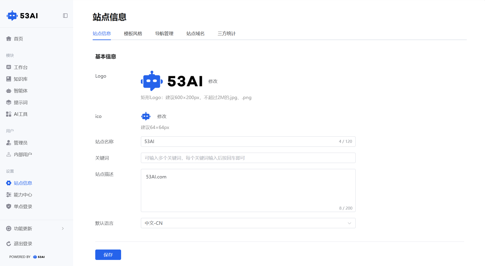

#### 2、站点类型与权限
-站点类型\
AI 独立站：站点仅对注册用户开放访问。\
企业 AI 门户：站点仅对内部用户开放访问。\
行业 AI 门户：站点对内部员工 + 注册用户开放访问。

-隐藏技术支持 Logo：\
开关控制是否隐藏页面底部「53AI」标识，开启后可实现更纯净的品牌展示。
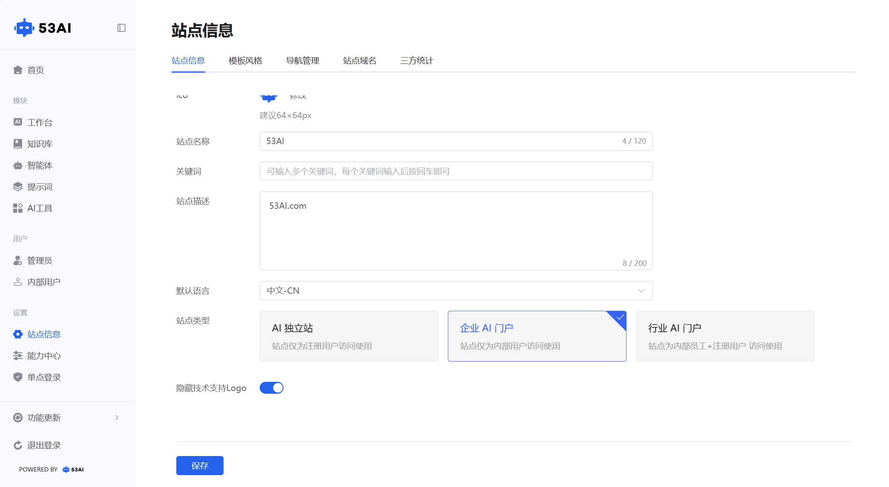

### (二)模板风格
「模板风格」模块支持自定义产品前端界面的视觉样式与布局，你可以根据品牌调性选择网站风格或软件风格，打造专属的 AI 产品体验。
#### 1、网站风格
适配公开展示的营销型前端界面，支持 Banner 轮播等宣传元素。
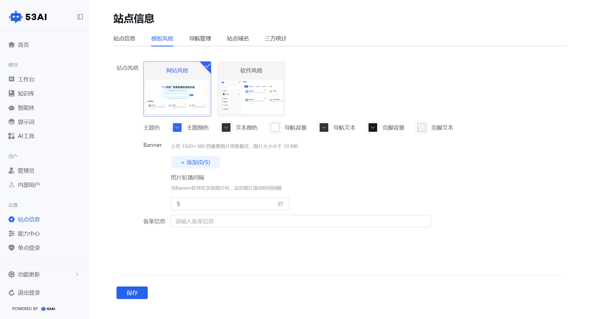
1.色彩定制\
-主题色：点击颜色框，自定义站点主色调（影响按钮、标题等关键元素）。\
-文本颜色：设置正文、辅助文字的颜色。\
-导航背景 / 页脚背景：配置导航栏与页脚的背景色。\
-导航文本 / 页脚文本：匹配导航与页脚的文字颜色。

2.Banner 配置\
图片要求：上传 1920×380px 像素的 Banner 图，单张大小不超过 10MB。\
轮播管理：点击「+ 添加」可上传多张 Banner 图（最多 5 张）。\
轮播间隔：输入数字（单位：秒），设置多张 Banner 图片的自动切换时间。

3.备案信息\
在输入框中填入网站备案号，合规展示底部备案信息。

#### 2、软件风格
选择「软件风格」后，界面将切换为工具类产品的展示样式，去除 Banner 等营销元素，更聚焦于智能体、工具列表的展示与操作，适合内部管理或工具类场景。

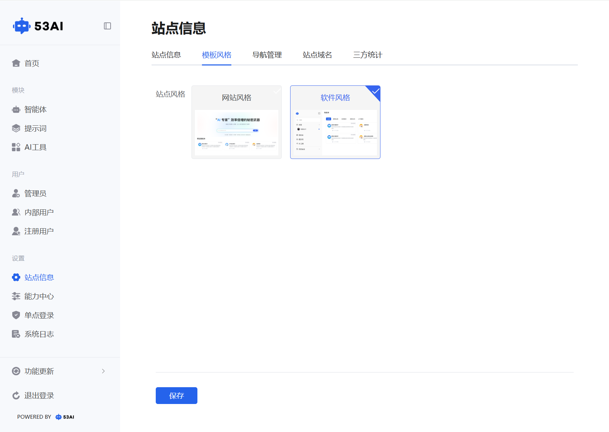

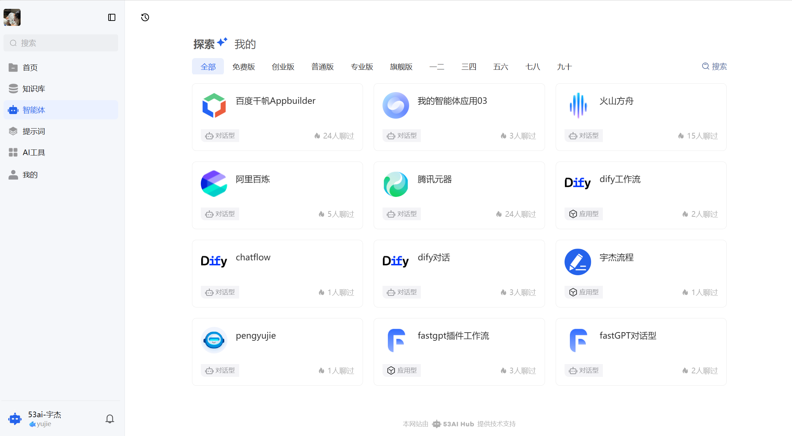

### （三）导航管理
用户可以在此处设置站点在前台展示的导航选项，从而使站点信息展示更加条理清晰，可选择外部链接或自定义页，最多支持 10个导航栏的添加。
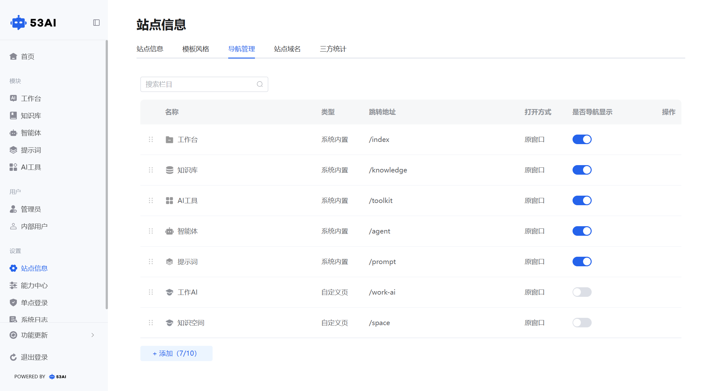

#### 1、操作步骤
-点击左下角“添加”按钮，设置需要的导航栏；
-配置导航栏的类型、名称、跳转地址、打开方式等基础信息，还可进行 SEO设置。

##### 基础信息：
-类型：可以根据跳转到平台内功能模块或是其他网站地址，在系统内置、外部链接、自定义页三种类型中进行选择。\
-名称：输入该导航栏的名称，方便更好地进行分类。\
-跳转地址：输入点击导航栏后需要跳转到的网页地址。\
-打开方式：选择点击导航栏后相关网页在“原窗口”还是“新窗口”打开。

##### SEO设置：
-Title：输入导航栏页面标题，告诉搜索引擎和用户该页面的核心主题。\
-Keywords：提供页面的相关关键词。\
-Description：输入页面描述，告诉搜索引擎页面内容摘要，作为搜索结果摘要显示。
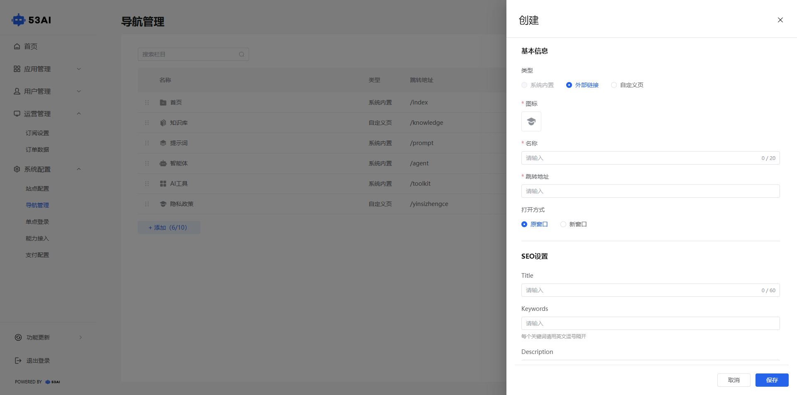

### （四）站点域名
「站点域名」模块用于配置产品的访问域名，支持使用系统专属域名或绑定自定义独立域名，让你的 AI 产品拥有更专业、更易记忆的访问地址。
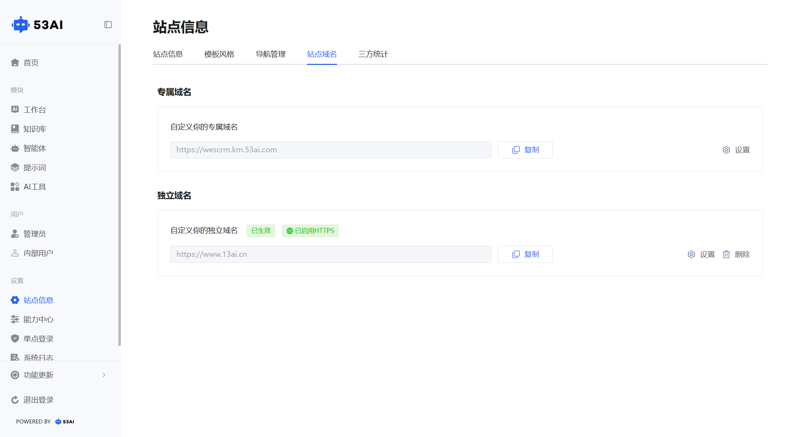

#### 1、专属域名
系统会自动生成一个专属二级域名（格式：https://xxx.km.53ai.com），无需额外配置即可直接访问站点。

#### 2、独立域名
在输入框中填写你的自定义独立域名（最多 20 字符，无需加https://前缀）。\
-CNAME 方式：根据你的域名备案平台，选择对应的 CNAME 地址。\
-自有服务器中转：通过你自己的服务器转发请求，适合有特殊运维需求的场景。
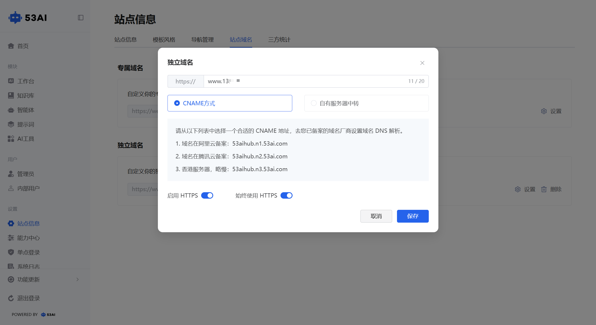

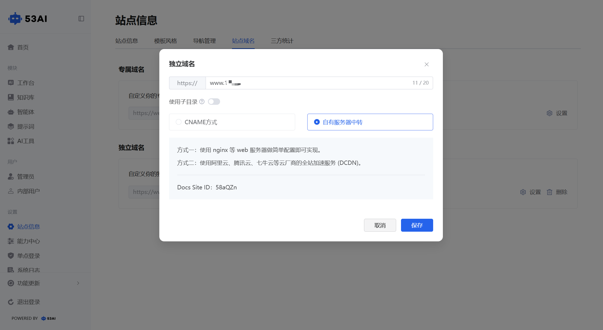

### (五)三方统计
支持用户通过插入自定义代码的方式，为站点接入第三方客服、数据分析、行为追踪等服务，无需修改页面源代码，即可实现运营能力增强与界面功能扩展。
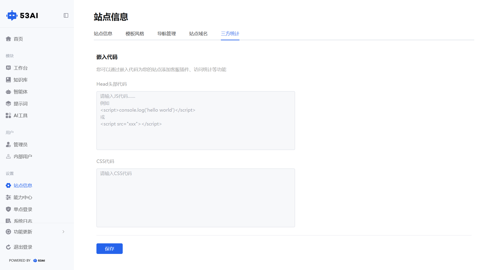

#### 1、Head头部代码：
将第三方 JavaScript 脚本加载到所有页面的 < head > 区域，确保统计或插件在页面渲染前初始化。可加载访问统计等功能。

常见用途：\
●接入访问统计工具（如 Google Analytics、百度统计）\
●嵌入在线客服脚本\
●引入第三方功能库\
填写方式：\
A.将< scrip >标签及配置内容粘贴到 Head 头部代码 框中；\
B.点击 保存，系统会自动在所有页面的 < head > 中插入该脚本。\
示例：\
插入代码后查看控制台输出，将以下代码粘贴至 Head 头部代码 区域，并点击保存：
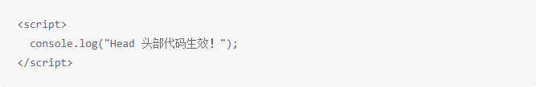
页面刷新后，打开浏览器的开发者工具（Console）标签页， 若看到该输出信息，表示脚本插入成功。

#### 2、CSS代码：
通过CSS代码可调整页面风格，适配品牌视觉规范。向页面注入样式规则，无需修改原始模板即可调整第三方组件或自定义元素的外观。

常见用途：\
●调整客服窗口位置、尺寸和样式\
●隐藏或美化统计工具界面元素\
●定制页面局部样式（如按钮、浮层）\
填写方式：\
A.将 CSS 规则粘贴到 CSS 代码 框中；\
B.点击 保存，系统会在页面加载时自动应用这些样式。\
示例：\
插入 CSS 代码更改页面背景颜色\
将以下代码粘贴至 CSS 代码 区域，并点击保存：
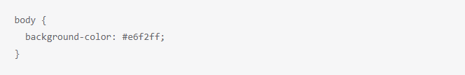
页面刷新后，网页背景将呈现为淡灰色，视觉更加柔和。 如需调整其他元素样式，也可在此区域添加更多自定义样式。
