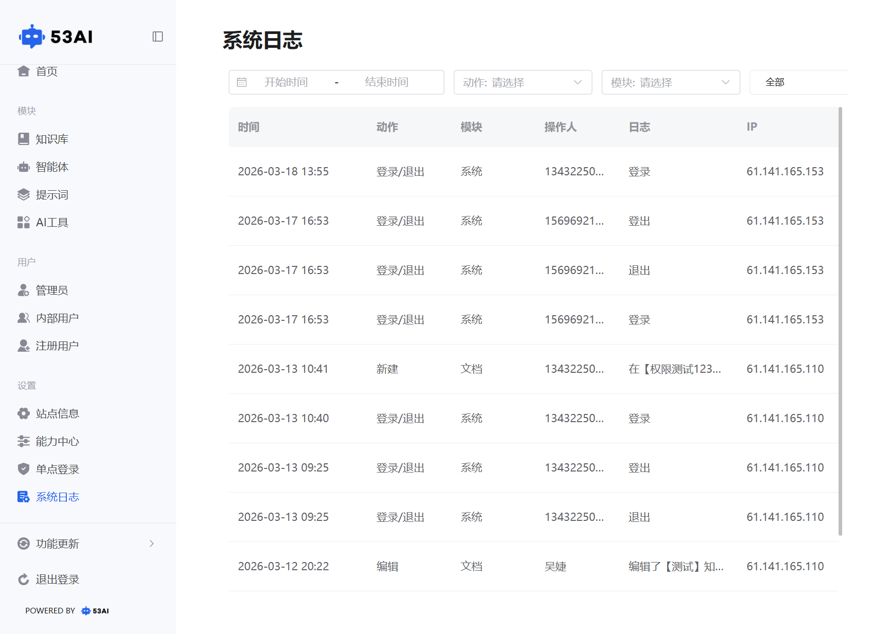

# 系统日志
## 一、功能入口与页面说明
「系统日志」模块用于记录产品内所有关键操作行为，是管理员排查问题、审计安全、追溯操作历史的核心工具，可清晰查看谁在什么时间、做了什么操作。

时间筛选：选择「开始时间」和「结束时间」，可查看指定时间段内的操作日志。\
动作筛选：下拉选择操作类型（如「登录 / 退出」「新建」「编辑」等），过滤特定行为。\
模块筛选：下拉选择功能模块（如「系统」「文档」等），仅查看对应模块的操作记录。\
全部按钮：点击可重置所有筛选条件，恢复查看完整日志列表。