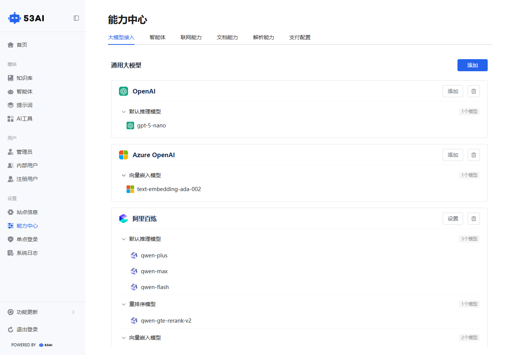
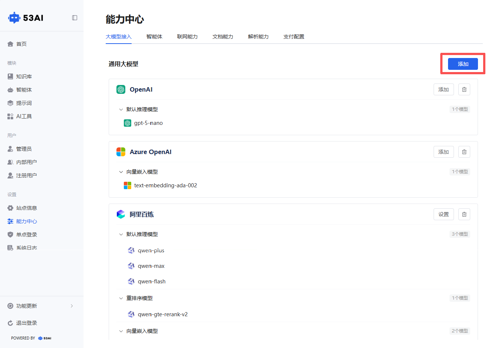
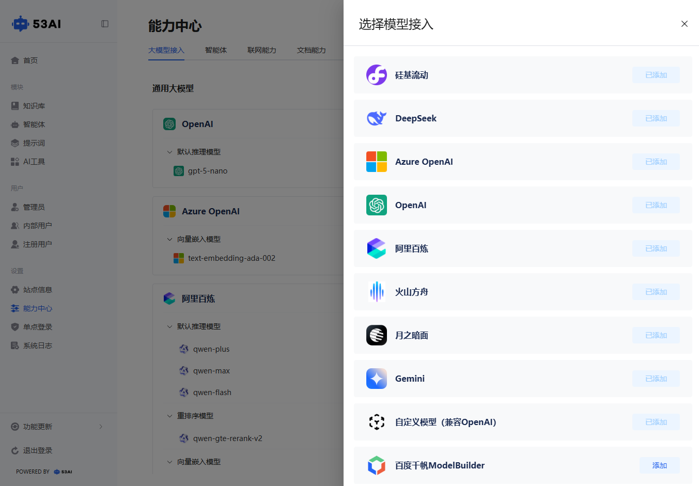
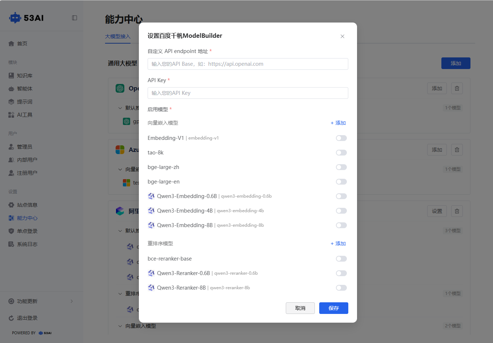
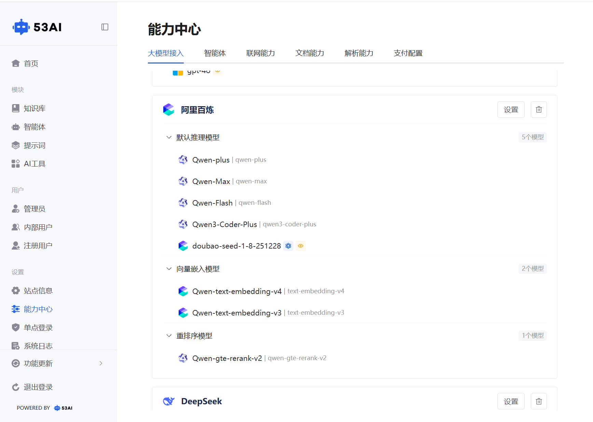
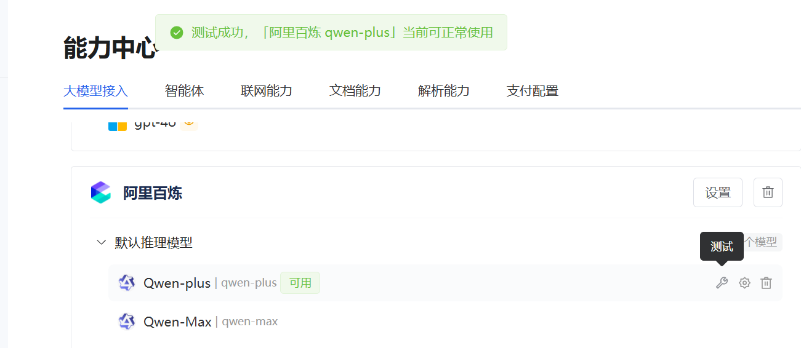
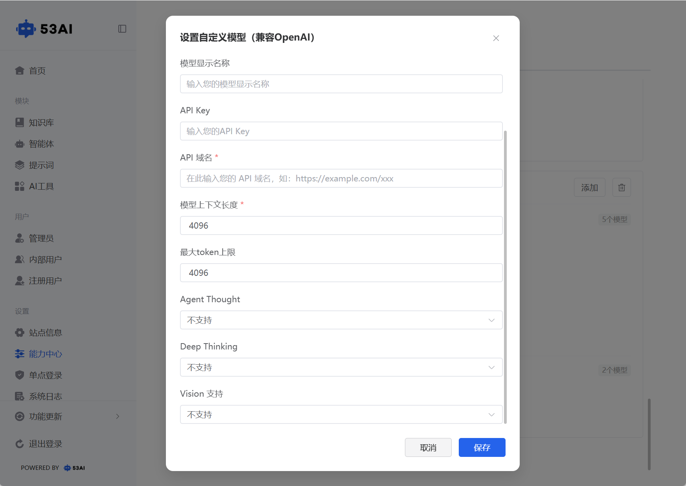

# 大模型接入
## 一、功能整体介绍
「大模型接入」是 53AI Brain 产品的AI 能力配置核心模块。简单来说，我们的产品本身不具备智能思考能力，需要通过接入 OpenAI、阿里百炼、DeepSeek 等主流 AI 大模型，才能为用户提供问答生成、内容分析、智能交互等服务。您在这个页面完成模型配置后，用户就能在前端产品中体验到完整的 AI 功能了。

## 二、添加新模型操作流程
当你需要接入新的 AI 模型（如百度千帆、Gemini）时，可按照以下步骤操作：

1、点击页面右上角的蓝色「添加」按钮，弹出「选择模型接入」窗口。

2、窗口内会展示所有支持的模型服务商列表，包括：硅基流动、DeepSeek、Azure OpenAI、OpenAI、阿里百炼、火山方舟、月之暗面、Gemini、自定义模型（兼容 OpenAI）、百度千帆 ModelBuilder 等。

3、找到你需要接入的模型，点击其右侧的「添加」按钮（已添加的模型会显示「已添加」状态）。
在弹出的配置窗口中，填写模型服务商提供的关键信息（如 API 密钥、服务地址、模型版本等），填写完成后点击保存，即可完成新模型的接入。

## 三、通用大模型列表区
页面中间的「通用大模型」列表，是你管理已接入 AI 模型的核心区域，每个模型卡片都包含完整的配置与状态信息：

### 1.模型基础信息与分类
每个卡片展示模型服务商名称（如 OpenAI、Azure OpenAI、阿里百炼），点击名称下方的小箭头可展开查看不同类型的子模型：
默认推理模型：用于 AI 对话、内容生成等核心推理场景（如 OpenAI 的gpt-5-nano、阿里百炼的qwen-plus/qwen-max/qwen-flash）。
重排序模型：用于优化搜索结果的排序精度（如阿里百炼的qwen-gte-rerank-v2）。
向量嵌入模型：用于将文本转换为向量，支撑知识库检索等功能（如 Azure OpenAI 的text-embedding-ada-002）。
卡片右侧会显示当前已启用的子模型数量（如「3 个模型」）。

### 2.模型状态与测试
每个子模型名称后会标注状态标签：
可用：绿色标签，表示该子模型配置正常，可正常调用服务。
不可用：红色标签，表示该子模型配置异常或服务不可用，需要检查参数或重新测试。
你可以对每个子模型进行连通性测试，测试成功后页面顶部会弹出绿色提示条（如「测试成功，[Azure OpenAI text-embedding-ada-002] 当前可正常使用」），同步更新状态标签。

### 3.模型管理操作
每个模型卡片右侧提供核心操作按钮：
设置：修改该模型服务商的全局配置参数（如 API 密钥、服务地址）。
添加：为该服务商新增子模型 ID，扩展可用的模型能力。
删除：移除整个模型服务商的接入配置（删除后所有子模型将不可用，操作前请确认）。

### 4.自定义模型（兼容OpenAI）
你可以灵活接入兼容 OpenAI 接口规范的自定义模型，满足个性化 AI 需求：

1、入口：在「能力中心 - 大模型接入」页面点击右上角「添加」，选择「自定义模型（兼容 OpenAI）」。

2、配置：填写模型类型（推理 / 嵌入 / 重排序）、名称、API 域名、上下文长度等参数，支持设置是否开启视觉、深度思考等高级能力。

3、管理：保存后即可在模型列表中管理，支持修改配置、测试可用性或删除，与预置模型一致使用，可接入开源模型、私有部署模型或第三方服务商模型，实现高度定制化的 AI 服务。
