# 支付配置
## 一、功能说明
用户可以在支付配置页面设置需要的支付方式
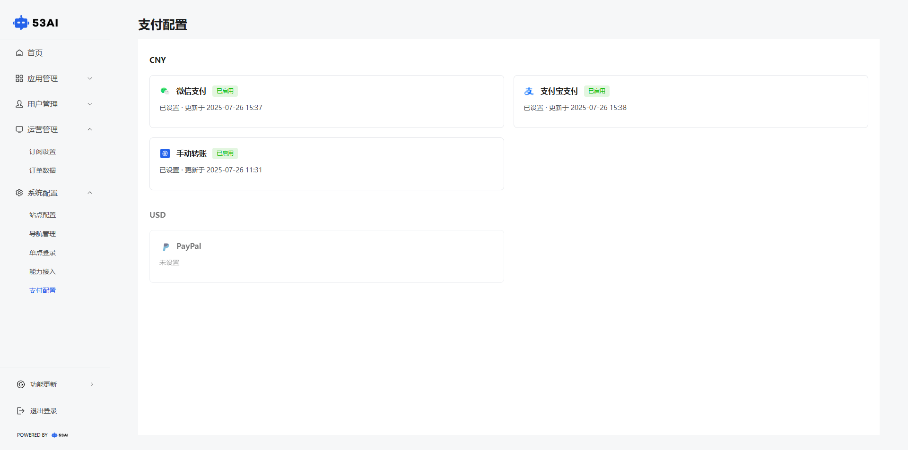

## 二、操作步骤
### 1.微信支付
点击 微信支付 右上角的 设置，填写以下信息后点击 确定：\
MCH ID：商户号\
APPID：微信应用 ID\
API密钥：在微信商户平台申请\
证书序列号 / 上传证书 / 上传证书密钥
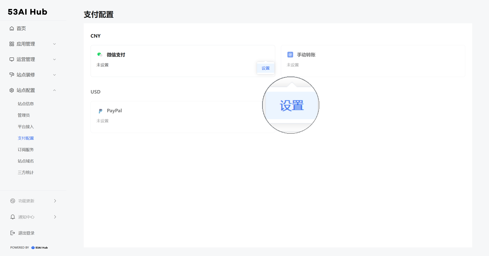
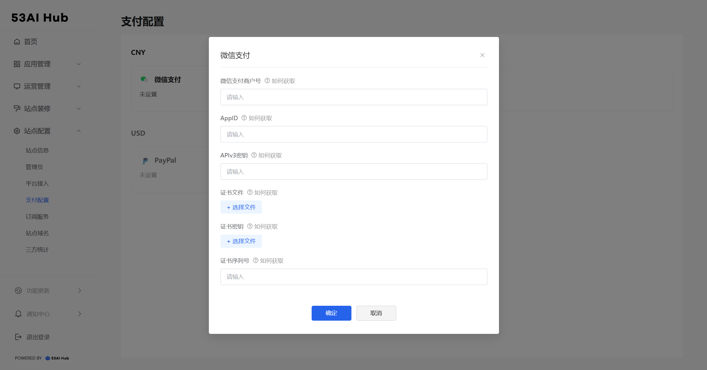

### 2.支付宝支付
点击 支付宝支付 右上角的 设置；
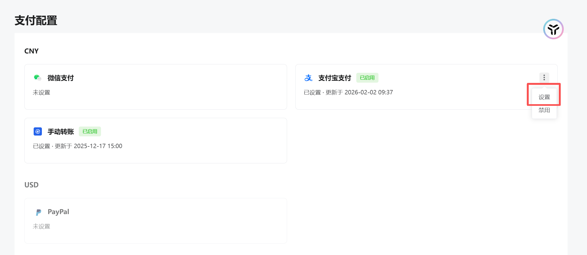

登录支付宝开放平台https://open.alipay.com/module/webApp/ 创建"网页/移动应用"，获得APPID；
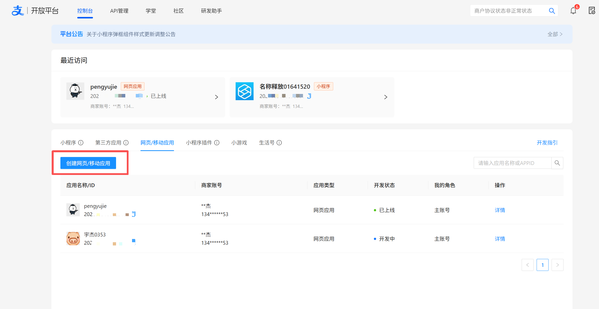

点击进入应用，在「开发设置」"接口加签方式"中按照支付宝官方的引导进行配置，获取应用私钥、支付宝公钥；
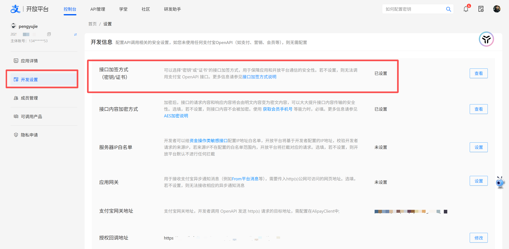

在「开发设置」"授权回调地址"中填入: https://kmapirc.53ai.com/api/payment/alipay/notify/312
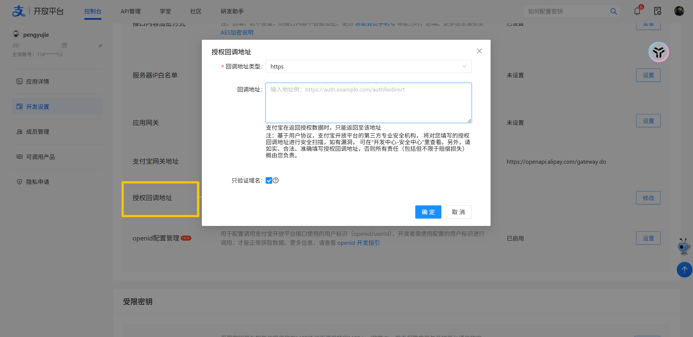

在【API管理】接入"电脑网站支付"的能力，按照支付宝官方的引导进行配置或开通；
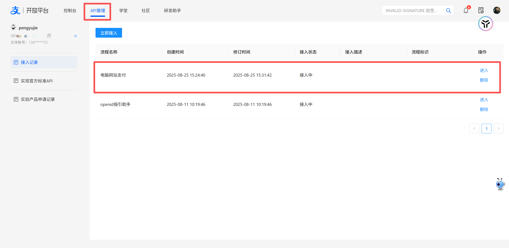

按配置的信息填入支付宝AppID、应用私钥和支付宝公钥。
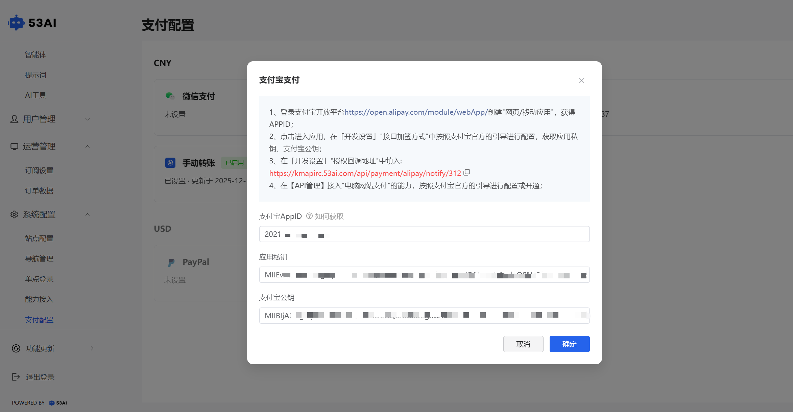

### 3.手动转账
点击 手动转账 右上角的 设置；
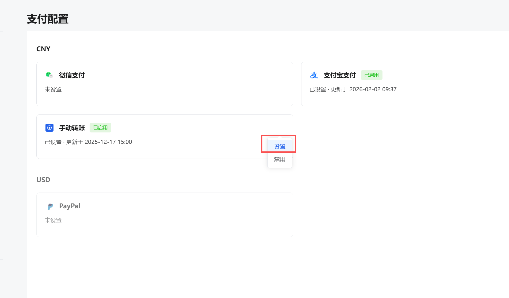

●手动转账可支持更多的支付方式，但金额需要用户自己填写，支付后需管理员后台-运营管理-“订单数据”手动确认。
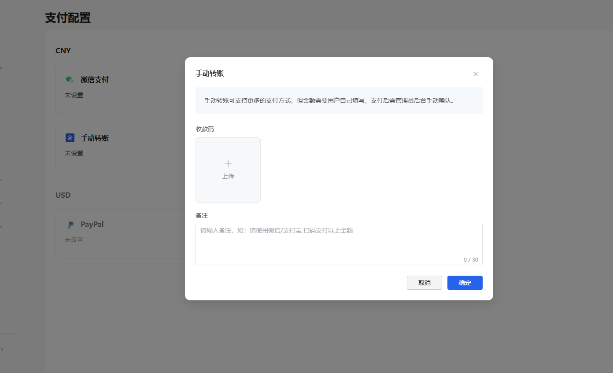