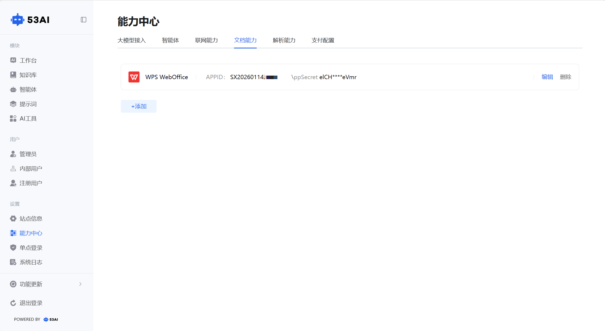
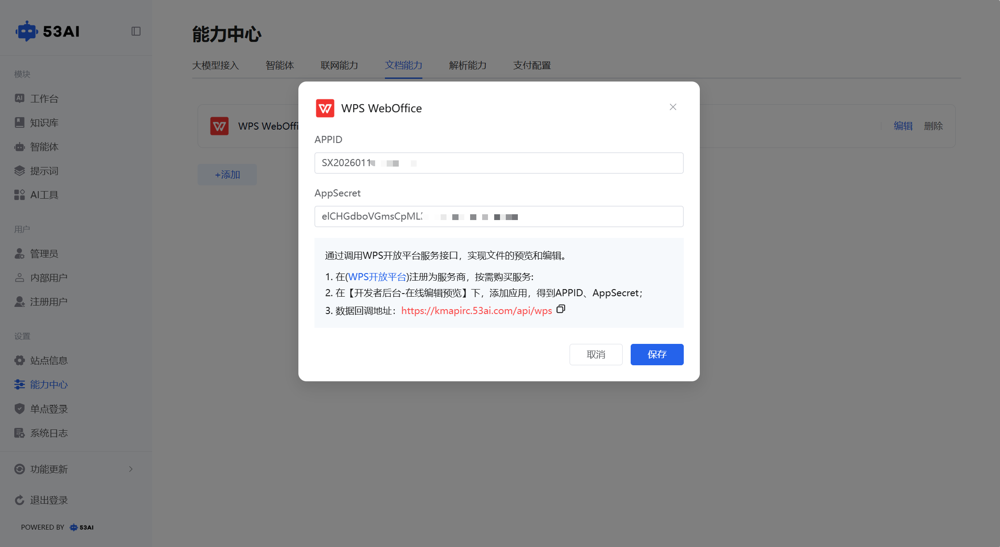

# 文档能力
「文档能力」模块用于为产品接入在线文档预览与编辑功能，当前支持WPS WebOffice平台，可实现 Word、Excel、PPT 等格式文件的协作与查看。

## 一、功能入口与页面说明
1、入口：\
在「能力中心」页面点击顶部「文档能力」标签，即可进入配置页面。\
2、页面展示：\
已接入的文档服务以卡片形式展示，当前仅支持「WPS WebOffice」。
卡片会显示已配置的APPID（完整展示）与AppSecret（部分脱敏展示），并提供「编辑」「删除」操作按钮。

## 二、添加 / 配置 WPS WebOffice
1、点击页面左下角「+ 添加」按钮，弹出「WPS WebOffice」配置窗口。\
2、按以下步骤获取并填写配置信息：\
&emsp;1.前往WPS 开放平台注册为服务商，按需购买服务；\
&emsp;2.在【开发者后台 - 在线编辑预览】下添加应用，获取APPID和AppSecret；\
&emsp;3.将数据回调地址设置为：https://kmapirc.53ai.com/api/wps；\
&emsp;4.将获取到的APPID和AppSecret填入配置窗口。\
3、点击「保存」按钮，完成接入配置。
