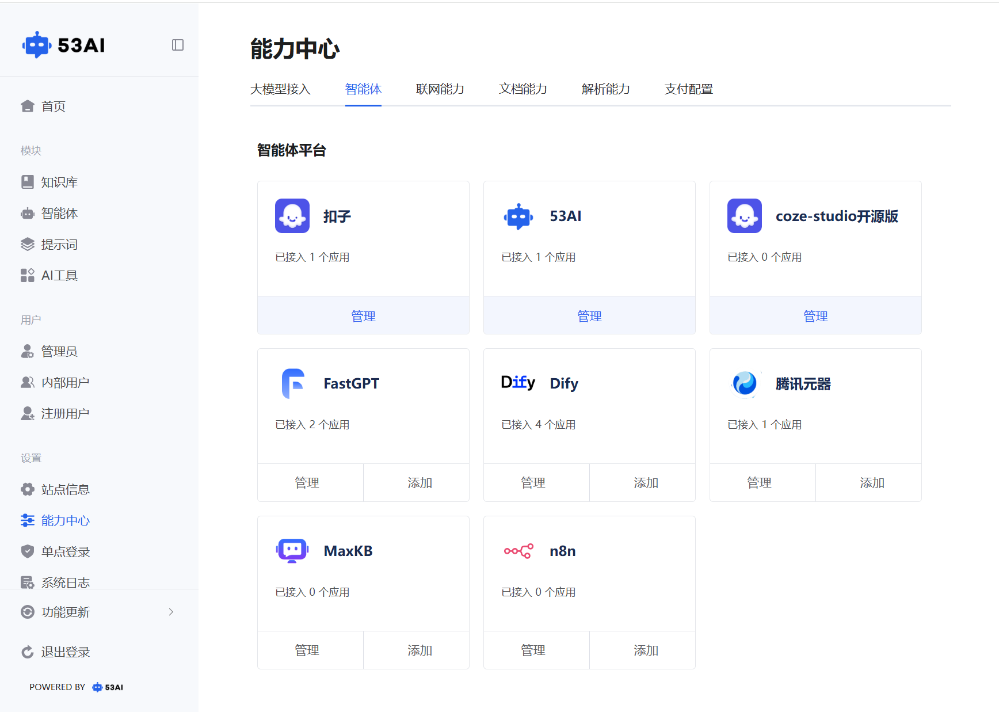
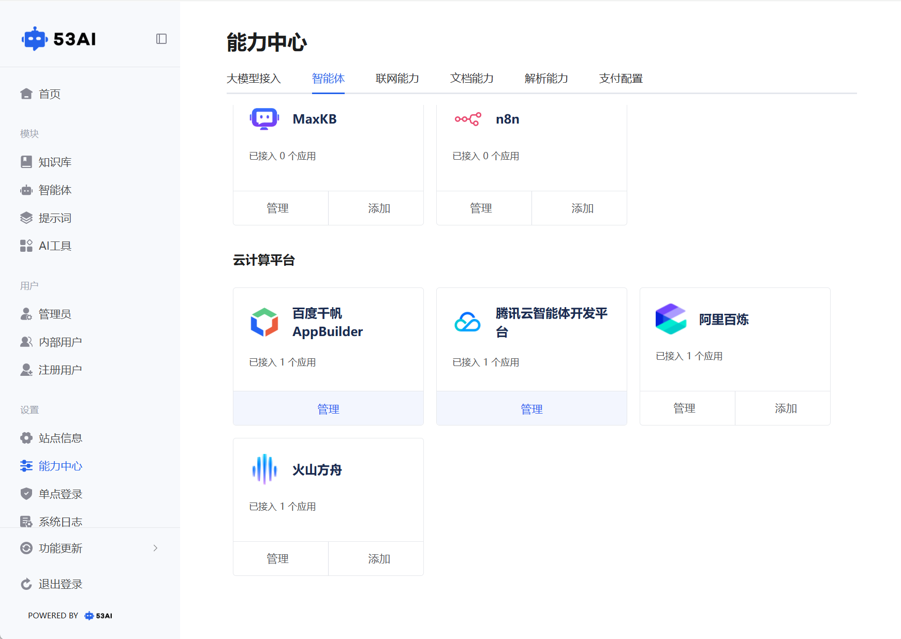

# 智能体接入
## 一、功能整体介绍
「智能体」模块支持你将 Brain 产品与多种主流智能体开发平台打通，实现更丰富的 AI 交互能力：

1、入口：\
「能力中心」页面点击顶部「智能体」标签，即可查看所有支持的智能体与云计算平台。

2、平台分类：\
智能体平台：包含扣子、53AI、coze-studio 开源版、FastGPT、Dify、腾讯元器、MaxKB、n8n 等，可直接对接成熟的智能体应用。\
云计算平台：包含百度千帆 AppBuilder、腾讯云智能体开发平台、阿里百炼、火山方舟等，可接入云厂商提供的智能体服务。

3、操作管理：\
每个平台卡片会显示「已接入 X 个应用」，直观了解接入状态。
点击「管理」可查看、编辑已接入的应用配置；点击「添加」可快速接入新的智能体应用。
接入后，Brain 即可调用对应平台的智能体能力，为用户提供更复杂的对话、工作流与自动化服务。
](image.png)
](image-9.png)

## 二、各平台接入步骤汇总
1. 扣子\
前往扣子 API 授权页创建 OAuth 应用，客户端类型选择Web 后端；\
重定向 URL 填写系统提供的回调地址；\
复制生成的客户端 ID、客户端密钥，勾选全权限后完成保存配置。

2. 53AI\
登录 53AI 后台，进入左侧菜单栏设置模块；\
在「企业信息」板块下生成并复制Secret Key；\
配置页填写站点名称，URL 固定为https://api.53ai.com，粘贴已复制的 Secret Key 即可。

3. coze-studio 开源版\
进入平台后台设置 - API 授权 - 个人访问令牌页面；\
点击添加新令牌，设置令牌名称、过期时间，勾选全权限与所有工作空间；\
复制生成的令牌，在配置页填写站点名称、API Endpoint 及令牌信息。

4. FastGPT\
登录 FastGPT 工作台，选择需要接入的目标应用；\
进入应用的发布渠道 - API 访问板块；\
新建并复制API KEY、API 根地址，直接填入配置表单对应位置。

5. 腾讯元器\
登录腾讯元器平台，进入我的创建页面；\
选择需接入的智能体，点击调用 API（需确保智能体已通过审核）；\
复制生成的智能体 ID、Token，完成配置填写。

6. MaxKB\
打开 MaxKB 客户端，进入应用板块；\
选择目标应用，在「API 访问凭据」下复制Base URL；\
新建并复制API Key，将 Base URL 和 API Key 填入配置页。

7. 百度千帆 AppBuilder\
登录百度智能云千帆平台，进入API Key管理页面；\
新建 API Key，服务类型选择千帆 AppBuilder；\
复制生成的API Key，配置页填写站点名称并粘贴 API Key 即可。

8. 腾讯云智能体开发平台\
登录腾讯云控制台，进入API 密钥管理模块；\
新建密钥，复制生成的SecretId、SecretKey；\
配置页填写站点名称，URL 固定为https://wss.lke.cloud.tencent.com，粘贴 SecretId 和 SecretKey。

9. 阿里百炼\
登录阿里百炼平台，进入应用 - 应用管理页面；\
选择目标应用，复制页面中的应用 ID；\
点击应用发布按钮，获取并复制API-KEY，将应用 ID 和 API-KEY 填入配置表单。

10. 火山方舟\
登录火山方舟平台，进入我的应用板块；\
选择或创建需接入的应用，复制页面左上角的bot-xxxx（bot 应用 ID）；\
进入应用API 调用指南页面，复制API Key，将 bot 应用 ID 和 API Key 完成配置。

11. n8n\
前往n8n官网并登录（https://n8n.io/）\
第一步：在「Personal」下，点击创建一个工作流，再点击添加节点「On webhook call」；\
第二步：在Webhook节点的编辑弹窗内，复制Webhook URLs 填入表单，Authentication选择「 Header Auth」，然后在点击「Creat new credential」;\
第三步：“Name”固定填入： authorization，“Value”对应的是渠道的 key 字段，可以是随机字符串，字符数请控制在64位内；\
第四步：“Respond”选择：When Last Node Finishes