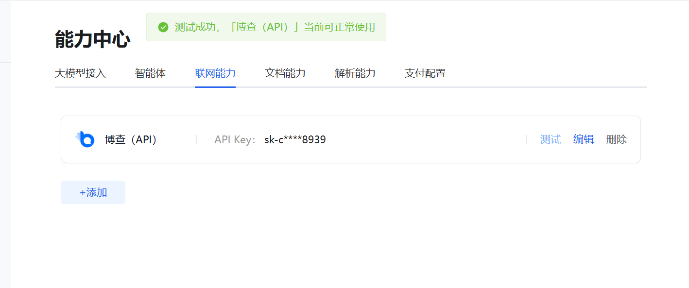
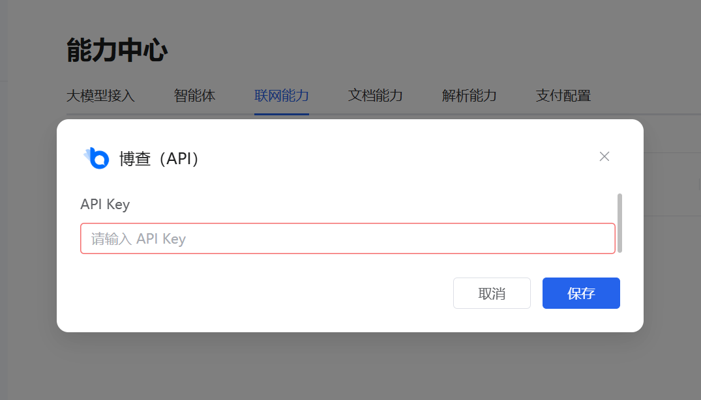

# 联网能力
「联网能力」模块用于为大模型开通实时联网搜索功能，当前支持接入 **博查（API）** 平台，让 AI 可以获取最新的网页信息、新闻数据等，提升回答的时效性与准确性。

## 一、功能入口与页面说明 
1、入口：\
在「能力中心」页面点击顶部「联网能力」标签，即可进入配置页面。\
2、页面展示：\
已接入的联网服务会以卡片形式展示，如支持「博查（API）」。\
卡片会显示已配置的API Key（部分脱敏展示），并提供「测试」「编辑」「删除」操作按钮。\
测试成功后，页面顶部会弹出绿色提示条，告知「当前可正常使用」。
](image-11.png)

## 二、添加 / 配置
1、点击页面左下角「+ 添加」按钮，如弹出「博查（API）」配置窗口。\
2、在输入框中填写从博查平台获取的API Key（完整密钥）。\
3、点击「保存」按钮，完成接入配置。
