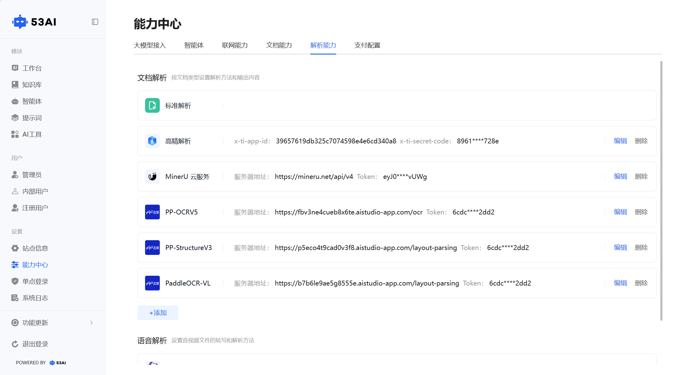
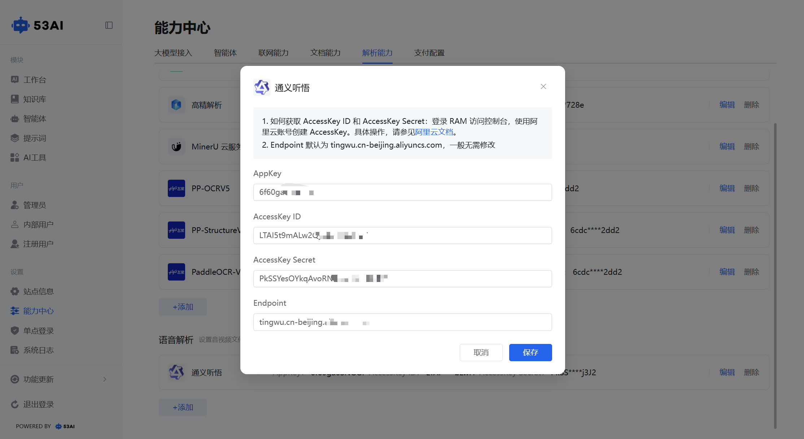

# 解析能力
「解析能力」模块用于配置文件与音视频的解析服务，支持文档解析和语音解析两大场景，可根据需求选择不同服务商实现高精度内容提取。
## 一、功能入口与页面说明
1、入口：\
在「能力中心」页面点击顶部「解析能力」标签，即可进入配置页面。\
2、页面分区：\
文档解析：按文档类型设置解析方法与输出内容，支持标准解析、高精解析、MinerU 系列、飞桨系列等工具。\
语音解析：设置音视频文件的转写和解析方法，当前支持通义听悟。
已接入的解析服务以卡片形式展示，显示配置信息（部分脱敏），并提供「编辑」「删除」操作按钮。
点击「+ 添加」可选择接入新的解析工具。

## 二、文档解析工具接入
1. 标准解析\
无需额外配置，默认启用，提供基础文档解析能力。

2. 高精解析（Textin）\
前往 Textin 工作台（https://www.textin.com/console/dashboard/overview）。
在【账号与开发者信息】下，复制 x-ti-app-id 和 x-ti-secret-code。
填入配置窗口，点击「保存」完成接入。

3. MinerU 云服务\
服务器地址固定为 https://mineru.net/api/v4。
填写从 MinerU 平台获取的Token（注意：Token 有效期为 14 天，需定期更新）。
点击「保存」完成接入。

4. MinerU 私有部署\
填写私有部署的服务器地址。
填写对应的Token，点击「保存」完成接入。

5. 飞桨系列（PP-OCRV5 / PP-StructureV3 / PaddleOCR-VL）\
填写对应服务的服务器地址。
填写平台提供的Token，点击「保存」完成接入。

## 三、语音解析工具接入
通义听悟\
1、获取凭证：登录阿里云 RAM 访问控制台，创建 AccessKey ID 和 AccessKey Secret（可参考阿里云文档）。\
2、配置参数：
填写从通义听悟获取的AppKey。\
粘贴已创建的AccessKey ID和AccessKey Secret。\
Endpoint 默认值为 tingwu.cn-beijing.aliyuncs.com，一般无需修改。\
3、点击「保存」完成接入，即可实现音视频文件的转写与解析。

